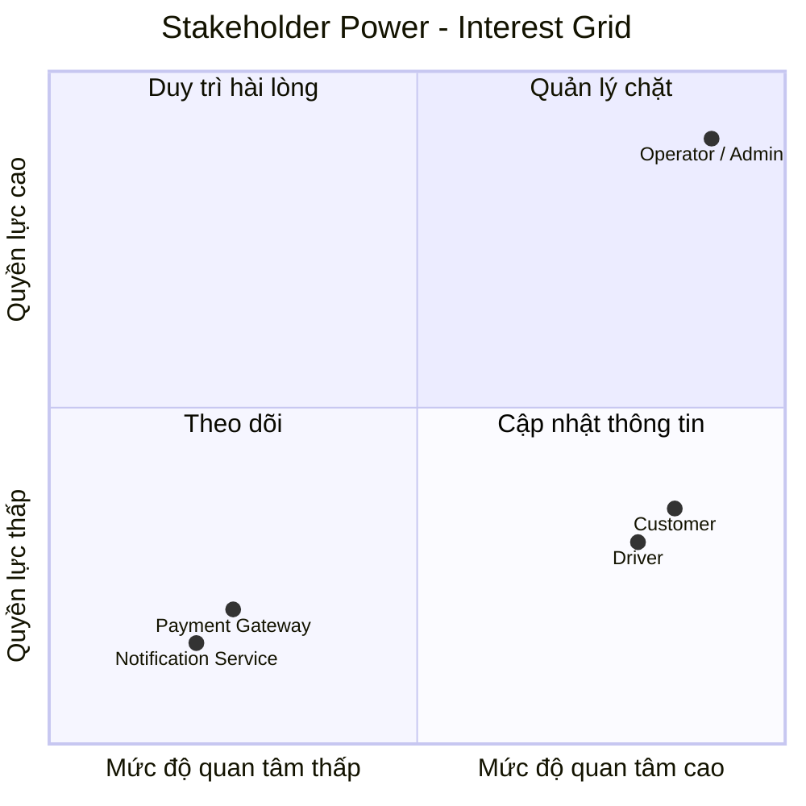
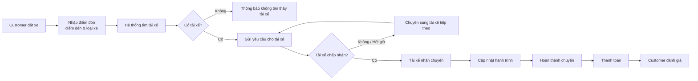
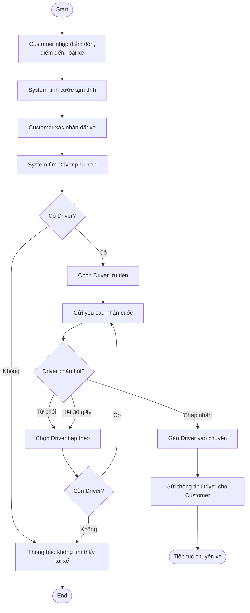

# Phân tích nghiệp vụ – CAB System

> **Đồ án cá nhân – Phân tích và thiết kế hệ thống đặt xe**

## 1. Tổng quan

### 1.1. Bối cảnh nghiệp vụ

Công ty ABC cung cấp dịch vụ đặt xe trực tuyến, hiện vận hành thủ công qua tổng đài kết hợp ứng dụng sơ khai.

### 1.2. Vấn đề nghiệp vụ

- **Phân công thủ công:** Điều phối xe thủ công gây chậm trễ, sai sót và tắc nghẽn khi lượng đặt xe tăng cao.
- **Trải nghiệm kém:** Khách hàng không thể theo dõi vị trí thực tế của tài xế, thời gian chờ hoặc trạng thái chuyến đi theo thời gian thực.
- **Dữ liệu phân mảnh:** Dữ liệu thanh toán, chuyến đi và hồ sơ tài xế chưa được đồng bộ tập trung.
- **Khó mở rộng:** Đội ngũ vận hành quá tải khi mở rộng quy mô phương tiện và địa bàn kinh doanh.

### 1.3. Câu hỏi phân tích ban đầu

1. Khách hàng muốn giải quyết vấn đề gì thông qua hệ thống mới?
2. Tại sao hệ thống cũ không đáp ứng được mà cần xây dựng hệ thống mới?
3. Ai tham gia sử dụng hệ thống?

---

## 2. Stakeholder

### 2.1. Danh sách stakeholder và vai trò

| Stakeholder | Vai trò |
|---|---|
| **Customer** | Đăng ký/đăng nhập, đặt chuyến, theo dõi chuyến, thanh toán và đánh giá tài xế. |
| **Driver** | Quản lý trạng thái sẵn sàng, nhận/từ chối cuốc và cập nhật trạng thái chuyến. |
| **Operator / Admin** | Quản lý dữ liệu khách hàng, tài xế, phương tiện; giám sát chuyến và xem báo cáo. |
| **Payment Gateway** | Xử lý thanh toán trực tuyến và trả kết quả giao dịch. |
| **Notification Service** | Gửi thông báo đến khách hàng và tài xế. |

### 2.2. Stakeholder Matrix

| Stakeholder | Quyền lực | Mức độ quan tâm | Cách quản lý |
|---|:---:|:---:|---|
| **Operator / Admin** | Cao | Cao | Manage Closely |
| **Customer** | Thấp | Cao | Keep Informed |
| **Driver** | Thấp | Cao | Keep Informed |
| **Payment Gateway** | Thấp | Thấp | Monitor |
| **Notification Service** | Thấp | Thấp | Monitor |

### 2.3. Stakeholder Power–Interest Grid

> **Lưu ý:** Sơ đồ trên dùng đúng hai trục **Quyền lực (Power)** và **Mức độ quan tâm (Interest)**. Đây là cách thể hiện phù hợp hơn so với việc dùng “tầm quan trọng” làm một trục.

---

## 3. Business Goal

| Mã BG | Business Problem | Business Goal |
|---|---|---|
| **BG01** | Phân công tài xế chủ yếu làm thủ công, mất nhiều thời gian. | Tự động hóa quá trình tìm kiếm và điều phối tài xế gần khách hàng. |
| **BG02** | Khách hàng khó theo dõi trạng thái chuyến đi và thời gian chờ. | Minh bạch hóa thông tin hành trình và thời gian xe đến. |
| **BG03** | Khách hàng phải tạo lại yêu cầu nếu tài xế đầu tiên từ chối. | Tự động chuyển tiếp chuyến cho tài xế khác. |
| **BG04** | Thông tin thanh toán chưa được quản lý tập trung, phụ thuộc tiền mặt. | Chuẩn hóa tính cước và hỗ trợ thanh toán tiền mặt/trực tuyến. |
| **BG05** | Bộ phận vận hành gặp khó khăn khi mở rộng quy mô. | Tối ưu hóa giám sát, quản lý dữ liệu và xử lý sự cố. |
| **BG06** | Ban lãnh đạo thiếu dữ liệu đánh giá hoạt động. | Cung cấp thống kê về doanh thu, chuyến đi và đánh giá tài xế. |

---

## 4. Phạm vi hệ thống MVP

### 4.1. In-Scope và Out-of-Scope

| Phân hệ | In-Scope – MVP | Out-of-Scope |
|---|---|---|
| **Tài khoản & Phân quyền** | Đăng ký, đăng nhập; cập nhật thông tin; phân quyền Customer/Driver/Admin. | Đăng nhập mạng xã hội, sinh trắc học, KYC nâng cao. |
| **Đặt xe & Khớp chuyến** | Nhập điểm đón/điểm đến; chọn loại xe; tìm tài xế gần nhất; chuyển cuốc khi tài xế từ chối/hết thời gian. | Đặt lịch trước, carpooling, surge pricing nâng cao. |
| **Theo dõi chuyến** | Theo dõi trạng thái chuyến; mô phỏng GPS và ETA cơ bản. | VoIP, điều hướng tránh tắc đường nâng cao. |
| **Thanh toán & Cước phí** | Tính cước cơ bản; tiền mặt; tích hợp mock/sandbox cổng thanh toán. | Nhiều cổng thanh toán đồng thời, ví nội bộ, voucher phức tạp. |
| **Đánh giá & Lịch sử** | Đánh giá 1–5 sao; xem lịch sử chuyến. | Rank tài xế, hoàn tiền tự động. |
| **Quản trị & Vận hành** | Quản lý Customer/Driver/Vehicle; giám sát chuyến; báo cáo cơ bản. | Chấm công chi tiết, Call Center, RBAC chuyên sâu. |

### 4.2. Core Flow của MVP

### 4.3. Nguyên tắc MVP

**Luồng chính:**

> Khách đặt xe → Hệ thống tìm tài xế → Tài xế nhận cuốc → Cập nhật lộ trình → Hoàn thành chuyến → Thanh toán → Đánh giá.

Các tính năng phụ như khuyến mãi, chat nội bộ, gọi tổng đài và ví tiền phức tạp được loại khỏi MVP.

---

## 5. Business Requirement

| Mã BR | Tên Business Requirement | Diễn giải |
|---|---|---|
| **BR01** | Đặt chuyến xe | Hệ thống cho phép Customer tạo yêu cầu đặt xe bằng điểm đón, điểm đến và loại xe. |
| **BR02** | Tìm và phân công tài xế | Hệ thống hỗ trợ tìm và phân công tài xế phù hợp dựa trên vị trí và trạng thái sẵn sàng. |
| **BR03** | Nhận và xử lý cuốc xe | Hệ thống cho phép Driver nhận hoặc từ chối cuốc xe. |
| **BR04** | Theo dõi chuyến xe | Hệ thống cho phép Customer theo dõi trạng thái chuyến từ lúc tìm tài xế đến khi hoàn thành. |
| **BR05** | Cập nhật trạng thái chuyến | Driver cập nhật các trạng thái: đã đến điểm đón, đã đón khách, đang di chuyển và hoàn thành. |
| **BR06** | Tính cước và thanh toán | Hệ thống tính cước và hỗ trợ thanh toán tiền mặt hoặc trực tuyến. |
| **BR07** | Đánh giá tài xế | Customer đánh giá Driver sau khi hoàn thành chuyến. |
| **BR08** | Quản lý tài khoản | Customer và Driver đăng ký, đăng nhập và cập nhật thông tin cá nhân. |
| **BR09** | Quản lý và giám sát | Admin quản lý Customer, Driver, phương tiện và theo dõi chuyến đang hoạt động. |
| **BR10** | Thông báo | Hệ thống gửi thông báo về các sự kiện quan trọng của chuyến xe và thanh toán. |
| **BR11** | Lịch sử chuyến đi | Customer xem lại các chuyến đã hoàn thành và số tiền đã thanh toán. |
| **BR12** | Báo cáo hoạt động | Admin xem thống kê số chuyến, doanh thu và tỷ lệ hoàn thành. |

---

## 6. Business Process

### BP01 – Quy trình Đặt chuyến xe và Điều phối tự động

**Tác nhân:** Customer, Driver, System.

**Luồng chính:**

1. Customer chọn **điểm đón, điểm đến và loại xe**.
2. System tính khoảng cách và hiển thị cước phí tạm tính.
3. Customer xác nhận đặt xe.
4. System tìm các Driver:
   - Đang **ONLINE/AVAILABLE**.
   - Đúng loại xe.
   - Trong bán kính quy định.
5. Nếu **không có Driver**, System thông báo không tìm thấy tài xế và kết thúc yêu cầu.
6. Nếu **có Driver**, System ưu tiên tài xế phù hợp và gửi yêu cầu nhận cuốc.
7. Driver có **30 giây** để phản hồi.
8. Nếu Driver **từ chối hoặc hết thời gian**, System chuyển yêu cầu sang Driver tiếp theo.
9. Nếu Driver **chấp nhận**, System gán Driver vào chuyến và gửi thông tin tài xế cho Customer.
10. Chuyến xe tiếp tục sang quá trình thực hiện và hoàn thành chuyến.

### BP01 – Activity Diagram

---

## 7. Kết luận phạm vi hiện tại

Tài liệu hiện tập trung vào các nội dung đã có dữ liệu:

- Phân tích bối cảnh và vấn đề nghiệp vụ.
- Xác định Stakeholder.
- Stakeholder Matrix.
- Business Goal.
- Phạm vi MVP.
- Business Requirement.
- Business Process.

**Các phần chưa có nội dung đủ để hoàn thiện sẽ không tự suy diễn thêm.** Có thể bổ sung tiếp ở các bước sau khi có yêu cầu hoặc dữ liệu cụ thể từ đề tài.
