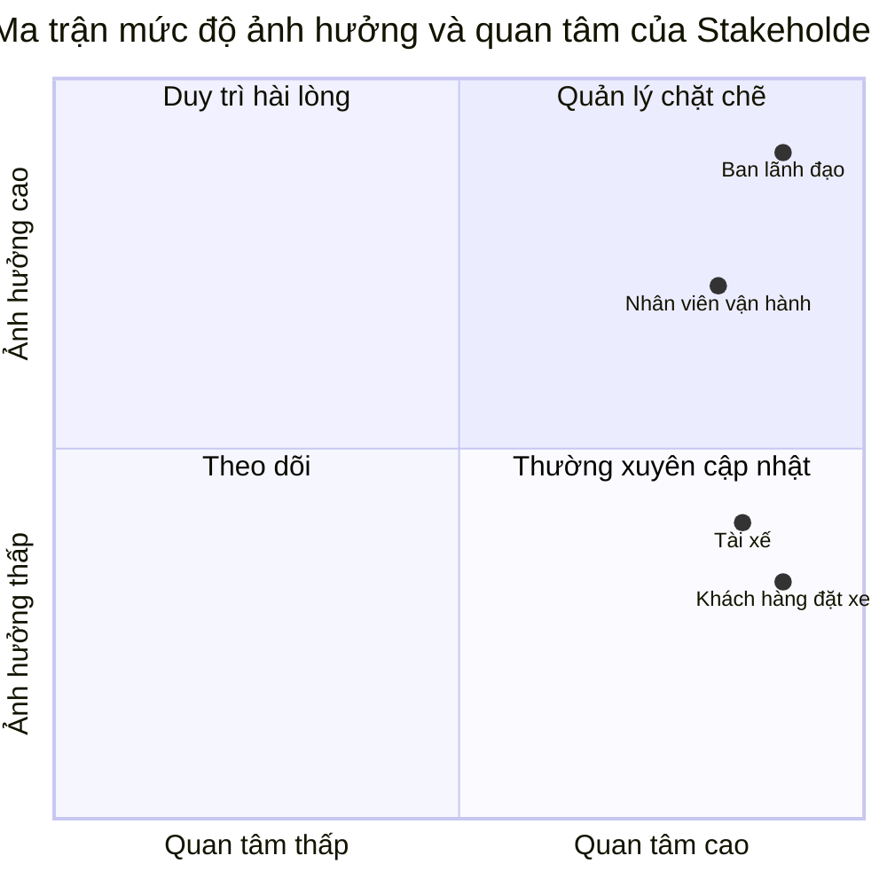

# PHÂN TÍCH YÊU CẦU HỆ THỐNG CAB SYSTEM

## Bước 1. Phân tích sơ khởi và ngữ cảnh nghiệp vụ

### 1.1. Bối cảnh nghiệp vụ

Công ty ABC đang cung cấp dịch vụ đặt xe trực tuyến. Hiện nay, khách hàng có thể liên hệ tổng đài hoặc sử dụng một ứng dụng đơn giản để yêu cầu xe. Tuy nhiên, quá trình phân công tài xế vẫn được thực hiện chủ yếu bằng phương pháp thủ công.

Công ty muốn xây dựng CAB System nhằm hỗ trợ quản lý quy trình đặt xe từ khi khách hàng tạo yêu cầu, hệ thống tìm tài xế, tài xế thực hiện chuyến, tính cước, thanh toán đến đánh giá sau chuyến đi.

CAB System được xây dựng trong thời gian 7 tuần và triển khai dưới dạng một hệ thống MVP. Hệ thống tập trung vào các chức năng cơ bản có thể triển khai và minh họa được bằng Node.js.

### 1.2. Vấn đề nghiệp vụ hiện tại

Hệ thống hiện tại tồn tại các vấn đề sau:

1. Việc tìm kiếm và phân công tài xế chủ yếu được thực hiện thủ công.
2. Khách hàng khó theo dõi trạng thái hiện tại của chuyến đi.
3. Khách hàng không biết tài xế nào đã nhận chuyến.
4. Tài xế chưa có quy trình thống nhất để nhận, từ chối và cập nhật chuyến đi.
5. Thông tin chuyến đi và thanh toán chưa được quản lý tập trung.
6. Nhân viên vận hành khó theo dõi các chuyến đang thực hiện.
7. Việc xử lý trường hợp tài xế từ chối hoặc không có tài xế phù hợp chưa hiệu quả.
8. Doanh nghiệp gặp khó khăn khi cần thống kê số chuyến, doanh thu và tỷ lệ hủy.

### 1.3. Vấn đề doanh nghiệp muốn giải quyết

Doanh nghiệp muốn hệ thống mới có thể:

- Quản lý tài khoản khách hàng, tài xế và nhân viên vận hành.
- Cho phép khách hàng tạo yêu cầu đặt xe.
- Tự động tìm tài xế phù hợp với yêu cầu.
- Cho phép tài xế chấp nhận hoặc từ chối chuyến.
- Theo dõi trạng thái chuyến đi.
- Tính và lưu cước phí của chuyến.
- Ghi nhận kết quả thanh toán.
- Cho phép khách hàng đánh giá tài xế.
- Hỗ trợ nhân viên vận hành theo dõi và thống kê hoạt động.

### 1.4. Tại sao cần xây dựng hệ thống mới?

Hệ thống hiện tại phụ thuộc nhiều vào việc phân công tài xế thủ công và chưa quản lý tập trung toàn bộ quy trình chuyến đi.

CAB System mới giúp tự động hóa một phần quá trình tìm tài xế, chuẩn hóa trạng thái chuyến đi và lưu trữ dữ liệu tập trung. Nhờ đó, khách hàng, tài xế và nhân viên vận hành có thể phối hợp thông qua cùng một hệ thống.

### 1.5. Người tham gia sử dụng hệ thống

#### Khách hàng

- Đăng ký và đăng nhập.
- Cập nhật thông tin cá nhân.
- Tạo yêu cầu đặt xe.
- Theo dõi trạng thái chuyến.
- Thanh toán.
- Xem lịch sử chuyến.
- Đánh giá tài xế.

#### Tài xế

- Đăng nhập.
- Cập nhật hồ sơ và phương tiện.
- Thay đổi trạng thái hoạt động.
- Nhận thông tin chuyến mới.
- Chấp nhận hoặc từ chối chuyến.
- Cập nhật trạng thái chuyến đi.
- Xem lịch sử chuyến.

#### Nhân viên vận hành

- Quản lý khách hàng và tài xế.
- Theo dõi các chuyến đi.
- Kiểm tra trạng thái của tài xế.
- Tra cứu lịch sử chuyến và giao dịch.
- Xem báo cáo hoạt động cơ bản.

### 1.6. Câu hỏi cần làm rõ

1. Hệ thống sẽ hỗ trợ những loại xe nào trong phiên bản MVP?
2. Phí mở cửa và giá tiền trên mỗi kilomet của từng loại xe là bao nhiêu?
3. Khoảng cách chuyến đi được nhập sẵn hay tính từ tọa độ?
4. Phạm vi tìm kiếm tài xế tối đa là bao nhiêu?
5. Khi có nhiều tài xế phù hợp, hệ thống ưu tiên khoảng cách hay điểm đánh giá?
6. Tài xế được phép từ chối chuyến bao nhiêu lần?
7. Sau bao nhiêu lần tìm thất bại thì hệ thống thông báo không có tài xế?
8. Khách hàng được hủy chuyến ở những trạng thái nào?
9. Tài xế được hủy chuyến sau khi đã chấp nhận hay không?
10. Việc hủy chuyến có phát sinh phí không?
11. Thanh toán điện tử trong MVP được mô phỏng theo những kết quả nào?
12. Khách hàng được đánh giá tài xế trong khoảng điểm nào?
13. Nhân viên vận hành có được sửa hoặc hủy chuyến hay chỉ được theo dõi?
14. Báo cáo MVP cần hiển thị những số liệu nào?

## Bước 2. Xác định Stakeholder

### 2.1. Khái niệm Stakeholder

Stakeholder là cá nhân hoặc nhóm người có liên quan, bị ảnh hưởng hoặc có khả năng tác động đến quá trình xây dựng và vận hành hệ thống.

Trong CAB System, stakeholder bao gồm người trực tiếp sử dụng hệ thống và người có quyền quyết định về yêu cầu, phạm vi và kết quả của dự án.

### 2.2. Danh sách Stakeholder

| Mã | Stakeholder | Vai trò và nhu cầu | Mức ảnh hưởng | Mức quan tâm | Cách quản lý |
|---|---|---|---|---|---|
| STK01 | Khách hàng đặt xe | Đặt chuyến, theo dõi trạng thái, thanh toán, xem lịch sử và đánh giá tài xế | Thấp – Trung bình | Cao | Thường xuyên cập nhật thông tin và tiếp nhận phản hồi |
| STK02 | Tài xế | Quản lý trạng thái hoạt động, nhận hoặc từ chối chuyến và cập nhật quá trình thực hiện chuyến | Thấp – Trung bình | Cao | Thường xuyên cập nhật thông tin và tiếp nhận phản hồi |
| STK03 | Nhân viên vận hành | Quản lý khách hàng, tài xế, phương tiện, theo dõi chuyến và hỗ trợ xử lý trường hợp bất thường | Cao | Cao | Tham gia chặt chẽ vào quá trình phân tích, kiểm thử và xác nhận quy trình |
| STK04 | Ban lãnh đạo Công ty ABC | Xác định mục tiêu, quyết định phạm vi, theo dõi hiệu quả và nghiệm thu hệ thống | Cao | Cao | Quản lý chặt chẽ và xác nhận các yêu cầu quan trọng |

### 2.3. Phân tích Stakeholder

#### STK01 – Khách hàng đặt xe

Khách hàng là người trực tiếp tạo và sử dụng dịch vụ đặt xe. Khách hàng cần đăng ký, đăng nhập, tạo yêu cầu đặt xe, theo dõi trạng thái chuyến, thanh toán, xem lịch sử và đánh giá tài xế sau khi chuyến hoàn thành.

Khách hàng có mức quan tâm cao vì chất lượng hệ thống ảnh hưởng trực tiếp đến trải nghiệm đặt xe. Tuy nhiên, từng khách hàng riêng lẻ không có quyền quyết định phạm vi hoặc quy tắc của dự án nên có mức ảnh hưởng thấp đến trung bình.

#### STK02 – Tài xế

Tài xế là người tiếp nhận và thực hiện chuyến đi. Tài xế cần quản lý hồ sơ, phương tiện và trạng thái hoạt động; đồng thời có thể chấp nhận, từ chối và cập nhật trạng thái chuyến.

Tài xế có mức quan tâm cao vì hệ thống ảnh hưởng trực tiếp đến quá trình nhận và thực hiện chuyến. Tuy nhiên, tài xế không trực tiếp quyết định phạm vi dự án nên có mức ảnh hưởng thấp đến trung bình.

#### STK03 – Nhân viên vận hành

Nhân viên vận hành theo dõi hoạt động hằng ngày của hệ thống. Họ cần quản lý thông tin khách hàng, tài xế, phương tiện, chuyến đi và hỗ trợ xử lý những trường hợp bất thường.

Nhân viên vận hành có mức quan tâm và ảnh hưởng cao vì họ hiểu rõ quy trình điều phối thực tế. Ý kiến của họ có thể làm thay đổi quy trình quản lý tài xế, theo dõi chuyến và xử lý sự cố.

#### STK04 – Ban lãnh đạo Công ty ABC

Ban lãnh đạo xác định mục tiêu, phê duyệt phạm vi và nghiệm thu kết quả cuối cùng. Ban lãnh đạo cũng cần theo dõi các số liệu như số lượng chuyến, doanh thu, tỷ lệ hoàn thành và tỷ lệ hủy.

Đây là stakeholder có mức ảnh hưởng cao nhất vì có quyền xác nhận yêu cầu và quyết định hệ thống có đáp ứng mục tiêu của doanh nghiệp hay không.

### 2.4. Stakeholder Matrix

Stakeholder Matrix được xây dựng dựa trên hai tiêu chí:

- Trục ngang thể hiện mức độ quan tâm đối với hệ thống.
- Trục dọc thể hiện mức độ ảnh hưởng đến yêu cầu và quyết định của dự án.

Các tọa độ trong biểu đồ chỉ thể hiện vị trí tương đối giữa các stakeholder, không phải kết quả của một cuộc khảo sát định lượng.

### 2.5. Kết luận

Ban lãnh đạo và nhân viên vận hành thuộc nhóm có mức quan tâm và ảnh hưởng cao nên cần được quản lý chặt chẽ trong suốt dự án.

Khách hàng và tài xế có mức quan tâm cao nhưng mức ảnh hưởng thấp hơn. Hai nhóm này cần được thường xuyên cập nhật và lấy ý kiến để bảo đảm các chức năng đặt xe và thực hiện chuyến phù hợp với nhu cầu sử dụng thực tế.
