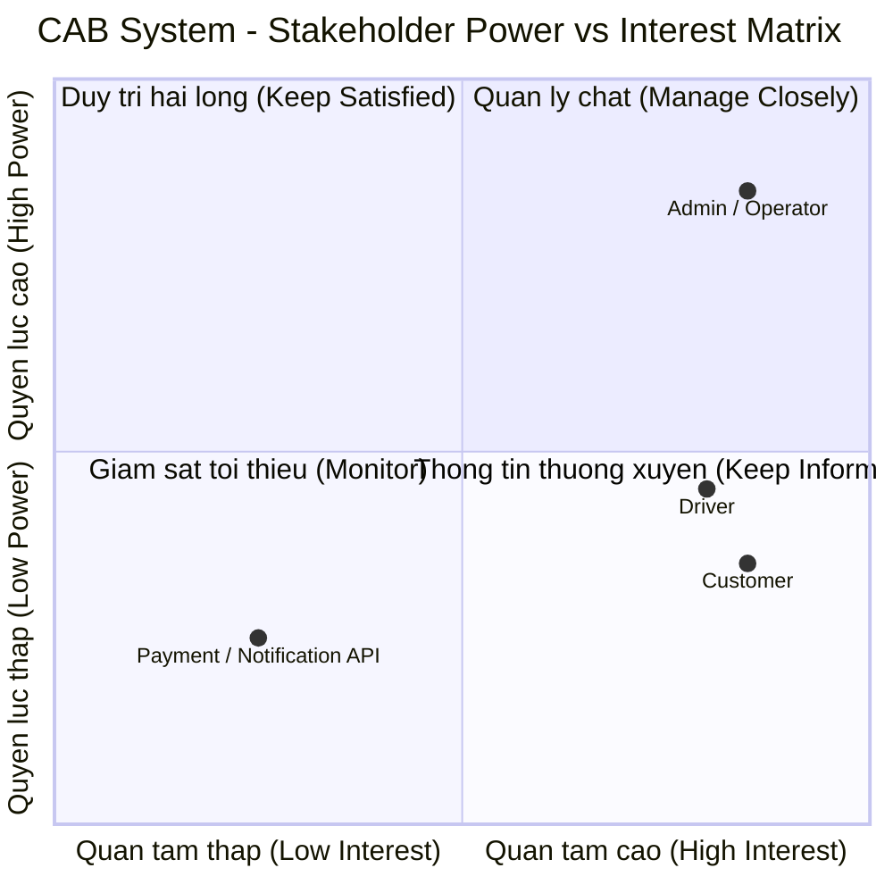

Bước 1 - Yêu cầu: Đọc và phân tích sơ khởi của khách hàng giai đoạn 1 ( ngữ cảnh nghiệp vụ )xác định vấn đề nghiệp vụ là gì, tự phân tích đặt ra 1 số câu hỏi khách hàng muốn giải quyết vấn đề gì tại sao hệ thống không làm được mà phải sử dụng hệ thống mới ai tham gia sử dụng hệ thống này ?  

Giai đoạn 1 – Ngữ cảnh nghiệp vụ, mình sẽ phân tích ở mức sơ khởi.
1. Bối cảnh & Vấn đề nghiệp vụ là gì?
Bối cảnh doanh nghiệp: Công ty ABC là doanh nghiệp cung cấp dịch vụ đặt xe trực tuyến, hiện đang vận hành qua tổng đài và một ứng dụng sơ khai.
Các vấn đề nghiệp vụ cốt lõi hiện tại:
Phân công thủ công: Việc gán tài xế cho chuyến đi chủ yếu do con người điều phối, gây chậm trễ, dễ sai sót và không đáp ứng được khi lượng đặt xe tăng cao.
Trải nghiệm khách hàng kém: Khách hàng không thể theo dõi vị trí thực tế của tài xế, thời gian chờ, trạng thái chuyến đi theo thời gian thực.
Dữ liệu phân mảnh, thiếu tập trung: Thông tin thanh toán, dữ liệu chuyến đi, hồ sơ tài xế chưa được quản lý đồng bộ.
Khó khăn trong mở rộng & vận hành: Quy trình thủ công khiến đội ngũ vận hành quá tải khi muốn mở rộng quy mô kinh doanh hoặc tăng số lượng phương tiện/tài xế.
2. Tự đặt câu hỏi
Câu hỏi 1: Khách hàng muốn giải quyết vấn đề gì thông qua hệ thống mới?
Câu hỏi 2: Tại sao hệ thống cũ không làm được mà bắt buộc phải xây dựng hệ thống mới?
Câu hỏi 3: Ai tham gia sử dụng hệ thống này? (Các tác nhân / Stakeholders)

Bước 2 - Xác định stack holder trong yêu cầu khách hàng
Tên stack holder: customer, 
Vai trò của stack holder
Customer: đặt xe, thanh toán
Lập ra một ma trận stack holder magic ( cho biết tầm ảnh hưởng quan trọng của stack holder trong hệ thống) công cụ mermaid github vẽ lược đồ sơ đồ trong md
stack holder table - stack holder magic biết tầm quan trọng vai trò trong hệ thống

DANH SÁCH STAKEHOLDERS VÀ VAI TRÒ (CAB SYSTEM)
1. Customer (Khách hàng)
Đăng ký & Đăng nhập: Tạo tài khoản và cập nhật thông tin cá nhân.
Đặt chuyến xe: Nhập điểm đón, điểm đến, chọn loại xe và gửi yêu cầu đặt xe.
Theo dõi chuyến đi: Xem tài xế nhận chuyến, thời gian xe đến và vị trí xe trên bản đồ.
Thanh toán & Đánh giá: Trả tiền mặt hoặc thanh toán online; xem lại lịch sử chuyến và chấm điểm/đánh giá tài xế.
2. Driver (Tài xế)
Quản lý trạng thái: Đăng nhập, cập nhật xe và bật/tắt chế độ sẵn sàng nhận khách.
Nhận cuốc xe: Nhận thông báo cuốc mới, chọn chấp nhận hoặc từ chối.
Cập nhật hành trình: Bấm chuyển trạng thái (Đã đến điểm đón => Đã đón khách => Đang di chuyển => Hoàn thành).  
3. Operator / Admin (Nhân viên vận hành & Quản trị viên)
Quản lý dữ liệu: Xem danh sách, thêm/sửa/khóa tài khoản khách hàng, tài xế và phương tiện.  
Giám sát & Hỗ trợ: Theo dõi các cuốc xe đang chạy, can thiệp xử lý khi chuyến bị lỗi hoặc hủy.  
Thống kê báo cáo: Xem tổng quan số chuyến đi, doanh thu và tỷ lệ hoàn thành chuyến.  
4. Hệ thống bên ngoài (External Services)
Cổng thanh toán (Payment Gateway): Nhận yêu cầu thanh toán online và trả kết quả thành công/thất bại về hệ thống.  
Dịch vụ thông báo (Notification Service): Gửi thông báo đẩy (Push notification/SMS) khi có tài xế nhận chuyến hoặc hoàn thành đơn. 

