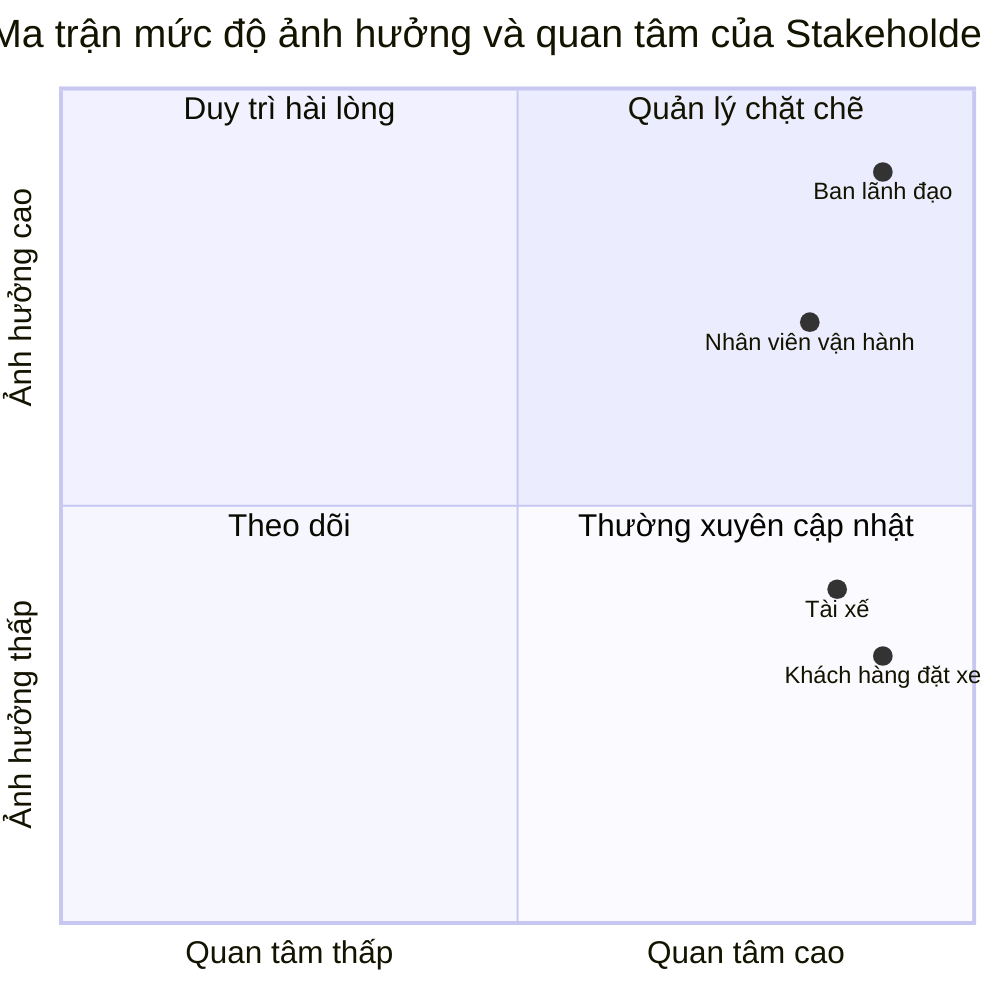
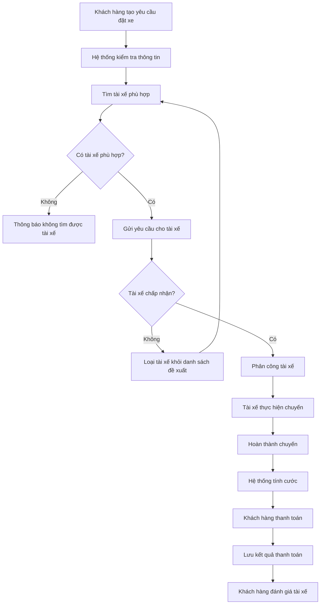

# PHÂN TÍCH YÊU CẦU HỆ THỐNG CAB SYSTEM

## Bước 1. Phân tích sơ khởi và ngữ cảnh nghiệp vụ

### 1.1. Bối cảnh nghiệp vụ

Công ty ABC đang cung cấp dịch vụ đặt xe trực tuyến. Hiện nay, khách hàng có thể liên hệ tổng đài hoặc sử dụng một ứng dụng đơn giản để yêu cầu xe. Tuy nhiên, quá trình phân công tài xế vẫn được thực hiện chủ yếu bằng phương pháp thủ công.

Công ty muốn xây dựng CAB System nhằm hỗ trợ quản lý quy trình đặt xe từ khi khách hàng tạo yêu cầu, hệ thống tìm tài xế, tài xế thực hiện chuyến, tính cước, thanh toán đến đánh giá sau chuyến đi.

CAB System được xây dựng trong thời gian 7 tuần và triển khai dưới dạng một hệ thống MVP. Hệ thống tập trung vào các chức năng cơ bản có thể triển khai và minh họa được bằng Node.js.

### 1.2. Vấn đề nghiệp vụ hiện tại

Hệ thống hiện tại tồn tại các vấn đề sau:

1. Việc tìm kiếm và phân công tài xế chủ yếu được thực hiện thủ công.
2. Khách hàng khó theo dõi trạng thái hiện tại của chuyến đi.
3. Khách hàng không biết tài xế nào đã nhận chuyến.
4. Tài xế chưa có quy trình thống nhất để nhận, từ chối và cập nhật chuyến đi.
5. Thông tin chuyến đi và thanh toán chưa được quản lý tập trung.
6. Nhân viên vận hành khó theo dõi các chuyến đang thực hiện.
7. Việc xử lý trường hợp tài xế từ chối hoặc không có tài xế phù hợp chưa hiệu quả.
8. Doanh nghiệp gặp khó khăn khi cần thống kê số chuyến, doanh thu và tỷ lệ hủy.

### 1.3. Vấn đề doanh nghiệp muốn giải quyết

Doanh nghiệp muốn hệ thống mới có thể:

- Quản lý tài khoản khách hàng, tài xế và nhân viên vận hành.
- Cho phép khách hàng tạo yêu cầu đặt xe.
- Tự động tìm tài xế phù hợp với yêu cầu.
- Cho phép tài xế chấp nhận hoặc từ chối chuyến.
- Theo dõi trạng thái chuyến đi.
- Tính và lưu cước phí của chuyến.
- Ghi nhận kết quả thanh toán.
- Cho phép khách hàng đánh giá tài xế.
- Hỗ trợ nhân viên vận hành theo dõi và thống kê hoạt động.

### 1.4. Tại sao cần xây dựng hệ thống mới?

Hệ thống hiện tại phụ thuộc nhiều vào việc phân công tài xế thủ công và chưa quản lý tập trung toàn bộ quy trình chuyến đi.

CAB System mới giúp tự động hóa một phần quá trình tìm tài xế, chuẩn hóa trạng thái chuyến đi và lưu trữ dữ liệu tập trung. Nhờ đó, khách hàng, tài xế và nhân viên vận hành có thể phối hợp thông qua cùng một hệ thống.

### 1.5. Người tham gia sử dụng hệ thống

#### Khách hàng

- Đăng ký và đăng nhập.
- Cập nhật thông tin cá nhân.
- Tạo yêu cầu đặt xe.
- Theo dõi trạng thái chuyến.
- Thanh toán.
- Xem lịch sử chuyến.
- Đánh giá tài xế.

#### Tài xế

- Đăng nhập.
- Cập nhật hồ sơ và phương tiện.
- Thay đổi trạng thái hoạt động.
- Nhận thông tin chuyến mới.
- Chấp nhận hoặc từ chối chuyến.
- Cập nhật trạng thái chuyến đi.
- Xem lịch sử chuyến.

#### Nhân viên vận hành

- Quản lý khách hàng và tài xế.
- Theo dõi các chuyến đi.
- Kiểm tra trạng thái của tài xế.
- Tra cứu lịch sử chuyến và giao dịch.
- Xem báo cáo hoạt động cơ bản.

### 1.6. Câu hỏi cần làm rõ

1. Hệ thống sẽ hỗ trợ những loại xe nào trong phiên bản MVP?
2. Phí mở cửa và giá tiền trên mỗi kilomet của từng loại xe là bao nhiêu?
3. Khoảng cách chuyến đi được nhập sẵn hay tính từ tọa độ?
4. Phạm vi tìm kiếm tài xế tối đa là bao nhiêu?
5. Khi có nhiều tài xế phù hợp, hệ thống ưu tiên khoảng cách hay điểm đánh giá?
6. Tài xế được phép từ chối chuyến bao nhiêu lần?
7. Sau bao nhiêu lần tìm thất bại thì hệ thống thông báo không có tài xế?
8. Khách hàng được hủy chuyến ở những trạng thái nào?
9. Tài xế được hủy chuyến sau khi đã chấp nhận hay không?
10. Việc hủy chuyến có phát sinh phí không?
11. Thanh toán điện tử trong MVP được mô phỏng theo những kết quả nào?
12. Khách hàng được đánh giá tài xế trong khoảng điểm nào?
13. Nhân viên vận hành có được sửa hoặc hủy chuyến hay chỉ được theo dõi?
14. Báo cáo MVP cần hiển thị những số liệu nào?

## Bước 2. Xác định Stakeholder

### 2.1. Khái niệm Stakeholder

Stakeholder là cá nhân hoặc nhóm người có liên quan, bị ảnh hưởng hoặc có khả năng tác động đến quá trình xây dựng và vận hành hệ thống.

Trong CAB System, stakeholder bao gồm người trực tiếp sử dụng hệ thống và người có quyền quyết định về yêu cầu, phạm vi và kết quả của dự án.

### 2.2. Danh sách Stakeholder

| Mã | Stakeholder | Vai trò và nhu cầu | Mức ảnh hưởng | Mức quan tâm | Cách quản lý |
|---|---|---|---|---|---|
| STK01 | Khách hàng đặt xe | Đặt chuyến, theo dõi trạng thái, thanh toán, xem lịch sử và đánh giá tài xế | Thấp – Trung bình | Cao | Thường xuyên cập nhật thông tin và tiếp nhận phản hồi |
| STK02 | Tài xế | Quản lý trạng thái hoạt động, nhận hoặc từ chối chuyến và cập nhật quá trình thực hiện chuyến | Thấp – Trung bình | Cao | Thường xuyên cập nhật thông tin và tiếp nhận phản hồi |
| STK03 | Nhân viên vận hành | Quản lý khách hàng, tài xế, phương tiện, theo dõi chuyến và hỗ trợ xử lý trường hợp bất thường | Cao | Cao | Tham gia chặt chẽ vào quá trình phân tích, kiểm thử và xác nhận quy trình |
| STK04 | Ban lãnh đạo Công ty ABC | Xác định mục tiêu, quyết định phạm vi, theo dõi hiệu quả và nghiệm thu hệ thống | Cao | Cao | Quản lý chặt chẽ và xác nhận các yêu cầu quan trọng |

### 2.3. Phân tích Stakeholder

#### STK01 – Khách hàng đặt xe

Khách hàng là người trực tiếp tạo và sử dụng dịch vụ đặt xe. Khách hàng cần đăng ký, đăng nhập, tạo yêu cầu đặt xe, theo dõi trạng thái chuyến, thanh toán, xem lịch sử và đánh giá tài xế sau khi chuyến hoàn thành.

Khách hàng có mức quan tâm cao vì chất lượng hệ thống ảnh hưởng trực tiếp đến trải nghiệm đặt xe. Tuy nhiên, từng khách hàng riêng lẻ không có quyền quyết định phạm vi hoặc quy tắc của dự án nên có mức ảnh hưởng thấp đến trung bình.

#### STK02 – Tài xế

Tài xế là người tiếp nhận và thực hiện chuyến đi. Tài xế cần quản lý hồ sơ, phương tiện và trạng thái hoạt động; đồng thời có thể chấp nhận, từ chối và cập nhật trạng thái chuyến.

Tài xế có mức quan tâm cao vì hệ thống ảnh hưởng trực tiếp đến quá trình nhận và thực hiện chuyến. Tuy nhiên, tài xế không trực tiếp quyết định phạm vi dự án nên có mức ảnh hưởng thấp đến trung bình.

#### STK03 – Nhân viên vận hành

Nhân viên vận hành theo dõi hoạt động hằng ngày của hệ thống. Họ cần quản lý thông tin khách hàng, tài xế, phương tiện, chuyến đi và hỗ trợ xử lý những trường hợp bất thường.

Nhân viên vận hành có mức quan tâm và ảnh hưởng cao vì họ hiểu rõ quy trình điều phối thực tế. Ý kiến của họ có thể làm thay đổi quy trình quản lý tài xế, theo dõi chuyến và xử lý sự cố.

#### STK04 – Ban lãnh đạo Công ty ABC

Ban lãnh đạo xác định mục tiêu, phê duyệt phạm vi và nghiệm thu kết quả cuối cùng. Ban lãnh đạo cũng cần theo dõi các số liệu như số lượng chuyến, doanh thu, tỷ lệ hoàn thành và tỷ lệ hủy.

Đây là stakeholder có mức ảnh hưởng cao nhất vì có quyền xác nhận yêu cầu và quyết định hệ thống có đáp ứng mục tiêu của doanh nghiệp hay không.

### 2.4. Stakeholder Matrix

Stakeholder Matrix được xây dựng dựa trên hai tiêu chí:

- Trục ngang thể hiện mức độ quan tâm đối với hệ thống.
- Trục dọc thể hiện mức độ ảnh hưởng đến yêu cầu và quyết định của dự án.

Các tọa độ trong biểu đồ chỉ thể hiện vị trí tương đối giữa các stakeholder, không phải kết quả của một cuộc khảo sát định lượng.

### 2.5. Kết luận

Ban lãnh đạo và nhân viên vận hành thuộc nhóm có mức quan tâm và ảnh hưởng cao nên cần được quản lý chặt chẽ trong suốt dự án.

Khách hàng và tài xế có mức quan tâm cao nhưng mức ảnh hưởng thấp hơn. Hai nhóm này cần được thường xuyên cập nhật và lấy ý kiến để bảo đảm các chức năng đặt xe và thực hiện chuyến phù hợp với nhu cầu sử dụng thực tế.

## Bước 3. Xác định mục tiêu nghiệp vụ

### 3.1. Khái niệm Business Goal

Business Goal là mục tiêu nghiệp vụ mà Công ty ABC muốn đạt được thông qua việc xây dựng CAB System.

Các mục tiêu được xác định dựa trên những vấn đề của hệ thống hiện tại và giới hạn triển khai của phiên bản MVP. Mỗi mục tiêu được ký hiệu bằng mã `BG`.

### 3.2. Danh sách Business Goal

| Mã | Mục tiêu nghiệp vụ | Vấn đề cần giải quyết | Kết quả mong đợi trong MVP |
|---|---|---|---|
| BG01 | Tự động hóa quá trình tìm và phân công tài xế | Việc tìm và phân công tài xế đang được thực hiện chủ yếu bằng phương pháp thủ công | Hệ thống có thể tìm tài xế đang sẵn sàng, đúng loại xe và chuyển yêu cầu cho tài xế phù hợp |
| BG02 | Chuẩn hóa và theo dõi quá trình thực hiện chuyến đi | Khách hàng và nhân viên vận hành khó theo dõi trạng thái hiện tại của chuyến | Mỗi chuyến đi được quản lý theo các trạng thái xác định từ khi tạo yêu cầu đến khi hoàn thành hoặc bị hủy |
| BG03 | Quản lý tập trung dữ liệu chuyến đi và thanh toán | Thông tin chuyến đi, cước phí và thanh toán chưa được quản lý tập trung | Hệ thống lưu được thông tin chuyến, cước phí, phương thức thanh toán và kết quả thanh toán |
| BG04 | Cải thiện khả năng xử lý các trường hợp đặt xe không thành công | Hệ thống hiện tại chưa xử lý hiệu quả khi tài xế từ chối hoặc không có tài xế phù hợp | Khi tài xế từ chối, hệ thống có thể tiếp tục tìm tài xế khác; khi không tìm được tài xế, khách hàng nhận được thông báo rõ ràng |
| BG05 | Hỗ trợ nhân viên vận hành theo dõi hoạt động | Nhân viên vận hành khó theo dõi khách hàng, tài xế và các chuyến đang diễn ra | Nhân viên vận hành có thể tra cứu người dùng, tài xế, chuyến đi và xem các báo cáo cơ bản |
| BG06 | Ghi nhận phản hồi sau chuyến đi | Doanh nghiệp chưa có dữ liệu tập trung để theo dõi đánh giá của khách hàng đối với tài xế | Khách hàng có thể đánh giá tài xế sau khi chuyến hoàn thành và hệ thống lưu lại kết quả đánh giá |

### 3.3. Phân tích Business Goal

#### BG01 – Tự động hóa quá trình tìm và phân công tài xế

Mục tiêu này giúp giảm sự phụ thuộc vào nhân viên vận hành khi có yêu cầu đặt xe. Trong phiên bản MVP, hệ thống tìm tài xế dựa trên trạng thái sẵn sàng, loại xe và tiêu chí ưu tiên đơn giản.

#### BG02 – Chuẩn hóa và theo dõi chuyến đi

Mỗi chuyến đi cần được quản lý bằng một chuỗi trạng thái thống nhất:

`SEARCHING → ACCEPTED → ARRIVED → IN_PROGRESS → COMPLETED`

Ngoài ra, chuyến có thể chuyển sang `CANCELLED` khi bị hủy theo quy định.

Việc chuẩn hóa trạng thái giúp khách hàng, tài xế và nhân viên vận hành cùng theo dõi một thông tin thống nhất.

#### BG03 – Quản lý tập trung chuyến đi và thanh toán

Hệ thống cần lưu trữ tập trung thông tin chuyến đi, cước phí và kết quả thanh toán. Trong MVP, hệ thống hỗ trợ thanh toán tiền mặt và thanh toán điện tử mô phỏng.

Mục tiêu này không bao gồm việc tích hợp cổng thanh toán hoặc ngân hàng thật.

#### BG04 – Xử lý trường hợp đặt xe không thành công

Khi tài xế được đề xuất từ chối chuyến, hệ thống không yêu cầu khách hàng tạo lại yêu cầu mà tiếp tục tìm tài xế khác.

Nếu không còn tài xế phù hợp, hệ thống kết thúc quá trình tìm kiếm và thông báo kết quả cho khách hàng.

#### BG05 – Hỗ trợ nhân viên vận hành

Nhân viên vận hành cần theo dõi được người dùng, tài xế và chuyến đi. Hệ thống cũng cung cấp báo cáo cơ bản gồm tổng số chuyến, số chuyến hoàn thành, số chuyến bị hủy và tổng doanh thu.

MVP không triển khai hệ thống phân tích dữ liệu hoặc báo cáo nâng cao.

#### BG06 – Ghi nhận phản hồi sau chuyến

Sau khi chuyến đi hoàn thành, khách hàng có thể gửi điểm đánh giá cho tài xế. Kết quả được lưu lại để hỗ trợ theo dõi chất lượng phục vụ và có thể được sử dụng làm tiêu chí tìm tài xế phù hợp.

### 3.4. Giới hạn của Business Goal

Các Business Goal trên chỉ áp dụng cho phạm vi MVP. Dự án không cam kết các mục tiêu như:

- Tự động điều phối tài xế bằng trí tuệ nhân tạo.
- Theo dõi GPS thời gian thực.
- Tích hợp cổng thanh toán thật.
- Hỗ trợ số lượng người dùng ở quy mô rất lớn.
- Phân tích dữ liệu và dự báo hoạt động nâng cao.

Những nội dung này chỉ có thể được xem xét trong các phiên bản phát triển sau.

## Bước 4. Xác định phạm vi hệ thống

### 4.1. Mục tiêu xác định phạm vi

CAB System được phát triển bởi một cá nhân trong thời gian 7 tuần. Vì vậy, phiên bản MVP tập trung vào quy trình đặt xe cơ bản có thể triển khai và demo hoàn chỉnh bằng Node.js.

Mọi chức năng nằm trong phạm vi phải được phân tích thành yêu cầu, triển khai trên hệ thống và có tình huống kiểm thử tương ứng.

### 4.2. Phạm vi triển khai của MVP

| Mã | Module | Chức năng trong phạm vi | Cách kiểm chứng khi demo |
|---|---|---|---|
| SC01 | Tài khoản và phân quyền | Đăng ký, đăng nhập và kiểm soát quyền theo ba vai trò: khách hàng, tài xế và nhân viên vận hành | Đăng nhập bằng từng tài khoản và kiểm tra chức năng được phép sử dụng |
| SC02 | Quản lý khách hàng | Xem và cập nhật thông tin cá nhân; xem lịch sử chuyến đi | Cập nhật hồ sơ và tra cứu các chuyến của một khách hàng |
| SC03 | Quản lý tài xế và phương tiện | Xem, cập nhật hồ sơ tài xế, thông tin phương tiện, loại xe và trạng thái hoạt động | Tài xế cập nhật phương tiện và chuyển trạng thái `AVAILABLE`, `BUSY` hoặc `OFFLINE` |
| SC04 | Đặt chuyến | Khách hàng nhập điểm đón, điểm đến, chọn loại xe và gửi yêu cầu đặt chuyến | Tạo một chuyến mới và kiểm tra dữ liệu được lưu |
| SC05 | Tìm và phân công tài xế | Tìm tài xế đang sẵn sàng, đúng loại xe và ưu tiên theo tiêu chí đơn giản | Chuẩn bị nhiều tài xế giả lập và kiểm tra tài xế phù hợp được lựa chọn |
| SC06 | Tiếp nhận chuyến | Tài xế xem yêu cầu mới, chấp nhận hoặc từ chối chuyến | Tài xế A từ chối và hệ thống chuyển yêu cầu sang tài xế B |
| SC07 | Quản lý trạng thái chuyến | Cập nhật các trạng thái tìm tài xế, đã chấp nhận, đã đến, đang thực hiện, hoàn thành hoặc đã hủy | Thực hiện một chuyến từ khi tạo đến khi hoàn thành |
| SC08 | Tính cước | Tính cước theo phí mở cửa, loại xe và khoảng cách chuyến đi | Nhập thông tin chuyến và kiểm tra số tiền được tính theo công thức |
| SC09 | Thanh toán | Ghi nhận thanh toán tiền mặt và mô phỏng kết quả thanh toán điện tử thành công hoặc thất bại | Thực hiện thanh toán và kiểm tra trạng thái giao dịch |
| SC10 | Thông báo trong hệ thống | Tạo và lưu thông báo liên quan đến kết quả tìm tài xế, trạng thái chuyến và thanh toán | Mở danh sách thông báo của khách hàng hoặc tài xế |
| SC11 | Đánh giá tài xế | Cho phép khách hàng đánh giá tài xế sau khi chuyến hoàn thành | Hoàn thành chuyến và gửi điểm đánh giá |
| SC12 | Vận hành và báo cáo | Nhân viên vận hành xem khách hàng, tài xế, chuyến đi và báo cáo cơ bản | Hiển thị tổng chuyến, chuyến hoàn thành, chuyến hủy và tổng doanh thu |

### 4.3. Quy trình nghiệp vụ nằm trong phạm vi

Phiên bản MVP tập trung vào một quy trình hoàn chỉnh:

1. Khách hàng đăng nhập.
2. Khách hàng tạo yêu cầu đặt xe.
3. Hệ thống tìm tài xế phù hợp.
4. Tài xế chấp nhận hoặc từ chối chuyến.
5. Nếu tài xế từ chối, hệ thống tìm tài xế tiếp theo.
6. Tài xế cập nhật trạng thái thực hiện chuyến.
7. Khi chuyến hoàn thành, hệ thống tính cước.
8. Khách hàng thanh toán.
9. Khách hàng đánh giá tài xế.
10. Nhân viên vận hành có thể tra cứu chuyến và xem báo cáo.

### 4.4. Phạm vi ngoài MVP

| Mã | Nội dung ngoài phạm vi | Lý do |
|---|---|---|
| OS01 | Theo dõi GPS thời gian thực | Yêu cầu bản đồ, thiết bị định vị và xử lý dữ liệu liên tục |
| OS02 | Hiển thị xe di chuyển trực tiếp trên bản đồ | Không cần thiết để chứng minh quy trình đặt xe cơ bản |
| OS03 | Tích hợp Google Maps hoặc dịch vụ bản đồ trả phí | MVP sử dụng địa điểm hoặc tọa độ giả lập |
| OS04 | Tích hợp ngân hàng, ví điện tử hoặc cổng thanh toán thật | MVP chỉ mô phỏng kết quả thanh toán điện tử |
| OS05 | Gửi SMS, email hoặc push notification thật | MVP chỉ lưu và hiển thị thông báo trong hệ thống |
| OS06 | Thuật toán AI điều phối tài xế | MVP sử dụng quy tắc tìm tài xế đơn giản |
| OS07 | Giá cước động theo thời tiết hoặc giờ cao điểm | MVP sử dụng công thức tính cước cố định theo loại xe |
| OS08 | Khuyến mãi, voucher và ví nội bộ | Không thuộc quy trình đặt xe cốt lõi |
| OS09 | Quản lý nhiều thành phố hoặc nhiều quốc gia | MVP chỉ sử dụng một khu vực dữ liệu giả lập |
| OS10 | Báo cáo và dự báo dữ liệu nâng cao | MVP chỉ cung cấp các số liệu tổng hợp cơ bản |
| OS11 | Triển khai microservice trên nhiều máy chủ | Các service được tổ chức thành module trong một ứng dụng Node.js |
| OS12 | Tự động mở rộng hạ tầng khi tải tăng | Không phù hợp với phạm vi và môi trường demo của dự án cá nhân |

### 4.5. Các quy ước đơn giản hóa trong MVP

- Vị trí khách hàng và tài xế được nhập hoặc tạo bằng dữ liệu giả lập.
- Khoảng cách được nhập sẵn hoặc tính bằng công thức đơn giản.
- Hệ thống chỉ hỗ trợ một số loại xe cơ bản.
- Việc tìm tài xế dựa trên trạng thái, loại xe và khoảng cách giả lập.
- Thanh toán điện tử chỉ mô phỏng kết quả thành công hoặc thất bại.
- Thông báo được lưu trong cơ sở dữ liệu và hiển thị trong hệ thống.
- Báo cáo chỉ gồm các phép đếm và tính tổng cơ bản.

### 4.6. Kết luận phạm vi

Phạm vi trên bảo đảm CAB System có thể minh họa một quy trình đặt xe hoàn chỉnh nhưng vẫn phù hợp với khả năng triển khai của một cá nhân trong thời gian 7 tuần.

Các chức năng trong phạm vi sẽ tiếp tục được chuyển thành Business Requirement, Functional Requirement, Use Case, Acceptance Criteria và Test Case. Các nội dung ngoài phạm vi không được xem là cam kết triển khai trong phiên bản MVP.

## Bước 5. Xây dựng Business Requirement

### 5.1. Khái niệm Business Requirement

Business Requirement là yêu cầu nghiệp vụ cấp cao mô tả khả năng mà CAB System phải cung cấp cho doanh nghiệp và người sử dụng.

Mỗi Business Requirement được ký hiệu bằng mã `BR`. Các yêu cầu này sẽ được phân rã thành Functional Requirement ở bước sau.

### 5.2. Danh sách Business Requirement

| Mã | Tên Business Requirement | Diễn giải |
|---|---|---|
| BR01 | Quản lý tài khoản và phân quyền | Hệ thống phải cho phép người dùng đăng ký, đăng nhập và sử dụng chức năng phù hợp với một trong ba vai trò: khách hàng, tài xế hoặc nhân viên vận hành. |
| BR02 | Quản lý hồ sơ người dùng và phương tiện | Hệ thống phải cho phép khách hàng cập nhật thông tin cá nhân; tài xế cập nhật hồ sơ, phương tiện, loại xe và trạng thái hoạt động. |
| BR03 | Tạo và theo dõi yêu cầu đặt xe | Hệ thống phải cho phép khách hàng tạo yêu cầu đặt xe bằng cách cung cấp điểm đón, điểm đến và loại xe; đồng thời theo dõi trạng thái của yêu cầu. |
| BR04 | Tìm kiếm và phân công tài xế | Hệ thống phải tìm tài xế đang sẵn sàng, có loại xe phù hợp và ưu tiên theo tiêu chí tìm kiếm đơn giản. Khi tài xế từ chối, hệ thống phải tiếp tục tìm tài xế khác. Nếu không có tài xế phù hợp, hệ thống phải thông báo cho khách hàng. |
| BR05 | Quản lý quá trình thực hiện chuyến | Hệ thống phải cho phép tài xế chấp nhận, từ chối và cập nhật trạng thái chuyến trong suốt quá trình thực hiện. Hệ thống phải lưu lại trạng thái hiện tại của mỗi chuyến đi. |
| BR06 | Tính cước và quản lý thanh toán | Sau khi chuyến hoàn thành, hệ thống phải tính cước theo loại xe và khoảng cách. Hệ thống phải hỗ trợ ghi nhận thanh toán tiền mặt và mô phỏng thanh toán điện tử thành công hoặc thất bại. |
| BR07 | Quản lý thông báo | Hệ thống phải tạo và lưu thông báo về các sự kiện quan trọng như tiếp nhận yêu cầu, tìm được tài xế, tài xế từ chối, không tìm được tài xế, chuyến hoàn thành và kết quả thanh toán. |
| BR08 | Quản lý lịch sử và đánh giá | Hệ thống phải cho phép khách hàng và tài xế xem lịch sử chuyến liên quan. Sau khi chuyến hoàn thành, khách hàng có thể đánh giá tài xế và hệ thống lưu lại kết quả đánh giá. |
| BR09 | Hỗ trợ vận hành và báo cáo | Hệ thống phải cho phép nhân viên vận hành tra cứu khách hàng, tài xế, phương tiện và chuyến đi; đồng thời xem báo cáo cơ bản về tổng số chuyến, chuyến hoàn thành, chuyến hủy và tổng doanh thu. |

### 5.3. Quan hệ giữa Business Goal và Business Requirement

| Business Goal | Business Requirement liên quan |
|---|---|
| BG01 – Tự động hóa quá trình tìm và phân công tài xế | BR02, BR03, BR04 |
| BG02 – Chuẩn hóa và theo dõi quá trình thực hiện chuyến | BR03, BR05, BR07 |
| BG03 – Quản lý tập trung chuyến đi và thanh toán | BR05, BR06, BR08 |
| BG04 – Xử lý trường hợp đặt xe không thành công | BR04, BR07 |
| BG05 – Hỗ trợ nhân viên vận hành theo dõi hoạt động | BR01, BR09 |
| BG06 – Ghi nhận phản hồi sau chuyến đi | BR08 |

### 5.4. Giới hạn của Business Requirement

Các Business Requirement trên không bao gồm:

- Theo dõi GPS thời gian thực.
- Tích hợp dịch vụ bản đồ thật.
- Tích hợp cổng thanh toán thật.
- Gửi SMS, email hoặc push notification thật.
- Thuật toán AI điều phối tài xế.
- Báo cáo và phân tích dữ liệu nâng cao.

Thanh toán điện tử và thông báo trong phiên bản MVP chỉ được triển khai dưới hình thức mô phỏng hoặc lưu dữ liệu trong hệ thống.

### 5.5. Kết luận

Chín Business Requirement trên bao phủ quy trình chính của CAB System, từ quản lý tài khoản, đặt xe, tìm tài xế, thực hiện chuyến, thanh toán đến đánh giá và báo cáo.

Mỗi Business Requirement là một cam kết thuộc phạm vi MVP và phải được phân rã thành chức năng có thể triển khai, kiểm thử và demo.

## Bước 6. Xây dựng Business Process

### 6.1. Khái niệm Business Process

Business Process mô tả trình tự các hoạt động nghiệp vụ được thực hiện để đạt được một kết quả cụ thể.

Trong CAB System, quy trình chính bắt đầu khi khách hàng tạo yêu cầu đặt xe và kết thúc khi chuyến được hoàn thành, thanh toán và đánh giá.

Mỗi Business Process được ký hiệu bằng mã `BP`.

### 6.2. Danh sách Business Process

| Mã | Tên quy trình | Người tham gia | Mô tả kết quả | BR liên quan |
|---|---|---|---|---|
| BP01 | Quản lý tài khoản và trạng thái tài xế | Khách hàng, tài xế, nhân viên vận hành | Người dùng đăng nhập được vào hệ thống; tài xế cập nhật trạng thái sẵn sàng nhận chuyến | BR01, BR02 |
| BP02 | Tạo yêu cầu và tìm tài xế | Khách hàng, tài xế | Khách hàng tạo yêu cầu và hệ thống tìm được tài xế phù hợp hoặc thông báo không có tài xế | BR03, BR04, BR07 |
| BP03 | Thực hiện chuyến đi | Khách hàng, tài xế | Tài xế chấp nhận chuyến và cập nhật chuyến đến khi hoàn thành hoặc bị hủy | BR05, BR07 |
| BP04 | Tính cước và thanh toán | Khách hàng, tài xế | Hệ thống tính cước và lưu kết quả thanh toán | BR06, BR07 |
| BP05 | Đánh giá và theo dõi hoạt động | Khách hàng, nhân viên vận hành | Khách hàng đánh giá tài xế; nhân viên vận hành tra cứu lịch sử và xem báo cáo | BR08, BR09 |

### 6.3. Quy trình nghiệp vụ tổng quát

### 6.4. Mô tả quy trình chính

#### Giai đoạn 1 – Chuẩn bị

1. Khách hàng đăng nhập vào hệ thống.
2. Tài xế đăng nhập và chuyển trạng thái sang `AVAILABLE`.
3. Hệ thống lưu trạng thái hoạt động hiện tại của tài xế.

#### Giai đoạn 2 – Tạo yêu cầu đặt xe

1. Khách hàng nhập điểm đón.
2. Khách hàng nhập điểm đến.
3. Khách hàng chọn loại xe.
4. Khách hàng gửi yêu cầu đặt xe.
5. Hệ thống kiểm tra tính đầy đủ của thông tin.
6. Hệ thống tạo chuyến với trạng thái `SEARCHING`.

#### Giai đoạn 3 – Tìm và phân công tài xế

1. Hệ thống tìm tài xế có trạng thái `AVAILABLE`.
2. Hệ thống chỉ chọn tài xế có loại xe phù hợp.
3. Hệ thống sắp xếp các tài xế theo tiêu chí ưu tiên.
4. Hệ thống gửi yêu cầu chuyến cho tài xế được chọn.
5. Tài xế chấp nhận hoặc từ chối yêu cầu.
6. Nếu tài xế từ chối, hệ thống tiếp tục tìm tài xế khác.
7. Nếu tài xế chấp nhận, hệ thống phân công tài xế cho chuyến.
8. Nếu không còn tài xế phù hợp, hệ thống thông báo cho khách hàng.

#### Giai đoạn 4 – Thực hiện chuyến

Sau khi tài xế chấp nhận, chuyến được cập nhật theo trình tự:

`ACCEPTED → ARRIVED → IN_PROGRESS → COMPLETED`

Trong trường hợp được phép hủy, chuyến chuyển sang trạng thái `CANCELLED`.

#### Giai đoạn 5 – Tính cước và thanh toán

1. Khi chuyến hoàn thành, hệ thống tính cước.
2. Khách hàng chọn tiền mặt hoặc thanh toán điện tử mô phỏng.
3. Hệ thống lưu phương thức và kết quả thanh toán.
4. Nếu thanh toán điện tử thất bại, khách hàng có thể thử lại hoặc chuyển sang tiền mặt.

#### Giai đoạn 6 – Sau chuyến đi

1. Chuyến hoàn thành được lưu vào lịch sử.
2. Khách hàng có thể đánh giá tài xế.
3. Tài xế chuyển về trạng thái `AVAILABLE`.
4. Nhân viên vận hành có thể tra cứu chuyến và xem báo cáo cơ bản.

### 6.5. Điểm bắt đầu và kết thúc quy trình

- Điểm bắt đầu: khách hàng gửi một yêu cầu đặt xe hợp lệ.
- Kết thúc thành công: chuyến hoàn thành, cước phí và kết quả thanh toán được lưu.
- Kết thúc không thành công: không tìm được tài xế hoặc chuyến bị hủy.

## Bước 7. Xây dựng Functional Requirement

### 7.1. Khái niệm Functional Requirement

Functional Requirement là yêu cầu mô tả một chức năng hoặc hành vi cụ thể mà hệ thống phải thực hiện.

Mỗi Functional Requirement được ký hiệu bằng mã `FR` và phải liên kết với một Business Requirement đã xác định ở Bước 5.

### 7.2. Functional Requirement của BR01 – Quản lý tài khoản và phân quyền

| Mã FR | BR liên quan | Tên chức năng | Mô tả |
|---|---|---|---|
| FR01 | BR01 | Đăng ký tài khoản | Hệ thống cho phép khách hàng và tài xế đăng ký tài khoản bằng các thông tin bắt buộc. |
| FR02 | BR01 | Đăng nhập | Hệ thống kiểm tra thông tin đăng nhập và trả về kết quả xác thực cho người dùng. |
| FR03 | BR01 | Kiểm soát quyền truy cập | Hệ thống giới hạn chức năng theo ba vai trò: khách hàng, tài xế và nhân viên vận hành. |

### 7.3. Functional Requirement của BR02 – Quản lý hồ sơ và phương tiện

| Mã FR | BR liên quan | Tên chức năng | Mô tả |
|---|---|---|---|
| FR04 | BR02 | Cập nhật hồ sơ khách hàng | Khách hàng có thể xem và cập nhật thông tin cá nhân của mình. |
| FR05 | BR02 | Cập nhật hồ sơ tài xế và phương tiện | Tài xế có thể cập nhật thông tin cá nhân, phương tiện, biển số và loại xe. |
| FR06 | BR02 | Cập nhật trạng thái tài xế | Tài xế có thể chuyển trạng thái hoạt động giữa `AVAILABLE` và `OFFLINE`. Hệ thống có thể chuyển tài xế sang `BUSY` khi tài xế nhận chuyến. |

### 7.4. Functional Requirement của BR03 – Tạo và theo dõi yêu cầu đặt xe

| Mã FR | BR liên quan | Tên chức năng | Mô tả |
|---|---|---|---|
| FR07 | BR03 | Tạo yêu cầu đặt xe | Khách hàng có thể tạo yêu cầu bằng cách nhập điểm đón, điểm đến và chọn loại xe. |
| FR08 | BR03 | Kiểm tra và lưu yêu cầu | Hệ thống kiểm tra dữ liệu bắt buộc, tạo mã chuyến và lưu chuyến với trạng thái `SEARCHING`. |
| FR09 | BR03 | Theo dõi trạng thái chuyến | Khách hàng có thể xem tài xế được phân công và trạng thái hiện tại của chuyến. |

### 7.5. Functional Requirement của BR04 – Tìm kiếm và phân công tài xế

| Mã FR | BR liên quan | Tên chức năng | Mô tả |
|---|---|---|---|
| FR10 | BR04 | Lọc tài xế phù hợp | Hệ thống chỉ tìm những tài xế có trạng thái `AVAILABLE` và có loại xe phù hợp với yêu cầu. |
| FR11 | BR04 | Sắp xếp tài xế | Hệ thống sắp xếp danh sách tài xế phù hợp theo khoảng cách giả lập; nếu khoảng cách bằng nhau thì ưu tiên điểm đánh giá cao hơn. |
| FR12 | BR04 | Gửi yêu cầu chuyến cho tài xế | Hệ thống gửi yêu cầu chuyến cho tài xế được lựa chọn và lưu trạng thái đề xuất. |
| FR13 | BR04 | Xử lý tài xế chấp nhận hoặc từ chối | Nếu tài xế chấp nhận, hệ thống phân công tài xế cho chuyến; nếu tài xế từ chối hoặc không phản hồi trong thời gian quy định, hệ thống chuyển sang tài xế tiếp theo. |
| FR14 | BR04 | Xử lý không tìm được tài xế | Nếu không còn tài xế phù hợp, hệ thống kết thúc quá trình tìm kiếm và thông báo cho khách hàng. |

### 7.6. Functional Requirement của BR05 – Quản lý quá trình thực hiện chuyến

| Mã FR | BR liên quan | Tên chức năng | Mô tả |
|---|---|---|---|
| FR15 | BR05 | Cập nhật trạng thái chuyến | Tài xế có thể cập nhật chuyến lần lượt qua các trạng thái `ACCEPTED`, `ARRIVED`, `IN_PROGRESS` và `COMPLETED`. |
| FR16 | BR05 | Hủy chuyến | Khách hàng hoặc tài xế có thể hủy chuyến khi đáp ứng quy tắc hủy của hệ thống. |
| FR17 | BR05 | Đồng bộ trạng thái tài xế | Khi nhận chuyến, tài xế chuyển sang `BUSY`; khi chuyến hoàn thành hoặc bị hủy, tài xế chuyển về `AVAILABLE`. |

### 7.7. Functional Requirement của BR06 – Tính cước và thanh toán

| Mã FR | BR liên quan | Tên chức năng | Mô tả |
|---|---|---|---|
| FR18 | BR06 | Tính cước chuyến đi | Khi chuyến hoàn thành, hệ thống tính cước dựa trên phí mở cửa, loại xe và khoảng cách chuyến đi. |
| FR19 | BR06 | Ghi nhận thanh toán tiền mặt | Hệ thống cho phép ghi nhận khách hàng thanh toán bằng tiền mặt và cập nhật trạng thái thanh toán. |
| FR20 | BR06 | Mô phỏng thanh toán điện tử | Hệ thống mô phỏng giao dịch điện tử thành công hoặc thất bại, lưu kết quả và cho phép thử lại hoặc chuyển sang tiền mặt. |

### 7.8. Functional Requirement của BR07 – Quản lý thông báo

| Mã FR | BR liên quan | Tên chức năng | Mô tả |
|---|---|---|---|
| FR21 | BR07 | Tạo thông báo | Hệ thống tạo thông báo khi tiếp nhận yêu cầu, tìm được tài xế, không tìm được tài xế, chuyến thay đổi trạng thái và thanh toán có kết quả. |
| FR22 | BR07 | Xem thông báo | Khách hàng và tài xế có thể xem danh sách thông báo liên quan đến tài khoản của mình. |

### 7.9. Functional Requirement của BR08 – Lịch sử và đánh giá

| Mã FR | BR liên quan | Tên chức năng | Mô tả |
|---|---|---|---|
| FR23 | BR08 | Xem lịch sử chuyến | Khách hàng và tài xế có thể xem danh sách và thông tin chi tiết các chuyến liên quan đến tài khoản của mình. |
| FR24 | BR08 | Đánh giá tài xế | Khách hàng có thể đánh giá tài xế một lần sau khi chuyến hoàn thành. Hệ thống lưu điểm đánh giá và cập nhật điểm trung bình của tài xế. |

### 7.10. Functional Requirement của BR09 – Vận hành và báo cáo

| Mã FR | BR liên quan | Tên chức năng | Mô tả |
|---|---|---|---|
| FR25 | BR09 | Tra cứu dữ liệu vận hành | Nhân viên vận hành có thể xem và tìm kiếm khách hàng, tài xế, phương tiện và chuyến đi. |
| FR26 | BR09 | Theo dõi chuyến đi | Nhân viên vận hành có thể xem các chuyến đang tìm tài xế, đang thực hiện, đã hoàn thành hoặc đã hủy. |
| FR27 | BR09 | Xem báo cáo cơ bản | Hệ thống thống kê tổng số chuyến, số chuyến hoàn thành, số chuyến bị hủy và tổng doanh thu. |

### 7.11. Nguyên tắc triển khai Functional Requirement

- Mỗi FR phải được thể hiện bằng API hoặc chức năng trên giao diện.
- Mỗi FR phải có ít nhất một Acceptance Criteria và Test Case tương ứng.
- Không bổ sung chức năng nằm ngoài phạm vi MVP nếu không thể triển khai và demo.
- Các yêu cầu về tốc độ, bảo mật và độ ổn định sẽ được trình bày ở phần Non-functional Requirement.

## Bước 8. Xác định Business Rules và Exceptions

### 8.1. Khái niệm Business Rule

Business Rule là quy định bắt buộc kiểm soát cách một nghiệp vụ được thực hiện.

Các quy tắc trong CAB System được ký hiệu bằng mã `RULE`. Đây là các quy tắc áp dụng cho phiên bản MVP và phải được triển khai trong hệ thống.

### 8.2. Business Rules của CAB System

| Mã | Tên quy tắc | Nội dung quy tắc | FR liên quan |
|---|---|---|---|
| RULE01 | Phân quyền người dùng | Hệ thống có ba vai trò: `CUSTOMER`, `DRIVER` và `OPERATOR`. Người dùng chỉ được sử dụng chức năng thuộc vai trò của mình. | FR01, FR02, FR03 |
| RULE02 | Điều kiện nhận chuyến | Chỉ tài xế có trạng thái `AVAILABLE`, có đầy đủ thông tin phương tiện và đúng loại xe khách hàng yêu cầu mới được đưa vào danh sách tìm kiếm. | FR05, FR06, FR10 |
| RULE03 | Giới hạn chuyến của tài xế | Một tài xế chỉ được thực hiện tối đa một chuyến chưa kết thúc tại cùng một thời điểm. | FR13, FR17 |
| RULE04 | Giới hạn chuyến của khách hàng | Một khách hàng chỉ được có tối đa một chuyến đang tìm tài xế hoặc đang thực hiện tại cùng một thời điểm. | FR07, FR08 |
| RULE05 | Tiêu chí tìm tài xế | Hệ thống tìm tài xế phù hợp trong bán kính giả lập tối đa 5 km. Tài xế gần hơn được ưu tiên; nếu khoảng cách bằng nhau thì ưu tiên tài xế có điểm đánh giá cao hơn. | FR10, FR11 |
| RULE06 | Thời gian phản hồi | Tài xế có tối đa 30 giây để chấp nhận yêu cầu. Nếu tài xế từ chối hoặc hết thời gian phản hồi, hệ thống chuyển yêu cầu sang tài xế tiếp theo. | FR12, FR13 |
| RULE07 | Trình tự trạng thái chuyến | Chuyến phải được cập nhật theo thứ tự `SEARCHING → ACCEPTED → ARRIVED → IN_PROGRESS → COMPLETED`. Không được bỏ qua hoặc quay ngược trạng thái. | FR08, FR15 |
| RULE08 | Quy tắc hủy chuyến | Khách hàng hoặc tài xế chỉ được hủy chuyến trước khi chuyến chuyển sang trạng thái `IN_PROGRESS`. MVP không áp dụng phí hủy chuyến. | FR16 |
| RULE09 | Trạng thái tài xế | Khi tài xế nhận chuyến, trạng thái tài xế chuyển thành `BUSY`. Khi chuyến hoàn thành hoặc bị hủy, trạng thái tài xế chuyển về `AVAILABLE`. Tài xế `BUSY` không thể tự chuyển sang `OFFLINE`. | FR06, FR17 |
| RULE10 | Loại xe và công thức tính cước | MVP hỗ trợ hai loại xe là `MOTORBIKE` và `CAR`. Cước được tính theo công thức: phí mở cửa + khoảng cách × giá mỗi kilomet. | FR05, FR07, FR18 |
| RULE11 | Mức cước giả lập | `MOTORBIKE`: phí mở cửa 10.000 đồng và 5.000 đồng/km. `CAR`: phí mở cửa 20.000 đồng và 10.000 đồng/km. Đây là mức cước dùng cho mục đích demo. | FR18 |
| RULE12 | Điều kiện thanh toán | Chỉ chuyến có trạng thái `COMPLETED` mới được thanh toán. Một chuyến chỉ được có một giao dịch thành công. | FR19, FR20 |
| RULE13 | Thanh toán điện tử mô phỏng | Thanh toán điện tử có thể trả về `SUCCESS` hoặc `FAILED`. Nếu thất bại, khách hàng được thử lại hoặc chuyển sang thanh toán tiền mặt. | FR20 |
| RULE14 | Đánh giá tài xế | Khách hàng chỉ được đánh giá tài xế một lần sau khi chuyến đã hoàn thành. Điểm đánh giá là số nguyên từ 1 đến 5. | FR24 |
| RULE15 | Doanh thu báo cáo | Doanh thu chỉ được tính từ những chuyến đã hoàn thành và có trạng thái thanh toán thành công. | FR27 |

### 8.3. Bảng giá cước của MVP

| Loại xe | Phí mở cửa | Giá mỗi kilomet |
|---|---:|---:|
| `MOTORBIKE` | 10.000 đồng | 5.000 đồng/km |
| `CAR` | 20.000 đồng | 10.000 đồng/km |

Ví dụ, một chuyến `MOTORBIKE` dài 4 km có cước:

`10.000 + 4 × 5.000 = 30.000 đồng`

Các mức giá trên là dữ liệu giả lập phục vụ việc triển khai và demo, không phải bảng giá thực tế của doanh nghiệp vận tải.

### 8.4. Khái niệm Exception

Exception là trường hợp bất thường hoặc trường hợp không thể tiếp tục theo luồng chính.

Mỗi Exception được ký hiệu bằng mã `EX`. Hệ thống phải phát hiện và trả về kết quả xử lý rõ ràng thay vì tiếp tục thực hiện sai quy trình.

### 8.5. Danh sách Exceptions

| Mã | Trường hợp ngoại lệ | Cách hệ thống xử lý | FR liên quan |
|---|---|---|---|
| EX01 | Khách hàng nhập thiếu điểm đón, điểm đến hoặc loại xe | Từ chối tạo chuyến và thông báo trường dữ liệu cần bổ sung | FR07, FR08 |
| EX02 | Khách hàng đang có một chuyến chưa kết thúc | Không cho phép tạo chuyến mới và hiển thị thông báo phù hợp | FR07, FR08 |
| EX03 | Không có tài xế phù hợp | Kết thúc quá trình tìm kiếm, giữ lại kết quả chuyến không thành công và thông báo cho khách hàng | FR14, FR21 |
| EX04 | Tài xế từ chối yêu cầu | Ghi nhận kết quả từ chối, loại tài xế khỏi lần tìm hiện tại và chuyển sang tài xế tiếp theo | FR13 |
| EX05 | Tài xế hết thời gian phản hồi | Đánh dấu yêu cầu gửi cho tài xế đã hết hạn và chuyển sang tài xế tiếp theo | FR13 |
| EX06 | Cập nhật sai trình tự trạng thái | Từ chối cập nhật và giữ nguyên trạng thái hiện tại của chuyến | FR15 |
| EX07 | Yêu cầu hủy chuyến không hợp lệ | Từ chối hủy nếu chuyến đã chuyển sang `IN_PROGRESS` hoặc `COMPLETED` | FR16 |
| EX08 | Thanh toán điện tử thất bại | Lưu giao dịch với trạng thái `FAILED` và cho phép thử lại hoặc chuyển sang tiền mặt | FR20 |
| EX09 | Đánh giá không hợp lệ | Từ chối nếu chuyến chưa hoàn thành, điểm không thuộc khoảng 1–5 hoặc khách hàng đã đánh giá trước đó | FR24 |
| EX10 | Người dùng không có quyền truy cập | Từ chối thao tác và trả về thông báo không đủ quyền | FR03 |

### 8.6. Kết luận

Business Rules xác định cách hệ thống được phép vận hành, còn Exceptions xác định cách xử lý khi luồng chính không thể tiếp tục.

Các quy tắc và ngoại lệ trong bước này là cam kết triển khai của phiên bản MVP. Vì vậy, chúng chỉ bao gồm những điều kiện có thể code và demo bằng hệ thống Node.js.
