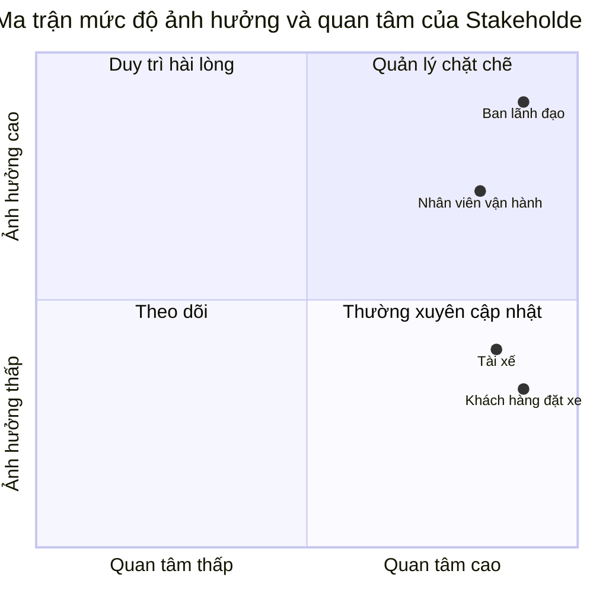
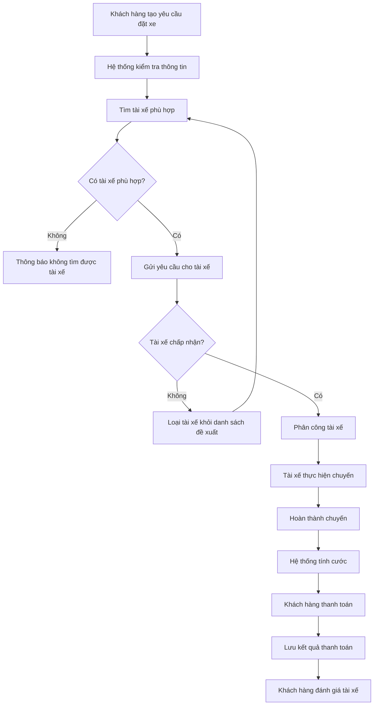
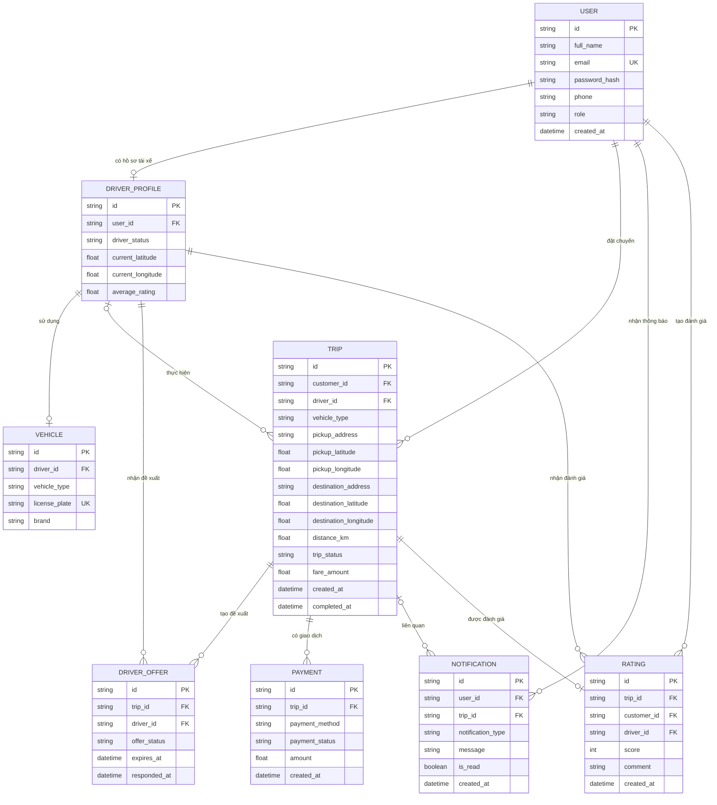

# PHÂN TÍCH YÊU CẦU HỆ THỐNG CAB SYSTEM

## Bước 1. Phân tích sơ khởi và ngữ cảnh nghiệp vụ

### 1.1. Bối cảnh nghiệp vụ

Công ty ABC đang cung cấp dịch vụ đặt xe trực tuyến. Hiện nay, khách hàng có thể liên hệ tổng đài hoặc sử dụng một ứng dụng đơn giản để yêu cầu xe. Tuy nhiên, quá trình phân công tài xế vẫn được thực hiện chủ yếu bằng phương pháp thủ công.

Công ty muốn xây dựng CAB System nhằm hỗ trợ quản lý quy trình đặt xe từ khi khách hàng tạo yêu cầu, hệ thống tìm tài xế, tài xế thực hiện chuyến, tính cước, thanh toán đến đánh giá sau chuyến đi.

CAB System được xây dựng trong thời gian 7 tuần và triển khai dưới dạng một hệ thống MVP. Hệ thống tập trung vào các chức năng cơ bản có thể triển khai và minh họa được bằng Node.js.

### 1.2. Vấn đề nghiệp vụ hiện tại

Hệ thống hiện tại tồn tại các vấn đề sau:

1. Việc tìm kiếm và phân công tài xế chủ yếu được thực hiện thủ công.
2. Khách hàng khó theo dõi trạng thái hiện tại của chuyến đi.
3. Khách hàng không biết tài xế nào đã nhận chuyến.
4. Tài xế chưa có quy trình thống nhất để nhận, từ chối và cập nhật chuyến đi.
5. Thông tin chuyến đi và thanh toán chưa được quản lý tập trung.
6. Nhân viên vận hành khó theo dõi các chuyến đang thực hiện.
7. Việc xử lý trường hợp tài xế từ chối hoặc không có tài xế phù hợp chưa hiệu quả.
8. Doanh nghiệp gặp khó khăn khi cần thống kê số chuyến, doanh thu và tỷ lệ hủy.

### 1.3. Vấn đề doanh nghiệp muốn giải quyết

Doanh nghiệp muốn hệ thống mới có thể:

- Quản lý tài khoản khách hàng, tài xế và nhân viên vận hành.
- Cho phép khách hàng tạo yêu cầu đặt xe.
- Tự động tìm tài xế phù hợp với yêu cầu.
- Cho phép tài xế chấp nhận hoặc từ chối chuyến.
- Theo dõi trạng thái chuyến đi.
- Tính và lưu cước phí của chuyến.
- Ghi nhận kết quả thanh toán.
- Cho phép khách hàng đánh giá tài xế.
- Hỗ trợ nhân viên vận hành theo dõi và thống kê hoạt động.

### 1.4. Tại sao cần xây dựng hệ thống mới?

Hệ thống hiện tại phụ thuộc nhiều vào việc phân công tài xế thủ công và chưa quản lý tập trung toàn bộ quy trình chuyến đi.

CAB System mới giúp tự động hóa một phần quá trình tìm tài xế, chuẩn hóa trạng thái chuyến đi và lưu trữ dữ liệu tập trung. Nhờ đó, khách hàng, tài xế và nhân viên vận hành có thể phối hợp thông qua cùng một hệ thống.

### 1.5. Người tham gia sử dụng hệ thống

#### Khách hàng

- Đăng ký và đăng nhập.
- Cập nhật thông tin cá nhân.
- Tạo yêu cầu đặt xe.
- Theo dõi trạng thái chuyến.
- Thanh toán.
- Xem lịch sử chuyến.
- Đánh giá tài xế.

#### Tài xế

- Đăng nhập.
- Cập nhật hồ sơ và phương tiện.
- Thay đổi trạng thái hoạt động.
- Nhận thông tin chuyến mới.
- Chấp nhận hoặc từ chối chuyến.
- Cập nhật trạng thái chuyến đi.
- Xem lịch sử chuyến.

#### Nhân viên vận hành

- Quản lý khách hàng và tài xế.
- Theo dõi các chuyến đi.
- Kiểm tra trạng thái của tài xế.
- Tra cứu lịch sử chuyến và giao dịch.
- Xem báo cáo hoạt động cơ bản.

### 1.6. Câu hỏi cần làm rõ

1. Hệ thống sẽ hỗ trợ những loại xe nào trong phiên bản MVP?
2. Phí mở cửa và giá tiền trên mỗi kilomet của từng loại xe là bao nhiêu?
3. Khoảng cách chuyến đi được nhập sẵn hay tính từ tọa độ?
4. Phạm vi tìm kiếm tài xế tối đa là bao nhiêu?
5. Khi có nhiều tài xế phù hợp, hệ thống ưu tiên khoảng cách hay điểm đánh giá?
6. Tài xế được phép từ chối chuyến bao nhiêu lần?
7. Sau bao nhiêu lần tìm thất bại thì hệ thống thông báo không có tài xế?
8. Khách hàng được hủy chuyến ở những trạng thái nào?
9. Tài xế được hủy chuyến sau khi đã chấp nhận hay không?
10. Việc hủy chuyến có phát sinh phí không?
11. Thanh toán điện tử trong MVP được mô phỏng theo những kết quả nào?
12. Khách hàng được đánh giá tài xế trong khoảng điểm nào?
13. Nhân viên vận hành có được sửa hoặc hủy chuyến hay chỉ được theo dõi?
14. Báo cáo MVP cần hiển thị những số liệu nào?

## Bước 2. Xác định Stakeholder

### 2.1. Khái niệm Stakeholder

Stakeholder là cá nhân hoặc nhóm người có liên quan, bị ảnh hưởng hoặc có khả năng tác động đến quá trình xây dựng và vận hành hệ thống.

Trong CAB System, stakeholder bao gồm người trực tiếp sử dụng hệ thống và người có quyền quyết định về yêu cầu, phạm vi và kết quả của dự án.

### 2.2. Danh sách Stakeholder

| Mã | Stakeholder | Vai trò và nhu cầu | Mức ảnh hưởng | Mức quan tâm | Cách quản lý |
|---|---|---|---|---|---|
| STK01 | Khách hàng đặt xe | Đặt chuyến, theo dõi trạng thái, thanh toán, xem lịch sử và đánh giá tài xế | Thấp – Trung bình | Cao | Thường xuyên cập nhật thông tin và tiếp nhận phản hồi |
| STK02 | Tài xế | Quản lý trạng thái hoạt động, nhận hoặc từ chối chuyến và cập nhật quá trình thực hiện chuyến | Thấp – Trung bình | Cao | Thường xuyên cập nhật thông tin và tiếp nhận phản hồi |
| STK03 | Nhân viên vận hành | Quản lý khách hàng, tài xế, phương tiện, theo dõi chuyến và hỗ trợ xử lý trường hợp bất thường | Cao | Cao | Tham gia chặt chẽ vào quá trình phân tích, kiểm thử và xác nhận quy trình |
| STK04 | Ban lãnh đạo Công ty ABC | Xác định mục tiêu, quyết định phạm vi, theo dõi hiệu quả và nghiệm thu hệ thống | Cao | Cao | Quản lý chặt chẽ và xác nhận các yêu cầu quan trọng |

### 2.3. Phân tích Stakeholder

#### STK01 – Khách hàng đặt xe

Khách hàng là người trực tiếp tạo và sử dụng dịch vụ đặt xe. Khách hàng cần đăng ký, đăng nhập, tạo yêu cầu đặt xe, theo dõi trạng thái chuyến, thanh toán, xem lịch sử và đánh giá tài xế sau khi chuyến hoàn thành.

Khách hàng có mức quan tâm cao vì chất lượng hệ thống ảnh hưởng trực tiếp đến trải nghiệm đặt xe. Tuy nhiên, từng khách hàng riêng lẻ không có quyền quyết định phạm vi hoặc quy tắc của dự án nên có mức ảnh hưởng thấp đến trung bình.

#### STK02 – Tài xế

Tài xế là người tiếp nhận và thực hiện chuyến đi. Tài xế cần quản lý hồ sơ, phương tiện và trạng thái hoạt động; đồng thời có thể chấp nhận, từ chối và cập nhật trạng thái chuyến.

Tài xế có mức quan tâm cao vì hệ thống ảnh hưởng trực tiếp đến quá trình nhận và thực hiện chuyến. Tuy nhiên, tài xế không trực tiếp quyết định phạm vi dự án nên có mức ảnh hưởng thấp đến trung bình.

#### STK03 – Nhân viên vận hành

Nhân viên vận hành theo dõi hoạt động hằng ngày của hệ thống. Họ cần quản lý thông tin khách hàng, tài xế, phương tiện, chuyến đi và hỗ trợ xử lý những trường hợp bất thường.

Nhân viên vận hành có mức quan tâm và ảnh hưởng cao vì họ hiểu rõ quy trình điều phối thực tế. Ý kiến của họ có thể làm thay đổi quy trình quản lý tài xế, theo dõi chuyến và xử lý sự cố.

#### STK04 – Ban lãnh đạo Công ty ABC

Ban lãnh đạo xác định mục tiêu, phê duyệt phạm vi và nghiệm thu kết quả cuối cùng. Ban lãnh đạo cũng cần theo dõi các số liệu như số lượng chuyến, doanh thu, tỷ lệ hoàn thành và tỷ lệ hủy.

Đây là stakeholder có mức ảnh hưởng cao nhất vì có quyền xác nhận yêu cầu và quyết định hệ thống có đáp ứng mục tiêu của doanh nghiệp hay không.

### 2.4. Stakeholder Matrix

Stakeholder Matrix được xây dựng dựa trên hai tiêu chí:

- Trục ngang thể hiện mức độ quan tâm đối với hệ thống.
- Trục dọc thể hiện mức độ ảnh hưởng đến yêu cầu và quyết định của dự án.

Các tọa độ trong biểu đồ chỉ thể hiện vị trí tương đối giữa các stakeholder, không phải kết quả của một cuộc khảo sát định lượng.

### 2.5. Kết luận

Ban lãnh đạo và nhân viên vận hành thuộc nhóm có mức quan tâm và ảnh hưởng cao nên cần được quản lý chặt chẽ trong suốt dự án.

Khách hàng và tài xế có mức quan tâm cao nhưng mức ảnh hưởng thấp hơn. Hai nhóm này cần được thường xuyên cập nhật và lấy ý kiến để bảo đảm các chức năng đặt xe và thực hiện chuyến phù hợp với nhu cầu sử dụng thực tế.

## Bước 3. Xác định mục tiêu nghiệp vụ

### 3.1. Khái niệm Business Goal

Business Goal là mục tiêu nghiệp vụ mà Công ty ABC muốn đạt được thông qua việc xây dựng CAB System.

Các mục tiêu được xác định dựa trên những vấn đề của hệ thống hiện tại và giới hạn triển khai của phiên bản MVP. Mỗi mục tiêu được ký hiệu bằng mã `BG`.

### 3.2. Danh sách Business Goal

| Mã | Mục tiêu nghiệp vụ | Vấn đề cần giải quyết | Kết quả mong đợi trong MVP |
|---|---|---|---|
| BG01 | Tự động hóa quá trình tìm và phân công tài xế | Việc tìm và phân công tài xế đang được thực hiện chủ yếu bằng phương pháp thủ công | Hệ thống có thể tìm tài xế đang sẵn sàng, đúng loại xe và chuyển yêu cầu cho tài xế phù hợp |
| BG02 | Chuẩn hóa và theo dõi quá trình thực hiện chuyến đi | Khách hàng và nhân viên vận hành khó theo dõi trạng thái hiện tại của chuyến | Mỗi chuyến đi được quản lý theo các trạng thái xác định từ khi tạo yêu cầu đến khi hoàn thành hoặc bị hủy |
| BG03 | Quản lý tập trung dữ liệu chuyến đi và thanh toán | Thông tin chuyến đi, cước phí và thanh toán chưa được quản lý tập trung | Hệ thống lưu được thông tin chuyến, cước phí, phương thức thanh toán và kết quả thanh toán |
| BG04 | Cải thiện khả năng xử lý các trường hợp đặt xe không thành công | Hệ thống hiện tại chưa xử lý hiệu quả khi tài xế từ chối hoặc không có tài xế phù hợp | Khi tài xế từ chối, hệ thống có thể tiếp tục tìm tài xế khác; khi không tìm được tài xế, khách hàng nhận được thông báo rõ ràng |
| BG05 | Hỗ trợ nhân viên vận hành theo dõi hoạt động | Nhân viên vận hành khó theo dõi khách hàng, tài xế và các chuyến đang diễn ra | Nhân viên vận hành có thể tra cứu người dùng, tài xế, chuyến đi và xem các báo cáo cơ bản |
| BG06 | Ghi nhận phản hồi sau chuyến đi | Doanh nghiệp chưa có dữ liệu tập trung để theo dõi đánh giá của khách hàng đối với tài xế | Khách hàng có thể đánh giá tài xế sau khi chuyến hoàn thành và hệ thống lưu lại kết quả đánh giá |

### 3.3. Phân tích Business Goal

#### BG01 – Tự động hóa quá trình tìm và phân công tài xế

Mục tiêu này giúp giảm sự phụ thuộc vào nhân viên vận hành khi có yêu cầu đặt xe. Trong phiên bản MVP, hệ thống tìm tài xế dựa trên trạng thái sẵn sàng, loại xe và tiêu chí ưu tiên đơn giản.

#### BG02 – Chuẩn hóa và theo dõi chuyến đi

Mỗi chuyến đi cần được quản lý bằng một chuỗi trạng thái thống nhất:

`SEARCHING → ACCEPTED → ARRIVED → IN_PROGRESS → COMPLETED`

Ngoài ra, chuyến có thể chuyển sang `CANCELLED` khi bị hủy theo quy định.

Việc chuẩn hóa trạng thái giúp khách hàng, tài xế và nhân viên vận hành cùng theo dõi một thông tin thống nhất.

#### BG03 – Quản lý tập trung chuyến đi và thanh toán

Hệ thống cần lưu trữ tập trung thông tin chuyến đi, cước phí và kết quả thanh toán. Trong MVP, hệ thống hỗ trợ thanh toán tiền mặt và thanh toán điện tử mô phỏng.

Mục tiêu này không bao gồm việc tích hợp cổng thanh toán hoặc ngân hàng thật.

#### BG04 – Xử lý trường hợp đặt xe không thành công

Khi tài xế được đề xuất từ chối chuyến, hệ thống không yêu cầu khách hàng tạo lại yêu cầu mà tiếp tục tìm tài xế khác.

Nếu không còn tài xế phù hợp, hệ thống kết thúc quá trình tìm kiếm và thông báo kết quả cho khách hàng.

#### BG05 – Hỗ trợ nhân viên vận hành

Nhân viên vận hành cần theo dõi được người dùng, tài xế và chuyến đi. Hệ thống cũng cung cấp báo cáo cơ bản gồm tổng số chuyến, số chuyến hoàn thành, số chuyến bị hủy và tổng doanh thu.

MVP không triển khai hệ thống phân tích dữ liệu hoặc báo cáo nâng cao.

#### BG06 – Ghi nhận phản hồi sau chuyến

Sau khi chuyến đi hoàn thành, khách hàng có thể gửi điểm đánh giá cho tài xế. Kết quả được lưu lại để hỗ trợ theo dõi chất lượng phục vụ và có thể được sử dụng làm tiêu chí tìm tài xế phù hợp.

### 3.4. Giới hạn của Business Goal

Các Business Goal trên chỉ áp dụng cho phạm vi MVP. Dự án không cam kết các mục tiêu như:

- Tự động điều phối tài xế bằng trí tuệ nhân tạo.
- Theo dõi GPS thời gian thực.
- Tích hợp cổng thanh toán thật.
- Hỗ trợ số lượng người dùng ở quy mô rất lớn.
- Phân tích dữ liệu và dự báo hoạt động nâng cao.

Những nội dung này chỉ có thể được xem xét trong các phiên bản phát triển sau.

## Bước 4. Xác định phạm vi hệ thống

### 4.1. Mục tiêu xác định phạm vi

CAB System được phát triển bởi một cá nhân trong thời gian 7 tuần. Vì vậy, phiên bản MVP tập trung vào quy trình đặt xe cơ bản có thể triển khai và demo hoàn chỉnh bằng Node.js.

Mọi chức năng nằm trong phạm vi phải được phân tích thành yêu cầu, triển khai trên hệ thống và có tình huống kiểm thử tương ứng.

### 4.2. Phạm vi triển khai của MVP

| Mã | Module | Chức năng trong phạm vi | Cách kiểm chứng khi demo |
|---|---|---|---|
| SC01 | Tài khoản và phân quyền | Đăng ký, đăng nhập và kiểm soát quyền theo ba vai trò: khách hàng, tài xế và nhân viên vận hành | Đăng nhập bằng từng tài khoản và kiểm tra chức năng được phép sử dụng |
| SC02 | Quản lý khách hàng | Xem và cập nhật thông tin cá nhân; xem lịch sử chuyến đi | Cập nhật hồ sơ và tra cứu các chuyến của một khách hàng |
| SC03 | Quản lý tài xế và phương tiện | Xem, cập nhật hồ sơ tài xế, thông tin phương tiện, loại xe và trạng thái hoạt động | Tài xế cập nhật phương tiện và chuyển trạng thái `AVAILABLE`, `BUSY` hoặc `OFFLINE` |
| SC04 | Đặt chuyến | Khách hàng nhập điểm đón, điểm đến, chọn loại xe và gửi yêu cầu đặt chuyến | Tạo một chuyến mới và kiểm tra dữ liệu được lưu |
| SC05 | Tìm và phân công tài xế | Tìm tài xế đang sẵn sàng, đúng loại xe và ưu tiên theo tiêu chí đơn giản | Chuẩn bị nhiều tài xế giả lập và kiểm tra tài xế phù hợp được lựa chọn |
| SC06 | Tiếp nhận chuyến | Tài xế xem yêu cầu mới, chấp nhận hoặc từ chối chuyến | Tài xế A từ chối và hệ thống chuyển yêu cầu sang tài xế B |
| SC07 | Quản lý trạng thái chuyến | Cập nhật các trạng thái tìm tài xế, đã chấp nhận, đã đến, đang thực hiện, hoàn thành hoặc đã hủy | Thực hiện một chuyến từ khi tạo đến khi hoàn thành |
| SC08 | Tính cước | Tính cước theo phí mở cửa, loại xe và khoảng cách chuyến đi | Nhập thông tin chuyến và kiểm tra số tiền được tính theo công thức |
| SC09 | Thanh toán | Ghi nhận thanh toán tiền mặt và mô phỏng kết quả thanh toán điện tử thành công hoặc thất bại | Thực hiện thanh toán và kiểm tra trạng thái giao dịch |
| SC10 | Thông báo trong hệ thống | Tạo và lưu thông báo liên quan đến kết quả tìm tài xế, trạng thái chuyến và thanh toán | Mở danh sách thông báo của khách hàng hoặc tài xế |
| SC11 | Đánh giá tài xế | Cho phép khách hàng đánh giá tài xế sau khi chuyến hoàn thành | Hoàn thành chuyến và gửi điểm đánh giá |
| SC12 | Vận hành và báo cáo | Nhân viên vận hành xem khách hàng, tài xế, chuyến đi và báo cáo cơ bản | Hiển thị tổng chuyến, chuyến hoàn thành, chuyến hủy và tổng doanh thu |

### 4.3. Quy trình nghiệp vụ nằm trong phạm vi

Phiên bản MVP tập trung vào một quy trình hoàn chỉnh:

1. Khách hàng đăng nhập.
2. Khách hàng tạo yêu cầu đặt xe.
3. Hệ thống tìm tài xế phù hợp.
4. Tài xế chấp nhận hoặc từ chối chuyến.
5. Nếu tài xế từ chối, hệ thống tìm tài xế tiếp theo.
6. Tài xế cập nhật trạng thái thực hiện chuyến.
7. Khi chuyến hoàn thành, hệ thống tính cước.
8. Khách hàng thanh toán.
9. Khách hàng đánh giá tài xế.
10. Nhân viên vận hành có thể tra cứu chuyến và xem báo cáo.

### 4.4. Phạm vi ngoài MVP

| Mã | Nội dung ngoài phạm vi | Lý do |
|---|---|---|
| OS01 | Theo dõi GPS thời gian thực | Yêu cầu bản đồ, thiết bị định vị và xử lý dữ liệu liên tục |
| OS02 | Hiển thị xe di chuyển trực tiếp trên bản đồ | Không cần thiết để chứng minh quy trình đặt xe cơ bản |
| OS03 | Tích hợp Google Maps hoặc dịch vụ bản đồ trả phí | MVP sử dụng địa điểm hoặc tọa độ giả lập |
| OS04 | Tích hợp ngân hàng, ví điện tử hoặc cổng thanh toán thật | MVP chỉ mô phỏng kết quả thanh toán điện tử |
| OS05 | Gửi SMS, email hoặc push notification thật | MVP chỉ lưu và hiển thị thông báo trong hệ thống |
| OS06 | Thuật toán AI điều phối tài xế | MVP sử dụng quy tắc tìm tài xế đơn giản |
| OS07 | Giá cước động theo thời tiết hoặc giờ cao điểm | MVP sử dụng công thức tính cước cố định theo loại xe |
| OS08 | Khuyến mãi, voucher và ví nội bộ | Không thuộc quy trình đặt xe cốt lõi |
| OS09 | Quản lý nhiều thành phố hoặc nhiều quốc gia | MVP chỉ sử dụng một khu vực dữ liệu giả lập |
| OS10 | Báo cáo và dự báo dữ liệu nâng cao | MVP chỉ cung cấp các số liệu tổng hợp cơ bản |
| OS11 | Triển khai microservice trên nhiều máy chủ | Các service được tổ chức thành module trong một ứng dụng Node.js |
| OS12 | Tự động mở rộng hạ tầng khi tải tăng | Không phù hợp với phạm vi và môi trường demo của dự án cá nhân |

### 4.5. Các quy ước đơn giản hóa trong MVP

- Vị trí khách hàng và tài xế được nhập hoặc tạo bằng dữ liệu giả lập.
- Khoảng cách được nhập sẵn hoặc tính bằng công thức đơn giản.
- Hệ thống chỉ hỗ trợ một số loại xe cơ bản.
- Việc tìm tài xế dựa trên trạng thái, loại xe và khoảng cách giả lập.
- Thanh toán điện tử chỉ mô phỏng kết quả thành công hoặc thất bại.
- Thông báo được lưu trong cơ sở dữ liệu và hiển thị trong hệ thống.
- Báo cáo chỉ gồm các phép đếm và tính tổng cơ bản.

### 4.6. Kết luận phạm vi

Phạm vi trên bảo đảm CAB System có thể minh họa một quy trình đặt xe hoàn chỉnh nhưng vẫn phù hợp với khả năng triển khai của một cá nhân trong thời gian 7 tuần.

Các chức năng trong phạm vi sẽ tiếp tục được chuyển thành Business Requirement, Functional Requirement, Use Case, Acceptance Criteria và Test Case. Các nội dung ngoài phạm vi không được xem là cam kết triển khai trong phiên bản MVP.

## Bước 5. Xây dựng Business Requirement

### 5.1. Khái niệm Business Requirement

Business Requirement là yêu cầu nghiệp vụ cấp cao mô tả khả năng mà CAB System phải cung cấp cho doanh nghiệp và người sử dụng.

Mỗi Business Requirement được ký hiệu bằng mã `BR`. Các yêu cầu này sẽ được phân rã thành Functional Requirement ở bước sau.

### 5.2. Danh sách Business Requirement

| Mã | Tên Business Requirement | Diễn giải |
|---|---|---|
| BR01 | Quản lý tài khoản và phân quyền | Hệ thống phải cho phép người dùng đăng ký, đăng nhập và sử dụng chức năng phù hợp với một trong ba vai trò: khách hàng, tài xế hoặc nhân viên vận hành. |
| BR02 | Quản lý hồ sơ người dùng và phương tiện | Hệ thống phải cho phép khách hàng cập nhật thông tin cá nhân; tài xế cập nhật hồ sơ, phương tiện, loại xe và trạng thái hoạt động. |
| BR03 | Tạo và theo dõi yêu cầu đặt xe | Hệ thống phải cho phép khách hàng tạo yêu cầu đặt xe bằng cách cung cấp điểm đón, điểm đến và loại xe; đồng thời theo dõi trạng thái của yêu cầu. |
| BR04 | Tìm kiếm và phân công tài xế | Hệ thống phải tìm tài xế đang sẵn sàng, có loại xe phù hợp và ưu tiên theo tiêu chí tìm kiếm đơn giản. Khi tài xế từ chối, hệ thống phải tiếp tục tìm tài xế khác. Nếu không có tài xế phù hợp, hệ thống phải thông báo cho khách hàng. |
| BR05 | Quản lý quá trình thực hiện chuyến | Hệ thống phải cho phép tài xế chấp nhận, từ chối và cập nhật trạng thái chuyến trong suốt quá trình thực hiện. Hệ thống phải lưu lại trạng thái hiện tại của mỗi chuyến đi. |
| BR06 | Tính cước và quản lý thanh toán | Sau khi chuyến hoàn thành, hệ thống phải tính cước theo loại xe và khoảng cách. Hệ thống phải hỗ trợ ghi nhận thanh toán tiền mặt và mô phỏng thanh toán điện tử thành công hoặc thất bại. |
| BR07 | Quản lý thông báo | Hệ thống phải tạo và lưu thông báo về các sự kiện quan trọng như tiếp nhận yêu cầu, tìm được tài xế, tài xế từ chối, không tìm được tài xế, chuyến hoàn thành và kết quả thanh toán. |
| BR08 | Quản lý lịch sử và đánh giá | Hệ thống phải cho phép khách hàng và tài xế xem lịch sử chuyến liên quan. Sau khi chuyến hoàn thành, khách hàng có thể đánh giá tài xế và hệ thống lưu lại kết quả đánh giá. |
| BR09 | Hỗ trợ vận hành và báo cáo | Hệ thống phải cho phép nhân viên vận hành tra cứu khách hàng, tài xế, phương tiện và chuyến đi; đồng thời xem báo cáo cơ bản về tổng số chuyến, chuyến hoàn thành, chuyến hủy và tổng doanh thu. |

### 5.3. Quan hệ giữa Business Goal và Business Requirement

| Business Goal | Business Requirement liên quan |
|---|---|
| BG01 – Tự động hóa quá trình tìm và phân công tài xế | BR02, BR03, BR04 |
| BG02 – Chuẩn hóa và theo dõi quá trình thực hiện chuyến | BR03, BR05, BR07 |
| BG03 – Quản lý tập trung chuyến đi và thanh toán | BR05, BR06, BR08 |
| BG04 – Xử lý trường hợp đặt xe không thành công | BR04, BR07 |
| BG05 – Hỗ trợ nhân viên vận hành theo dõi hoạt động | BR01, BR09 |
| BG06 – Ghi nhận phản hồi sau chuyến đi | BR08 |

### 5.4. Giới hạn của Business Requirement

Các Business Requirement trên không bao gồm:

- Theo dõi GPS thời gian thực.
- Tích hợp dịch vụ bản đồ thật.
- Tích hợp cổng thanh toán thật.
- Gửi SMS, email hoặc push notification thật.
- Thuật toán AI điều phối tài xế.
- Báo cáo và phân tích dữ liệu nâng cao.

Thanh toán điện tử và thông báo trong phiên bản MVP chỉ được triển khai dưới hình thức mô phỏng hoặc lưu dữ liệu trong hệ thống.

### 5.5. Kết luận

Chín Business Requirement trên bao phủ quy trình chính của CAB System, từ quản lý tài khoản, đặt xe, tìm tài xế, thực hiện chuyến, thanh toán đến đánh giá và báo cáo.

Mỗi Business Requirement là một cam kết thuộc phạm vi MVP và phải được phân rã thành chức năng có thể triển khai, kiểm thử và demo.

## Bước 6. Xây dựng Business Process

### 6.1. Khái niệm Business Process

Business Process mô tả trình tự các hoạt động nghiệp vụ được thực hiện để đạt được một kết quả cụ thể.

Trong CAB System, quy trình chính bắt đầu khi khách hàng tạo yêu cầu đặt xe và kết thúc khi chuyến được hoàn thành, thanh toán và đánh giá.

Mỗi Business Process được ký hiệu bằng mã `BP`.

### 6.2. Danh sách Business Process

| Mã | Tên quy trình | Người tham gia | Mô tả kết quả | BR liên quan |
|---|---|---|---|---|
| BP01 | Quản lý tài khoản và trạng thái tài xế | Khách hàng, tài xế, nhân viên vận hành | Người dùng đăng nhập được vào hệ thống; tài xế cập nhật trạng thái sẵn sàng nhận chuyến | BR01, BR02 |
| BP02 | Tạo yêu cầu và tìm tài xế | Khách hàng, tài xế | Khách hàng tạo yêu cầu và hệ thống tìm được tài xế phù hợp hoặc thông báo không có tài xế | BR03, BR04, BR07 |
| BP03 | Thực hiện chuyến đi | Khách hàng, tài xế | Tài xế chấp nhận chuyến và cập nhật chuyến đến khi hoàn thành hoặc bị hủy | BR05, BR07 |
| BP04 | Tính cước và thanh toán | Khách hàng, tài xế | Hệ thống tính cước và lưu kết quả thanh toán | BR06, BR07 |
| BP05 | Đánh giá và theo dõi hoạt động | Khách hàng, nhân viên vận hành | Khách hàng đánh giá tài xế; nhân viên vận hành tra cứu lịch sử và xem báo cáo | BR08, BR09 |

### 6.3. Quy trình nghiệp vụ tổng quát

### 6.4. Mô tả quy trình chính

#### Giai đoạn 1 – Chuẩn bị

1. Khách hàng đăng nhập vào hệ thống.
2. Tài xế đăng nhập và chuyển trạng thái sang `AVAILABLE`.
3. Hệ thống lưu trạng thái hoạt động hiện tại của tài xế.

#### Giai đoạn 2 – Tạo yêu cầu đặt xe

1. Khách hàng nhập điểm đón.
2. Khách hàng nhập điểm đến.
3. Khách hàng chọn loại xe.
4. Khách hàng gửi yêu cầu đặt xe.
5. Hệ thống kiểm tra tính đầy đủ của thông tin.
6. Hệ thống tạo chuyến với trạng thái `SEARCHING`.

#### Giai đoạn 3 – Tìm và phân công tài xế

1. Hệ thống tìm tài xế có trạng thái `AVAILABLE`.
2. Hệ thống chỉ chọn tài xế có loại xe phù hợp.
3. Hệ thống sắp xếp các tài xế theo tiêu chí ưu tiên.
4. Hệ thống gửi yêu cầu chuyến cho tài xế được chọn.
5. Tài xế chấp nhận hoặc từ chối yêu cầu.
6. Nếu tài xế từ chối, hệ thống tiếp tục tìm tài xế khác.
7. Nếu tài xế chấp nhận, hệ thống phân công tài xế cho chuyến.
8. Nếu không còn tài xế phù hợp, hệ thống thông báo cho khách hàng.

#### Giai đoạn 4 – Thực hiện chuyến

Sau khi tài xế chấp nhận, chuyến được cập nhật theo trình tự:

`ACCEPTED → ARRIVED → IN_PROGRESS → COMPLETED`

Trong trường hợp được phép hủy, chuyến chuyển sang trạng thái `CANCELLED`.

#### Giai đoạn 5 – Tính cước và thanh toán

1. Khi chuyến hoàn thành, hệ thống tính cước.
2. Khách hàng chọn tiền mặt hoặc thanh toán điện tử mô phỏng.
3. Hệ thống lưu phương thức và kết quả thanh toán.
4. Nếu thanh toán điện tử thất bại, khách hàng có thể thử lại hoặc chuyển sang tiền mặt.

#### Giai đoạn 6 – Sau chuyến đi

1. Chuyến hoàn thành được lưu vào lịch sử.
2. Khách hàng có thể đánh giá tài xế.
3. Tài xế chuyển về trạng thái `AVAILABLE`.
4. Nhân viên vận hành có thể tra cứu chuyến và xem báo cáo cơ bản.

### 6.5. Điểm bắt đầu và kết thúc quy trình

- Điểm bắt đầu: khách hàng gửi một yêu cầu đặt xe hợp lệ.
- Kết thúc thành công: chuyến hoàn thành, cước phí và kết quả thanh toán được lưu.
- Kết thúc không thành công: không tìm được tài xế hoặc chuyến bị hủy.

## Bước 7. Xây dựng Functional Requirement

### 7.1. Khái niệm Functional Requirement

Functional Requirement là yêu cầu mô tả một chức năng hoặc hành vi cụ thể mà hệ thống phải thực hiện.

Mỗi Functional Requirement được ký hiệu bằng mã `FR` và phải liên kết với một Business Requirement đã xác định ở Bước 5.

### 7.2. Functional Requirement của BR01 – Quản lý tài khoản và phân quyền

| Mã FR | BR liên quan | Tên chức năng | Mô tả |
|---|---|---|---|
| FR01 | BR01 | Đăng ký tài khoản | Hệ thống cho phép khách hàng và tài xế đăng ký tài khoản bằng các thông tin bắt buộc. |
| FR02 | BR01 | Đăng nhập | Hệ thống kiểm tra thông tin đăng nhập và trả về kết quả xác thực cho người dùng. |
| FR03 | BR01 | Kiểm soát quyền truy cập | Hệ thống giới hạn chức năng theo ba vai trò: khách hàng, tài xế và nhân viên vận hành. |

### 7.3. Functional Requirement của BR02 – Quản lý hồ sơ và phương tiện

| Mã FR | BR liên quan | Tên chức năng | Mô tả |
|---|---|---|---|
| FR04 | BR02 | Cập nhật hồ sơ khách hàng | Khách hàng có thể xem và cập nhật thông tin cá nhân của mình. |
| FR05 | BR02 | Cập nhật hồ sơ tài xế và phương tiện | Tài xế có thể cập nhật thông tin cá nhân, phương tiện, biển số và loại xe. |
| FR06 | BR02 | Cập nhật trạng thái tài xế | Tài xế có thể chuyển trạng thái hoạt động giữa `AVAILABLE` và `OFFLINE`. Hệ thống có thể chuyển tài xế sang `BUSY` khi tài xế nhận chuyến. |

### 7.4. Functional Requirement của BR03 – Tạo và theo dõi yêu cầu đặt xe

| Mã FR | BR liên quan | Tên chức năng | Mô tả |
|---|---|---|---|
| FR07 | BR03 | Tạo yêu cầu đặt xe | Khách hàng có thể tạo yêu cầu bằng cách nhập điểm đón, điểm đến và chọn loại xe. |
| FR08 | BR03 | Kiểm tra và lưu yêu cầu | Hệ thống kiểm tra dữ liệu bắt buộc, tạo mã chuyến và lưu chuyến với trạng thái `SEARCHING`. |
| FR09 | BR03 | Theo dõi trạng thái chuyến | Khách hàng có thể xem tài xế được phân công và trạng thái hiện tại của chuyến. |

### 7.5. Functional Requirement của BR04 – Tìm kiếm và phân công tài xế

| Mã FR | BR liên quan | Tên chức năng | Mô tả |
|---|---|---|---|
| FR10 | BR04 | Lọc tài xế phù hợp | Hệ thống chỉ tìm những tài xế có trạng thái `AVAILABLE` và có loại xe phù hợp với yêu cầu. |
| FR11 | BR04 | Sắp xếp tài xế | Hệ thống sắp xếp danh sách tài xế phù hợp theo khoảng cách giả lập; nếu khoảng cách bằng nhau thì ưu tiên điểm đánh giá cao hơn. |
| FR12 | BR04 | Gửi yêu cầu chuyến cho tài xế | Hệ thống gửi yêu cầu chuyến cho tài xế được lựa chọn và lưu trạng thái đề xuất. |
| FR13 | BR04 | Xử lý tài xế chấp nhận hoặc từ chối | Nếu tài xế chấp nhận, hệ thống phân công tài xế cho chuyến; nếu tài xế từ chối hoặc không phản hồi trong thời gian quy định, hệ thống chuyển sang tài xế tiếp theo. |
| FR14 | BR04 | Xử lý không tìm được tài xế | Nếu không còn tài xế phù hợp, hệ thống kết thúc quá trình tìm kiếm và thông báo cho khách hàng. |

### 7.6. Functional Requirement của BR05 – Quản lý quá trình thực hiện chuyến

| Mã FR | BR liên quan | Tên chức năng | Mô tả |
|---|---|---|---|
| FR15 | BR05 | Cập nhật trạng thái chuyến | Tài xế có thể cập nhật chuyến lần lượt qua các trạng thái `ACCEPTED`, `ARRIVED`, `IN_PROGRESS` và `COMPLETED`. |
| FR16 | BR05 | Hủy chuyến | Khách hàng hoặc tài xế có thể hủy chuyến khi đáp ứng quy tắc hủy của hệ thống. |
| FR17 | BR05 | Đồng bộ trạng thái tài xế | Khi nhận chuyến, tài xế chuyển sang `BUSY`; khi chuyến hoàn thành hoặc bị hủy, tài xế chuyển về `AVAILABLE`. |

### 7.7. Functional Requirement của BR06 – Tính cước và thanh toán

| Mã FR | BR liên quan | Tên chức năng | Mô tả |
|---|---|---|---|
| FR18 | BR06 | Tính cước chuyến đi | Khi chuyến hoàn thành, hệ thống tính cước dựa trên phí mở cửa, loại xe và khoảng cách chuyến đi. |
| FR19 | BR06 | Ghi nhận thanh toán tiền mặt | Hệ thống cho phép ghi nhận khách hàng thanh toán bằng tiền mặt và cập nhật trạng thái thanh toán. |
| FR20 | BR06 | Mô phỏng thanh toán điện tử | Hệ thống mô phỏng giao dịch điện tử thành công hoặc thất bại, lưu kết quả và cho phép thử lại hoặc chuyển sang tiền mặt. |

### 7.8. Functional Requirement của BR07 – Quản lý thông báo

| Mã FR | BR liên quan | Tên chức năng | Mô tả |
|---|---|---|---|
| FR21 | BR07 | Tạo thông báo | Hệ thống tạo thông báo khi tiếp nhận yêu cầu, tìm được tài xế, không tìm được tài xế, chuyến thay đổi trạng thái và thanh toán có kết quả. |
| FR22 | BR07 | Xem thông báo | Khách hàng và tài xế có thể xem danh sách thông báo liên quan đến tài khoản của mình. |

### 7.9. Functional Requirement của BR08 – Lịch sử và đánh giá

| Mã FR | BR liên quan | Tên chức năng | Mô tả |
|---|---|---|---|
| FR23 | BR08 | Xem lịch sử chuyến | Khách hàng và tài xế có thể xem danh sách và thông tin chi tiết các chuyến liên quan đến tài khoản của mình. |
| FR24 | BR08 | Đánh giá tài xế | Khách hàng có thể đánh giá tài xế một lần sau khi chuyến hoàn thành. Hệ thống lưu điểm đánh giá và cập nhật điểm trung bình của tài xế. |

### 7.10. Functional Requirement của BR09 – Vận hành và báo cáo

| Mã FR | BR liên quan | Tên chức năng | Mô tả |
|---|---|---|---|
| FR25 | BR09 | Tra cứu dữ liệu vận hành | Nhân viên vận hành có thể xem và tìm kiếm khách hàng, tài xế, phương tiện và chuyến đi. |
| FR26 | BR09 | Theo dõi chuyến đi | Nhân viên vận hành có thể xem các chuyến đang tìm tài xế, đang thực hiện, đã hoàn thành hoặc đã hủy. |
| FR27 | BR09 | Xem báo cáo cơ bản | Hệ thống thống kê tổng số chuyến, số chuyến hoàn thành, số chuyến bị hủy và tổng doanh thu. |

### 7.11. Nguyên tắc triển khai Functional Requirement

- Mỗi FR phải được thể hiện bằng API hoặc chức năng trên giao diện.
- Mỗi FR phải có ít nhất một Acceptance Criteria và Test Case tương ứng.
- Không bổ sung chức năng nằm ngoài phạm vi MVP nếu không thể triển khai và demo.
- Các yêu cầu về tốc độ, bảo mật và độ ổn định sẽ được trình bày ở phần Non-functional Requirement.

## Bước 8. Xác định Business Rules và Exceptions

### 8.1. Khái niệm Business Rule

Business Rule là quy định bắt buộc kiểm soát cách một nghiệp vụ được thực hiện.

Các quy tắc trong CAB System được ký hiệu bằng mã `RULE`. Đây là các quy tắc áp dụng cho phiên bản MVP và phải được triển khai trong hệ thống.

### 8.2. Business Rules của CAB System

| Mã | Tên quy tắc | Nội dung quy tắc | FR liên quan |
|---|---|---|---|
| RULE01 | Phân quyền người dùng | Hệ thống có ba vai trò: `CUSTOMER`, `DRIVER` và `OPERATOR`. Người dùng chỉ được sử dụng chức năng thuộc vai trò của mình. | FR01, FR02, FR03 |
| RULE02 | Điều kiện nhận chuyến | Chỉ tài xế có trạng thái `AVAILABLE`, có đầy đủ thông tin phương tiện và đúng loại xe khách hàng yêu cầu mới được đưa vào danh sách tìm kiếm. | FR05, FR06, FR10 |
| RULE03 | Giới hạn chuyến của tài xế | Một tài xế chỉ được thực hiện tối đa một chuyến chưa kết thúc tại cùng một thời điểm. | FR13, FR17 |
| RULE04 | Giới hạn chuyến của khách hàng | Một khách hàng chỉ được có tối đa một chuyến đang tìm tài xế hoặc đang thực hiện tại cùng một thời điểm. | FR07, FR08 |
| RULE05 | Tiêu chí tìm tài xế | Hệ thống tìm tài xế phù hợp trong bán kính giả lập tối đa 5 km. Tài xế gần hơn được ưu tiên; nếu khoảng cách bằng nhau thì ưu tiên tài xế có điểm đánh giá cao hơn. | FR10, FR11 |
| RULE06 | Thời gian phản hồi | Tài xế có tối đa 30 giây để chấp nhận yêu cầu. Nếu tài xế từ chối hoặc hết thời gian phản hồi, hệ thống chuyển yêu cầu sang tài xế tiếp theo. | FR12, FR13 |
| RULE07 | Trình tự trạng thái chuyến | Chuyến phải được cập nhật theo thứ tự `SEARCHING → ACCEPTED → ARRIVED → IN_PROGRESS → COMPLETED`. Không được bỏ qua hoặc quay ngược trạng thái. | FR08, FR15 |
| RULE08 | Quy tắc hủy chuyến | Khách hàng hoặc tài xế chỉ được hủy chuyến trước khi chuyến chuyển sang trạng thái `IN_PROGRESS`. MVP không áp dụng phí hủy chuyến. | FR16 |
| RULE09 | Trạng thái tài xế | Khi tài xế nhận chuyến, trạng thái tài xế chuyển thành `BUSY`. Khi chuyến hoàn thành hoặc bị hủy, trạng thái tài xế chuyển về `AVAILABLE`. Tài xế `BUSY` không thể tự chuyển sang `OFFLINE`. | FR06, FR17 |
| RULE10 | Loại xe và công thức tính cước | MVP hỗ trợ hai loại xe là `MOTORBIKE` và `CAR`. Cước được tính theo công thức: phí mở cửa + khoảng cách × giá mỗi kilomet. | FR05, FR07, FR18 |
| RULE11 | Mức cước giả lập | `MOTORBIKE`: phí mở cửa 10.000 đồng và 5.000 đồng/km. `CAR`: phí mở cửa 20.000 đồng và 10.000 đồng/km. Đây là mức cước dùng cho mục đích demo. | FR18 |
| RULE12 | Điều kiện thanh toán | Chỉ chuyến có trạng thái `COMPLETED` mới được thanh toán. Một chuyến chỉ được có một giao dịch thành công. | FR19, FR20 |
| RULE13 | Thanh toán điện tử mô phỏng | Thanh toán điện tử có thể trả về `SUCCESS` hoặc `FAILED`. Nếu thất bại, khách hàng được thử lại hoặc chuyển sang thanh toán tiền mặt. | FR20 |
| RULE14 | Đánh giá tài xế | Khách hàng chỉ được đánh giá tài xế một lần sau khi chuyến đã hoàn thành. Điểm đánh giá là số nguyên từ 1 đến 5. | FR24 |
| RULE15 | Doanh thu báo cáo | Doanh thu chỉ được tính từ những chuyến đã hoàn thành và có trạng thái thanh toán thành công. | FR27 |

### 8.3. Bảng giá cước của MVP

| Loại xe | Phí mở cửa | Giá mỗi kilomet |
|---|---:|---:|
| `MOTORBIKE` | 10.000 đồng | 5.000 đồng/km |
| `CAR` | 20.000 đồng | 10.000 đồng/km |

Ví dụ, một chuyến `MOTORBIKE` dài 4 km có cước:

`10.000 + 4 × 5.000 = 30.000 đồng`

Các mức giá trên là dữ liệu giả lập phục vụ việc triển khai và demo, không phải bảng giá thực tế của doanh nghiệp vận tải.

### 8.4. Khái niệm Exception

Exception là trường hợp bất thường hoặc trường hợp không thể tiếp tục theo luồng chính.

Mỗi Exception được ký hiệu bằng mã `EX`. Hệ thống phải phát hiện và trả về kết quả xử lý rõ ràng thay vì tiếp tục thực hiện sai quy trình.

### 8.5. Danh sách Exceptions

| Mã | Trường hợp ngoại lệ | Cách hệ thống xử lý | FR liên quan |
|---|---|---|---|
| EX01 | Khách hàng nhập thiếu điểm đón, điểm đến hoặc loại xe | Từ chối tạo chuyến và thông báo trường dữ liệu cần bổ sung | FR07, FR08 |
| EX02 | Khách hàng đang có một chuyến chưa kết thúc | Không cho phép tạo chuyến mới và hiển thị thông báo phù hợp | FR07, FR08 |
| EX03 | Không có tài xế phù hợp | Kết thúc quá trình tìm kiếm, giữ lại kết quả chuyến không thành công và thông báo cho khách hàng | FR14, FR21 |
| EX04 | Tài xế từ chối yêu cầu | Ghi nhận kết quả từ chối, loại tài xế khỏi lần tìm hiện tại và chuyển sang tài xế tiếp theo | FR13 |
| EX05 | Tài xế hết thời gian phản hồi | Đánh dấu yêu cầu gửi cho tài xế đã hết hạn và chuyển sang tài xế tiếp theo | FR13 |
| EX06 | Cập nhật sai trình tự trạng thái | Từ chối cập nhật và giữ nguyên trạng thái hiện tại của chuyến | FR15 |
| EX07 | Yêu cầu hủy chuyến không hợp lệ | Từ chối hủy nếu chuyến đã chuyển sang `IN_PROGRESS` hoặc `COMPLETED` | FR16 |
| EX08 | Thanh toán điện tử thất bại | Lưu giao dịch với trạng thái `FAILED` và cho phép thử lại hoặc chuyển sang tiền mặt | FR20 |
| EX09 | Đánh giá không hợp lệ | Từ chối nếu chuyến chưa hoàn thành, điểm không thuộc khoảng 1–5 hoặc khách hàng đã đánh giá trước đó | FR24 |
| EX10 | Người dùng không có quyền truy cập | Từ chối thao tác và trả về thông báo không đủ quyền | FR03 |

### 8.6. Kết luận

Business Rules xác định cách hệ thống được phép vận hành, còn Exceptions xác định cách xử lý khi luồng chính không thể tiếp tục.

Các quy tắc và ngoại lệ trong bước này là cam kết triển khai của phiên bản MVP. Vì vậy, chúng chỉ bao gồm những điều kiện có thể code và demo bằng hệ thống Node.js.

## Bước 9. Xây dựng Data Model

### 9.1. Mục đích của Data Model

Data Model xác định những dữ liệu hệ thống cần lưu trữ và mối quan hệ giữa các dữ liệu.

Mỗi thực thể trong mô hình sẽ được chuyển thành bảng hoặc collection khi triển khai hệ thống.

### 9.2. Danh sách thực thể

| Mã | Thực thể | Mục đích |
|---|---|---|
| ENT01 | `USER` | Lưu tài khoản của khách hàng, tài xế và nhân viên vận hành |
| ENT02 | `DRIVER_PROFILE` | Lưu hồ sơ nghiệp vụ, vị trí và trạng thái của tài xế |
| ENT03 | `VEHICLE` | Lưu phương tiện mà tài xế sử dụng |
| ENT04 | `TRIP` | Lưu yêu cầu đặt xe và quá trình thực hiện chuyến |
| ENT05 | `DRIVER_OFFER` | Lưu những lần hệ thống đề xuất chuyến cho tài xế |
| ENT06 | `PAYMENT` | Lưu các lần thanh toán của chuyến |
| ENT07 | `NOTIFICATION` | Lưu thông báo gửi cho người dùng |
| ENT08 | `RATING` | Lưu đánh giá của khách hàng dành cho tài xế |

### 9.3. Mô tả thuộc tính chính

#### ENT01 – USER

| Thuộc tính | Kiểu dữ liệu | Ràng buộc | Ý nghĩa |
|---|---|---|---|
| `id` | String | Khóa chính | Mã người dùng |
| `full_name` | String | Bắt buộc | Họ tên |
| `email` | String | Bắt buộc, duy nhất | Email đăng nhập |
| `password_hash` | String | Bắt buộc | Mật khẩu đã được mã hóa |
| `phone` | String | Bắt buộc | Số điện thoại |
| `role` | String | Bắt buộc | `CUSTOMER`, `DRIVER` hoặc `OPERATOR` |
| `created_at` | DateTime | Tự động tạo | Thời điểm tạo tài khoản |

#### ENT02 – DRIVER_PROFILE

| Thuộc tính | Kiểu dữ liệu | Ràng buộc | Ý nghĩa |
|---|---|---|---|
| `id` | String | Khóa chính | Mã hồ sơ tài xế |
| `user_id` | String | Khóa ngoại, duy nhất | Liên kết với `USER` |
| `driver_status` | String | Bắt buộc | `AVAILABLE`, `BUSY` hoặc `OFFLINE` |
| `current_latitude` | Number | Có thể cập nhật | Vĩ độ giả lập của tài xế |
| `current_longitude` | Number | Có thể cập nhật | Kinh độ giả lập của tài xế |
| `average_rating` | Number | Mặc định 0 | Điểm đánh giá trung bình |

#### ENT03 – VEHICLE

| Thuộc tính | Kiểu dữ liệu | Ràng buộc | Ý nghĩa |
|---|---|---|---|
| `id` | String | Khóa chính | Mã phương tiện |
| `driver_id` | String | Khóa ngoại, duy nhất | Tài xế sử dụng phương tiện |
| `vehicle_type` | String | Bắt buộc | `MOTORBIKE` hoặc `CAR` |
| `license_plate` | String | Bắt buộc, duy nhất | Biển số xe |
| `brand` | String | Không bắt buộc | Hãng hoặc tên phương tiện |

#### ENT04 – TRIP

| Thuộc tính | Kiểu dữ liệu | Ràng buộc | Ý nghĩa |
|---|---|---|---|
| `id` | String | Khóa chính | Mã chuyến |
| `customer_id` | String | Khóa ngoại, bắt buộc | Khách hàng đặt chuyến |
| `driver_id` | String | Khóa ngoại, có thể rỗng | Tài xế được phân công |
| `vehicle_type` | String | Bắt buộc | Loại xe khách hàng yêu cầu |
| `pickup_address` | String | Bắt buộc | Địa chỉ điểm đón |
| `pickup_latitude` | Number | Bắt buộc | Vĩ độ giả lập của điểm đón |
| `pickup_longitude` | Number | Bắt buộc | Kinh độ giả lập của điểm đón |
| `destination_address` | String | Bắt buộc | Địa chỉ điểm đến |
| `destination_latitude` | Number | Bắt buộc | Vĩ độ giả lập của điểm đến |
| `destination_longitude` | Number | Bắt buộc | Kinh độ giả lập của điểm đến |
| `distance_km` | Number | Bắt buộc | Khoảng cách chuyến đi |
| `trip_status` | String | Bắt buộc | Trạng thái hiện tại của chuyến |
| `fare_amount` | Number | Mặc định 0 | Cước phí chuyến đi |
| `created_at` | DateTime | Tự động tạo | Thời điểm tạo chuyến |
| `completed_at` | DateTime | Có thể rỗng | Thời điểm hoàn thành |

#### ENT05 – DRIVER_OFFER

| Thuộc tính | Kiểu dữ liệu | Ràng buộc | Ý nghĩa |
|---|---|---|---|
| `id` | String | Khóa chính | Mã đề xuất |
| `trip_id` | String | Khóa ngoại, bắt buộc | Chuyến cần tìm tài xế |
| `driver_id` | String | Khóa ngoại, bắt buộc | Tài xế nhận đề xuất |
| `offer_status` | String | Bắt buộc | `PENDING`, `ACCEPTED`, `REJECTED` hoặc `EXPIRED` |
| `expires_at` | DateTime | Bắt buộc | Thời điểm hết hạn phản hồi |
| `responded_at` | DateTime | Có thể rỗng | Thời điểm tài xế phản hồi |

#### ENT06 – PAYMENT

| Thuộc tính | Kiểu dữ liệu | Ràng buộc | Ý nghĩa |
|---|---|---|---|
| `id` | String | Khóa chính | Mã giao dịch |
| `trip_id` | String | Khóa ngoại, bắt buộc | Chuyến được thanh toán |
| `payment_method` | String | Bắt buộc | `CASH` hoặc `ELECTRONIC` |
| `payment_status` | String | Bắt buộc | `PENDING`, `SUCCESS` hoặc `FAILED` |
| `amount` | Number | Bắt buộc | Số tiền thanh toán |
| `created_at` | DateTime | Tự động tạo | Thời điểm giao dịch |

#### ENT07 – NOTIFICATION

| Thuộc tính | Kiểu dữ liệu | Ràng buộc | Ý nghĩa |
|---|---|---|---|
| `id` | String | Khóa chính | Mã thông báo |
| `user_id` | String | Khóa ngoại, bắt buộc | Người nhận thông báo |
| `trip_id` | String | Khóa ngoại, có thể rỗng | Chuyến liên quan |
| `notification_type` | String | Bắt buộc | Loại thông báo |
| `message` | String | Bắt buộc | Nội dung thông báo |
| `is_read` | Boolean | Mặc định false | Trạng thái đã đọc |
| `created_at` | DateTime | Tự động tạo | Thời điểm tạo thông báo |

#### ENT08 – RATING

| Thuộc tính | Kiểu dữ liệu | Ràng buộc | Ý nghĩa |
|---|---|---|---|
| `id` | String | Khóa chính | Mã đánh giá |
| `trip_id` | String | Khóa ngoại, duy nhất | Chuyến được đánh giá |
| `customer_id` | String | Khóa ngoại, bắt buộc | Khách hàng tạo đánh giá |
| `driver_id` | String | Khóa ngoại, bắt buộc | Tài xế được đánh giá |
| `score` | Number | Từ 1 đến 5 | Điểm đánh giá |
| `comment` | String | Không bắt buộc | Nội dung nhận xét |
| `created_at` | DateTime | Tự động tạo | Thời điểm đánh giá |

### 9.4. Sơ đồ ERD

### 9.5. Các ràng buộc dữ liệu quan trọng

1. Email của người dùng không được trùng.
2. Biển số xe không được trùng.
3. Một tài khoản tài xế chỉ có một `DRIVER_PROFILE`.
4. Trong MVP, một tài xế chỉ quản lý tối đa một phương tiện.
5. `driver_id` trong `TRIP` được để trống khi chưa tìm được tài xế.
6. Một chuyến có thể có nhiều `DRIVER_OFFER` vì nhiều tài xế có thể từ chối hoặc hết hạn.
7. Một chuyến có thể có nhiều lần thanh toán thất bại nhưng chỉ có một thanh toán thành công.
8. Một chuyến chỉ được có tối đa một đánh giá.
9. Mật khẩu chỉ được lưu dưới dạng đã mã hóa, không lưu mật khẩu gốc.
10. Báo cáo được tính từ dữ liệu chuyến và thanh toán, không cần thực thể báo cáo riêng.

### 9.6. Kết luận

Data Model gồm tám thực thể, đủ để lưu dữ liệu cho toàn bộ quy trình MVP từ tài khoản, đặt chuyến, tìm tài xế, thanh toán đến đánh giá và thông báo.

Mô hình không tạo thêm các thực thể dành cho GPS thời gian thực, cổng thanh toán thật hoặc báo cáo nâng cao vì những nội dung đó nằm ngoài phạm vi MVP.

## Bước 10. Xác định yêu cầu phi chức năng

### 10.1. Khái niệm yêu cầu phi chức năng

Yêu cầu phi chức năng – Non-functional Requirement – mô tả các tiêu chuẩn chất lượng và ràng buộc mà CAB System phải đáp ứng trong quá trình vận hành.

Khác với Functional Requirement mô tả hệ thống thực hiện chức năng gì, Non-functional Requirement mô tả hệ thống phải thực hiện các chức năng đó như thế nào, chẳng hạn như tốc độ phản hồi, bảo mật, tính toàn vẹn dữ liệu, khả năng xử lý lỗi và khả năng bảo trì.

Mỗi yêu cầu phi chức năng được ký hiệu bằng mã `NFR`. Các NFR trong tài liệu này chỉ áp dụng cho phiên bản MVP và phải có khả năng kiểm chứng trong môi trường demo.

### 10.2. Danh sách yêu cầu phi chức năng

| Mã | Nhóm yêu cầu | Nội dung yêu cầu | Cách kiểm chứng |
|---|---|---|---|
| NFR01 | Hiệu năng | Trong môi trường demo cục bộ, các API thông thường phải phản hồi trong vòng 3 giây | Gửi request bằng Postman và kiểm tra thời gian phản hồi |
| NFR02 | Hiệu năng tìm tài xế | Với tối đa 100 tài xế thử nghiệm, quá trình lọc và lựa chọn tài xế phù hợp phải hoàn thành trong vòng 3 giây | Tạo dữ liệu tài xế giả lập và đo thời gian thực hiện API tìm tài xế |
| NFR03 | Xác thực | Người dùng phải đăng nhập hợp lệ trước khi sử dụng các chức năng yêu cầu tài khoản | Gọi API được bảo vệ khi chưa đăng nhập và kiểm tra hệ thống từ chối |
| NFR04 | Phân quyền | Hệ thống phải kiểm soát quyền truy cập theo ba vai trò: `CUSTOMER`, `DRIVER` và `OPERATOR` | Dùng tài khoản của từng vai trò để thử truy cập chức năng không được phép |
| NFR05 | Bảo mật mật khẩu | Mật khẩu phải được băm một chiều trước khi lưu và không được trả về trong response của API | Kiểm tra dữ liệu trong cơ sở dữ liệu và kết quả API người dùng |
| NFR06 | Bảo vệ dữ liệu thanh toán | Hệ thống không được lưu số thẻ, tài khoản ngân hàng hoặc dữ liệu thanh toán nhạy cảm | Kiểm tra dữ liệu `PAYMENT` chỉ chứa phương thức, số tiền, trạng thái và thời gian giao dịch |
| NFR07 | Kiểm tra dữ liệu đầu vào | Hệ thống phải từ chối dữ liệu thiếu trường bắt buộc, sai kiểu dữ liệu hoặc không đúng giá trị quy định | Gửi request thiếu điểm đón, sai loại xe, sai điểm đánh giá hoặc sai trạng thái |
| NFR08 | Tính toàn vẹn dữ liệu | Hệ thống phải duy trì đúng mối quan hệ giữa người dùng, tài xế, chuyến đi, thanh toán và đánh giá | Kiểm tra không thể thanh toán chuyến chưa hoàn thành hoặc đánh giá chuyến không thuộc khách hàng |
| NFR09 | Xử lý lỗi | Thanh toán điện tử mô phỏng thất bại không được làm mất dữ liệu chuyến hoặc khiến chức năng đặt xe ngừng hoạt động | Mô phỏng thanh toán thất bại, sau đó tiếp tục xem chuyến và chuyển sang thanh toán tiền mặt |
| NFR10 | Khả năng bảo trì | Mã nguồn Node.js phải được tổ chức thành các module riêng như xác thực, người dùng, tài xế, chuyến đi, thanh toán, thông báo và báo cáo | Kiểm tra cấu trúc thư mục và trách nhiệm của từng module trong mã nguồn |
| NFR11 | Ghi nhật ký | Hệ thống phải ghi nhận các sự kiện quan trọng gồm đăng nhập thất bại, thay đổi trạng thái chuyến và kết quả thanh toán | Thực hiện các thao tác tương ứng và kiểm tra log của ứng dụng |
| NFR12 | Tính nhất quán của API | Các API phải sử dụng cấu trúc response thống nhất, thể hiện trạng thái thành công, thông báo và dữ liệu trả về | Kiểm tra response của các API trong cả trường hợp thành công và thất bại |
| NFR13 | Khả năng sử dụng | Thông báo trả về phải rõ ràng, giúp người dùng biết thao tác đã thành công hoặc nguyên nhân thất bại | Kiểm tra nội dung thông báo của các trường hợp đăng nhập sai, đặt xe thiếu dữ liệu và không tìm được tài xế |

## Bước 11. Xây dựng sơ đồ Use Case

### 11.1. Khái niệm Use Case

Use Case mô tả một mục tiêu mà actor muốn thực hiện thông qua hệ thống.

Sơ đồ Use Case thể hiện:

- Những actor tương tác với CAB System.
- Những chức năng mỗi actor được sử dụng.
- Mối quan hệ giữa các chức năng.

### 11.2. Danh sách Actor

| Mã | Actor | Mô tả |
|---|---|---|
| ACT01 | Khách hàng | Người tạo yêu cầu đặt xe, theo dõi chuyến, thanh toán và đánh giá tài xế |
| ACT02 | Tài xế | Người tiếp nhận yêu cầu và thực hiện chuyến đi |
| ACT03 | Nhân viên vận hành | Người theo dõi dữ liệu hoạt động và xem báo cáo |

Tài khoản nhân viên vận hành được tạo sẵn trong dữ liệu hệ thống MVP. Chức năng tự đăng ký chỉ áp dụng cho khách hàng và tài xế.

### 11.3. Danh sách Use Case

| Mã | Tên Use Case | Actor chính | FR liên quan |
|---|---|---|---|
| UC01 | Đăng ký tài khoản | Khách hàng, tài xế | FR01 |
| UC02 | Đăng nhập | Khách hàng, tài xế, nhân viên vận hành | FR02, FR03 |
| UC03 | Cập nhật hồ sơ | Khách hàng, tài xế | FR04, FR05 |
| UC04 | Tạo yêu cầu đặt xe | Khách hàng | FR07, FR08 |
| UC05 | Tìm và phân công tài xế | Hệ thống | FR10, FR11, FR12, FR13, FR14 |
| UC06 | Theo dõi trạng thái chuyến | Khách hàng | FR09 |
| UC07 | Hủy chuyến | Khách hàng, tài xế | FR16, FR17 |
| UC08 | Thanh toán chuyến | Khách hàng | FR18, FR19, FR20 |
| UC09 | Xem lịch sử chuyến | Khách hàng, tài xế | FR23 |
| UC10 | Đánh giá tài xế | Khách hàng | FR24 |
| UC11 | Xem thông báo | Khách hàng, tài xế | FR21, FR22 |
| UC12 | Quản lý phương tiện | Tài xế | FR05 |
| UC13 | Cập nhật trạng thái hoạt động | Tài xế | FR06 |
| UC14 | Phản hồi yêu cầu chuyến | Tài xế | FR12, FR13 |
| UC15 | Cập nhật trạng thái chuyến | Tài xế | FR15, FR17, FR18 |
| UC16 | Tra cứu dữ liệu vận hành | Nhân viên vận hành | FR25, FR26 |
| UC17 | Xem báo cáo hoạt động | Nhân viên vận hành | FR27 |

### 11.4. Sơ đồ Use Case tổng quát

CHỜ CẬP NHẬT SAU

## Bước 12. Đặc tả Use Case

### 12.1. Mục đích đặc tả Use Case

Đặc tả Use Case mô tả chi tiết điều kiện bắt đầu, luồng xử lý chính, các trường hợp ngoại lệ và kết quả sau khi một actor thực hiện chức năng.

Mỗi Use Case trong CAB System gồm:

- Actor chính.
- Tiền điều kiện.
- Sự kiện kích hoạt.
- Luồng chính.
- Luồng thay thế hoặc ngoại lệ.
- Hậu điều kiện.
- FR và Business Rule liên quan.

---

### 12.2. UC01 – Đăng ký tài khoản

- **Actor chính:** Khách hàng, tài xế.
- **Mục tiêu:** Tạo tài khoản mới để sử dụng CAB System.
- **Tiền điều kiện:** Email đăng ký chưa tồn tại trong hệ thống.
- **Sự kiện kích hoạt:** Người dùng chọn chức năng đăng ký.
- **FR liên quan:** FR01.
- **Business Rule liên quan:** RULE01.

#### Luồng chính

1. Người dùng chọn vai trò `CUSTOMER` hoặc `DRIVER`.
2. Người dùng nhập họ tên, email, số điện thoại và mật khẩu.
3. Người dùng gửi yêu cầu đăng ký.
4. Hệ thống kiểm tra dữ liệu bắt buộc.
5. Hệ thống kiểm tra email chưa được sử dụng.
6. Hệ thống băm mật khẩu.
7. Hệ thống tạo tài khoản người dùng.
8. Nếu người đăng ký là tài xế, hệ thống tạo `DRIVER_PROFILE` với trạng thái `OFFLINE`.
9. Hệ thống thông báo đăng ký thành công.

#### Luồng ngoại lệ

- **EX01:** Thiếu thông tin bắt buộc → hệ thống từ chối và thông báo trường cần bổ sung.
- **EX02:** Email đã tồn tại → hệ thống từ chối tạo tài khoản.
- **EX03:** Vai trò không hợp lệ → hệ thống từ chối yêu cầu.

#### Hậu điều kiện

Tài khoản mới được tạo và có thể sử dụng để đăng nhập.

---

### 12.3. UC02 – Đăng nhập

- **Actor chính:** Khách hàng, tài xế, nhân viên vận hành.
- **Mục tiêu:** Xác thực người dùng và cấp quyền sử dụng hệ thống.
- **Tiền điều kiện:** Tài khoản đã tồn tại.
- **Sự kiện kích hoạt:** Người dùng gửi thông tin đăng nhập.
- **FR liên quan:** FR02, FR03.
- **Business Rule liên quan:** RULE01.

#### Luồng chính

1. Người dùng nhập email và mật khẩu.
2. Hệ thống tìm tài khoản theo email.
3. Hệ thống so sánh mật khẩu với mật khẩu đã băm.
4. Hệ thống xác định vai trò của người dùng.
5. Hệ thống tạo thông tin xác thực cho phiên đăng nhập.
6. Hệ thống trả về thông tin người dùng và vai trò.
7. Hệ thống thông báo đăng nhập thành công.

#### Luồng ngoại lệ

- Không tìm thấy email → hệ thống thông báo thông tin đăng nhập không hợp lệ.
- Mật khẩu không đúng → hệ thống từ chối đăng nhập và ghi log.
- Người dùng truy cập chức năng không đúng vai trò → hệ thống trả về lỗi không đủ quyền.

#### Hậu điều kiện

Người dùng được xác thực và có thể sử dụng các chức năng thuộc vai trò của mình.

---

### 12.4. UC03 – Cập nhật hồ sơ

- **Actor chính:** Khách hàng, tài xế.
- **Mục tiêu:** Cập nhật thông tin cá nhân.
- **Tiền điều kiện:** Người dùng đã đăng nhập.
- **Sự kiện kích hoạt:** Người dùng chọn cập nhật hồ sơ.
- **FR liên quan:** FR04, FR05.

#### Luồng chính

1. Người dùng yêu cầu xem hồ sơ.
2. Hệ thống hiển thị thông tin hiện tại.
3. Người dùng thay đổi các thông tin được phép.
4. Người dùng gửi yêu cầu cập nhật.
5. Hệ thống kiểm tra dữ liệu.
6. Hệ thống lưu thông tin mới.
7. Hệ thống thông báo cập nhật thành công.

#### Luồng ngoại lệ

- Dữ liệu không hợp lệ → hệ thống từ chối cập nhật.
- Người dùng cố cập nhật hồ sơ của người khác → hệ thống từ chối vì không đủ quyền.
- Không tìm thấy hồ sơ → hệ thống thông báo dữ liệu không tồn tại.

#### Hậu điều kiện

Thông tin hồ sơ hợp lệ được cập nhật.

---

### 12.5. UC04 – Tạo yêu cầu đặt xe

- **Actor chính:** Khách hàng.
- **Mục tiêu:** Tạo một yêu cầu đặt xe mới.
- **Tiền điều kiện:**
  - Khách hàng đã đăng nhập.
  - Khách hàng không có chuyến chưa kết thúc.
- **Sự kiện kích hoạt:** Khách hàng chọn chức năng đặt xe.
- **FR liên quan:** FR07, FR08.
- **Business Rule liên quan:** RULE04, RULE10.

#### Luồng chính

1. Khách hàng nhập điểm đón và tọa độ giả lập.
2. Khách hàng nhập điểm đến và tọa độ giả lập.
3. Khách hàng chọn `MOTORBIKE` hoặc `CAR`.
4. Khách hàng cung cấp khoảng cách chuyến đi.
5. Khách hàng gửi yêu cầu.
6. Hệ thống kiểm tra dữ liệu bắt buộc.
7. Hệ thống kiểm tra khách hàng không có chuyến đang hoạt động.
8. Hệ thống tạo `TRIP` với trạng thái `SEARCHING`.
9. Hệ thống tạo thông báo đã tiếp nhận yêu cầu.
10. Hệ thống kích hoạt UC05 – Tìm và phân công tài xế.

#### Luồng ngoại lệ

- Thiếu điểm đón, điểm đến hoặc loại xe → hệ thống từ chối yêu cầu.
- Khoảng cách nhỏ hơn hoặc bằng 0 → hệ thống thông báo dữ liệu không hợp lệ.
- Khách hàng đang có chuyến chưa kết thúc → hệ thống không cho phép tạo chuyến mới.

#### Hậu điều kiện

Một chuyến có trạng thái `SEARCHING` được tạo và quá trình tìm tài xế bắt đầu.

---

### 12.6. UC05 – Tìm và phân công tài xế

- **Actor chính:** Khách hàng.
- **Actor hỗ trợ:** Tài xế.
- **Mục tiêu:** Tìm và phân công tài xế phù hợp cho chuyến.
- **Tiền điều kiện:** Một chuyến hợp lệ đang có trạng thái `SEARCHING`.
- **Sự kiện kích hoạt:** UC04 tạo chuyến thành công.
- **FR liên quan:** FR10, FR11, FR12, FR13, FR14.
- **Business Rule liên quan:** RULE02, RULE03, RULE05, RULE06.

#### Luồng chính

1. Hệ thống lấy danh sách tài xế có trạng thái `AVAILABLE`.
2. Hệ thống lọc tài xế có đúng loại xe khách hàng yêu cầu.
3. Hệ thống lọc tài xế nằm trong bán kính giả lập tối đa 5 km.
4. Hệ thống loại những tài xế đã từ chối hoặc hết thời gian phản hồi.
5. Hệ thống sắp xếp tài xế theo khoảng cách tăng dần.
6. Nếu khoảng cách bằng nhau, hệ thống ưu tiên tài xế có điểm đánh giá cao hơn.
7. Hệ thống chọn tài xế đầu tiên.
8. Hệ thống tạo `DRIVER_OFFER` với trạng thái `PENDING`.
9. Hệ thống đặt thời gian hết hạn phản hồi là 30 giây.
10. Hệ thống gửi thông báo chuyến mới cho tài xế.
11. Tài xế chấp nhận yêu cầu.
12. Hệ thống gán tài xế cho chuyến.
13. Hệ thống chuyển chuyến sang `ACCEPTED`.
14. Hệ thống chuyển tài xế sang `BUSY`.
15. Hệ thống thông báo cho khách hàng.

#### Luồng thay thế và ngoại lệ

- Tài xế từ chối → `DRIVER_OFFER` chuyển thành `REJECTED` và hệ thống tìm tài xế tiếp theo.
- Tài xế không phản hồi trong 30 giây → `DRIVER_OFFER` chuyển thành `EXPIRED` và hệ thống tìm tài xế tiếp theo.
- Không còn tài xế phù hợp → chuyến chuyển thành `NO_DRIVER` và khách hàng nhận thông báo.
- Tài xế không còn `AVAILABLE` → hệ thống bỏ qua tài xế và chọn người tiếp theo.

#### Hậu điều kiện

- Thành công: chuyến có tài xế và trạng thái `ACCEPTED`.
- Không thành công: chuyến có trạng thái `NO_DRIVER`.

---

### 12.7. UC06 – Theo dõi trạng thái chuyến

- **Actor chính:** Khách hàng.
- **Mục tiêu:** Xem tài xế và trạng thái hiện tại của chuyến.
- **Tiền điều kiện:** Khách hàng đã đăng nhập và là người tạo chuyến.
- **Sự kiện kích hoạt:** Khách hàng chọn xem chuyến hiện tại.
- **FR liên quan:** FR09.

#### Luồng chính

1. Khách hàng yêu cầu xem thông tin chuyến.
2. Hệ thống kiểm tra quyền sở hữu chuyến.
3. Hệ thống lấy thông tin chuyến.
4. Nếu đã phân công, hệ thống lấy thông tin cơ bản của tài xế và phương tiện.
5. Hệ thống hiển thị trạng thái hiện tại, điểm đón, điểm đến, loại xe và tài xế.
6. Nếu chuyến đã hoàn thành, hệ thống hiển thị cước phí.

#### Luồng ngoại lệ

- Không tìm thấy chuyến → hệ thống thông báo chuyến không tồn tại.
- Khách hàng không phải người đặt chuyến → hệ thống từ chối truy cập.
- Chuyến chưa có tài xế → hệ thống chỉ hiển thị trạng thái tìm kiếm.

#### Hậu điều kiện

Không làm thay đổi dữ liệu chuyến.

---

### 12.8. UC07 – Hủy chuyến

- **Actor chính:** Khách hàng, tài xế.
- **Mục tiêu:** Hủy chuyến trước khi chuyến bắt đầu di chuyển.
- **Tiền điều kiện:**
  - Actor đã đăng nhập.
  - Actor có liên quan đến chuyến.
  - Chuyến chưa ở trạng thái `IN_PROGRESS` hoặc `COMPLETED`.
- **Sự kiện kích hoạt:** Khách hàng hoặc tài xế yêu cầu hủy chuyến.
- **FR liên quan:** FR16, FR17.
- **Business Rule liên quan:** RULE08, RULE09.

#### Luồng chính

1. Actor chọn chuyến cần hủy.
2. Actor nhập lý do hủy.
3. Hệ thống kiểm tra actor có liên quan đến chuyến.
4. Hệ thống kiểm tra trạng thái hiện tại.
5. Hệ thống chuyển chuyến sang `CANCELLED`.
6. Nếu đã có tài xế, hệ thống chuyển tài xế về `AVAILABLE`.
7. Hệ thống lưu lý do hủy.
8. Hệ thống thông báo cho bên còn lại.
9. Hệ thống thông báo hủy thành công.

#### Luồng ngoại lệ

- Chuyến đang `IN_PROGRESS` → hệ thống từ chối hủy.
- Chuyến đã `COMPLETED`, `CANCELLED` hoặc `NO_DRIVER` → hệ thống từ chối.
- Actor không liên quan đến chuyến → hệ thống trả về lỗi không đủ quyền.

#### Hậu điều kiện

Chuyến chuyển sang `CANCELLED`; tài xế được giải phóng nếu đã được phân công.

---

### 12.9. UC08 – Thanh toán chuyến

- **Actor chính:** Khách hàng.
- **Mục tiêu:** Thanh toán cước phí của chuyến đã hoàn thành.
- **Tiền điều kiện:**
  - Khách hàng đã đăng nhập.
  - Chuyến thuộc khách hàng.
  - Chuyến có trạng thái `COMPLETED`.
  - Chuyến chưa có thanh toán thành công.
- **Sự kiện kích hoạt:** Khách hàng chọn thanh toán.
- **FR liên quan:** FR18, FR19, FR20.
- **Business Rule liên quan:** RULE10, RULE11, RULE12, RULE13.

#### Luồng chính – Thanh toán tiền mặt

1. Khách hàng chọn phương thức `CASH`.
2. Hệ thống kiểm tra điều kiện thanh toán.
3. Hệ thống lấy cước phí từ chuyến.
4. Hệ thống tạo `PAYMENT`.
5. Hệ thống ghi nhận thanh toán `SUCCESS`.
6. Hệ thống thông báo thanh toán thành công.

#### Luồng thay thế – Thanh toán điện tử mô phỏng

1. Khách hàng chọn `ELECTRONIC`.
2. Hệ thống tạo giao dịch `PENDING`.
3. Hệ thống thực hiện xử lý thanh toán mô phỏng.
4. Nếu thành công, giao dịch chuyển thành `SUCCESS`.
5. Nếu thất bại, giao dịch chuyển thành `FAILED`.
6. Hệ thống lưu kết quả và thông báo cho khách hàng.

#### Luồng ngoại lệ

- Chuyến chưa hoàn thành → hệ thống từ chối thanh toán.
- Chuyến đã có thanh toán thành công → hệ thống không tạo giao dịch mới.
- Thanh toán điện tử thất bại → khách hàng có thể thử lại hoặc chuyển sang tiền mặt.

#### Hậu điều kiện

Kết quả thanh toán được lưu mà không làm thay đổi dữ liệu chuyến.

---

### 12.10. UC09 – Xem lịch sử chuyến

- **Actor chính:** Khách hàng, tài xế.
- **Mục tiêu:** Xem các chuyến liên quan đến tài khoản.
- **Tiền điều kiện:** Actor đã đăng nhập.
- **Sự kiện kích hoạt:** Actor chọn xem lịch sử.
- **FR liên quan:** FR23.

#### Luồng chính

1. Actor yêu cầu xem lịch sử chuyến.
2. Hệ thống xác định vai trò và mã người dùng.
3. Với khách hàng, hệ thống tìm các chuyến theo `customer_id`.
4. Với tài xế, hệ thống tìm các chuyến theo `driver_id`.
5. Hệ thống sắp xếp chuyến theo thời gian mới nhất.
6. Hệ thống trả về danh sách chuyến.
7. Actor có thể xem chi tiết một chuyến.

#### Luồng ngoại lệ

- Không có chuyến → hệ thống trả về danh sách rỗng.
- Actor cố xem lịch sử của người khác → hệ thống từ chối truy cập.

#### Hậu điều kiện

Không làm thay đổi dữ liệu.

---

### 12.11. UC10 – Đánh giá tài xế

- **Actor chính:** Khách hàng.
- **Mục tiêu:** Ghi nhận đánh giá sau chuyến đi.
- **Tiền điều kiện:**
  - Khách hàng đã đăng nhập.
  - Chuyến thuộc khách hàng và đã `COMPLETED`.
  - Chuyến chưa được đánh giá.
- **Sự kiện kích hoạt:** Khách hàng chọn đánh giá tài xế.
- **FR liên quan:** FR24.
- **Business Rule liên quan:** RULE14.

#### Luồng chính

1. Khách hàng chọn một chuyến đã hoàn thành.
2. Khách hàng nhập điểm từ 1 đến 5.
3. Khách hàng có thể nhập nhận xét.
4. Hệ thống kiểm tra quyền sở hữu chuyến.
5. Hệ thống kiểm tra chuyến chưa được đánh giá.
6. Hệ thống lưu `RATING`.
7. Hệ thống tính lại điểm trung bình của tài xế.
8. Hệ thống thông báo đánh giá thành công.

#### Luồng ngoại lệ

- Điểm không phải số nguyên từ 1 đến 5 → hệ thống từ chối.
- Chuyến chưa hoàn thành → hệ thống từ chối.
- Chuyến đã được đánh giá → hệ thống không cho đánh giá lại.
- Khách hàng không sở hữu chuyến → hệ thống từ chối truy cập.

#### Hậu điều kiện

Đánh giá được lưu và điểm trung bình của tài xế được cập nhật.

---

### 12.12. UC11 – Xem thông báo

- **Actor chính:** Khách hàng, tài xế.
- **Mục tiêu:** Xem các thông báo liên quan đến tài khoản và chuyến.
- **Tiền điều kiện:** Actor đã đăng nhập.
- **Sự kiện kích hoạt:** Actor mở danh sách thông báo.
- **FR liên quan:** FR21, FR22.

#### Luồng chính

1. Actor yêu cầu xem thông báo.
2. Hệ thống xác định người dùng hiện tại.
3. Hệ thống tìm các thông báo theo `user_id`.
4. Hệ thống sắp xếp thông báo mới nhất trước.
5. Hệ thống trả về nội dung, loại và thời gian thông báo.
6. Khi actor mở một thông báo, hệ thống có thể cập nhật `is_read` thành `true`.

#### Luồng ngoại lệ

- Không có thông báo → hệ thống trả về danh sách rỗng.
- Actor yêu cầu xem thông báo của người khác → hệ thống từ chối.

#### Hậu điều kiện

Thông báo được hiển thị; trạng thái đã đọc có thể được cập nhật.

---

### 12.13. UC12 – Quản lý phương tiện

- **Actor chính:** Tài xế.
- **Mục tiêu:** Tạo hoặc cập nhật phương tiện sử dụng để nhận chuyến.
- **Tiền điều kiện:** Tài xế đã đăng nhập.
- **Sự kiện kích hoạt:** Tài xế chọn quản lý phương tiện.
- **FR liên quan:** FR05.
- **Business Rule liên quan:** RULE02, RULE10.

#### Luồng chính

1. Tài xế yêu cầu xem phương tiện.
2. Hệ thống hiển thị phương tiện hiện tại nếu có.
3. Tài xế nhập loại xe, biển số và hãng xe.
4. Tài xế gửi yêu cầu lưu.
5. Hệ thống kiểm tra loại xe.
6. Hệ thống kiểm tra biển số chưa thuộc phương tiện khác.
7. Hệ thống tạo mới hoặc cập nhật `VEHICLE`.
8. Hệ thống thông báo thành công.

#### Luồng ngoại lệ

- Loại xe không phải `MOTORBIKE` hoặc `CAR` → hệ thống từ chối.
- Biển số đã tồn tại → hệ thống từ chối lưu.
- Người dùng không có vai trò `DRIVER` → hệ thống từ chối truy cập.

#### Hậu điều kiện

Thông tin phương tiện hợp lệ được lưu.

---

### 12.14. UC13 – Cập nhật trạng thái hoạt động

- **Actor chính:** Tài xế.
- **Mục tiêu:** Bật hoặc tắt trạng thái sẵn sàng nhận chuyến.
- **Tiền điều kiện:** Tài xế đã đăng nhập và có thông tin phương tiện.
- **Sự kiện kích hoạt:** Tài xế yêu cầu thay đổi trạng thái.
- **FR liên quan:** FR06.
- **Business Rule liên quan:** RULE02, RULE09.

#### Luồng chính

1. Tài xế xem trạng thái hiện tại.
2. Tài xế chọn `AVAILABLE` hoặc `OFFLINE`.
3. Hệ thống kiểm tra hồ sơ và phương tiện.
4. Hệ thống kiểm tra tài xế không ở trạng thái `BUSY`.
5. Hệ thống cập nhật trạng thái.
6. Hệ thống thông báo thành công.

#### Luồng ngoại lệ

- Tài xế chưa có phương tiện → không thể chuyển sang `AVAILABLE`.
- Tài xế đang `BUSY` → không thể tự chuyển sang `OFFLINE`.
- Trạng thái yêu cầu không hợp lệ → hệ thống từ chối cập nhật.

#### Hậu điều kiện

Trạng thái hoạt động của tài xế được cập nhật.

---

### 12.15. UC14 – Phản hồi yêu cầu chuyến

- **Actor chính:** Tài xế.
- **Mục tiêu:** Chấp nhận hoặc từ chối chuyến được đề xuất.
- **Tiền điều kiện:**
  - Tài xế đã đăng nhập.
  - `DRIVER_OFFER` thuộc tài xế, đang `PENDING` và chưa hết hạn.
  - Tài xế đang `AVAILABLE`.
- **Sự kiện kích hoạt:** Tài xế mở một yêu cầu chuyến mới.
- **FR liên quan:** FR12, FR13.
- **Business Rule liên quan:** RULE02, RULE03, RULE06.

#### Luồng chính – Chấp nhận

1. Tài xế xem điểm đón, điểm đến, loại xe và khoảng cách.
2. Tài xế chọn chấp nhận.
3. Hệ thống kiểm tra đề xuất chưa hết hạn.
4. Hệ thống kiểm tra chuyến vẫn đang `SEARCHING`.
5. Hệ thống chuyển `DRIVER_OFFER` thành `ACCEPTED`.
6. Hệ thống gán tài xế cho chuyến.
7. Hệ thống chuyển chuyến thành `ACCEPTED`.
8. Hệ thống chuyển tài xế thành `BUSY`.
9. Hệ thống thông báo cho khách hàng.

#### Luồng thay thế – Từ chối

1. Tài xế chọn từ chối.
2. Hệ thống chuyển đề xuất thành `REJECTED`.
3. Hệ thống tiếp tục tìm tài xế khác.
4. Tài xế hiện tại vẫn giữ trạng thái `AVAILABLE`.

#### Luồng ngoại lệ

- Đề xuất hết 30 giây → chuyển thành `EXPIRED`.
- Chuyến đã được tài xế khác nhận → hệ thống từ chối phản hồi.
- Tài xế không còn `AVAILABLE` → hệ thống từ chối chấp nhận.

#### Hậu điều kiện

Tài xế được phân công hoặc hệ thống tiếp tục tìm người khác.

---

### 12.16. UC15 – Cập nhật trạng thái chuyến

- **Actor chính:** Tài xế.
- **Mục tiêu:** Cập nhật tiến trình thực hiện chuyến.
- **Tiền điều kiện:**
  - Tài xế đã đăng nhập.
  - Tài xế được phân công cho chuyến.
- **Sự kiện kích hoạt:** Tài xế yêu cầu chuyển trạng thái chuyến.
- **FR liên quan:** FR15, FR17, FR18.
- **Business Rule liên quan:** RULE07, RULE09, RULE10, RULE11.

#### Luồng chính

1. Tài xế mở chuyến đang thực hiện.
2. Tài xế chọn trạng thái tiếp theo.
3. Hệ thống kiểm tra tài xế được phân công.
4. Hệ thống kiểm tra trình tự trạng thái.
5. Hệ thống cập nhật trạng thái chuyến.
6. Hệ thống tạo thông báo cho khách hàng.
7. Khi chuyển sang `COMPLETED`, hệ thống tính cước.
8. Hệ thống lưu `fare_amount` và `completed_at`.
9. Hệ thống chuyển tài xế về `AVAILABLE`.
10. Hệ thống thông báo chuyến hoàn thành.

#### Luồng ngoại lệ

- Tài xế không được phân công → hệ thống từ chối.
- Bỏ qua hoặc quay ngược trạng thái → hệ thống từ chối.
- Chuyến đã kết thúc → hệ thống không cho cập nhật.

#### Hậu điều kiện

Trạng thái chuyến được cập nhật; nếu hoàn thành thì cước được tính và tài xế được giải phóng.

---

### 12.17. UC16 – Tra cứu dữ liệu vận hành

- **Actor chính:** Nhân viên vận hành.
- **Mục tiêu:** Theo dõi người dùng, tài xế, phương tiện và chuyến.
- **Tiền điều kiện:** Nhân viên vận hành đã đăng nhập.
- **Sự kiện kích hoạt:** Nhân viên chọn chức năng tra cứu.
- **FR liên quan:** FR25, FR26.

#### Luồng chính

1. Nhân viên chọn loại dữ liệu cần xem.
2. Hệ thống kiểm tra vai trò `OPERATOR`.
3. Nhân viên nhập từ khóa hoặc trạng thái cần tìm.
4. Hệ thống tìm dữ liệu phù hợp.
5. Hệ thống hiển thị danh sách kết quả.
6. Nhân viên chọn một kết quả.
7. Hệ thống hiển thị thông tin chi tiết.

#### Luồng ngoại lệ

- Không có kết quả → hệ thống trả về danh sách rỗng.
- Người dùng không phải `OPERATOR` → hệ thống từ chối truy cập.
- Dữ liệu không tồn tại → hệ thống thông báo không tìm thấy.

#### Hậu điều kiện

Không làm thay đổi dữ liệu.

---

### 12.18. UC17 – Xem báo cáo hoạt động

- **Actor chính:** Nhân viên vận hành.
- **Mục tiêu:** Xem số liệu hoạt động cơ bản.
- **Tiền điều kiện:** Nhân viên vận hành đã đăng nhập.
- **Sự kiện kích hoạt:** Nhân viên chọn xem báo cáo.
- **FR liên quan:** FR27.
- **Business Rule liên quan:** RULE15.

#### Luồng chính

1. Nhân viên yêu cầu xem báo cáo.
2. Hệ thống kiểm tra vai trò `OPERATOR`.
3. Hệ thống đếm tổng số chuyến.
4. Hệ thống đếm số chuyến `COMPLETED`.
5. Hệ thống đếm số chuyến `CANCELLED`.
6. Hệ thống tính tổng doanh thu từ những thanh toán `SUCCESS`.
7. Hệ thống trả về kết quả báo cáo.

#### Luồng ngoại lệ

- Chưa có dữ liệu → các giá trị báo cáo bằng 0.
- Người dùng không phải `OPERATOR` → hệ thống từ chối truy cập.
- Không thể truy vấn dữ liệu → hệ thống thông báo lỗi và ghi log.

#### Hậu điều kiện

Không làm thay đổi dữ liệu hệ thống.

---

### 12.19. Kết luận

Các đặc tả Use Case trên mô tả toàn bộ chức năng thuộc phạm vi MVP của CAB System.

Mỗi Use Case đều liên kết với Functional Requirement và Business Rule tương ứng. Các luồng chính và ngoại lệ sẽ được sử dụng để xây dựng Acceptance Criteria và Test Case ở các bước tiếp theo.

## Bước 13. Xây dựng Acceptance Criteria

### 13.1. Khái niệm Acceptance Criteria

Acceptance Criteria là những điều kiện cụ thể mà một yêu cầu phải đáp ứng để được xem là hoàn thành và có thể nghiệm thu.

Mỗi Acceptance Criteria được ký hiệu bằng mã `AC` và được viết theo cấu trúc:

- **Given:** Điều kiện ban đầu.
- **When:** Hành động được thực hiện.
- **Then:** Kết quả hệ thống phải trả về.

### 13.2. Danh sách Acceptance Criteria

| Mã AC | FR liên quan | Given – Điều kiện | When – Hành động | Then – Kết quả mong đợi |
|---|---|---|---|---|
| AC01 | FR01 | Email chưa tồn tại và thông tin đăng ký hợp lệ | Khách hàng hoặc tài xế gửi yêu cầu đăng ký | Hệ thống tạo tài khoản đúng vai trò; nếu email đã tồn tại thì từ chối |
| AC02 | FR02 | Tài khoản đã tồn tại | Người dùng nhập đúng email và mật khẩu | Hệ thống xác thực thành công và trả về thông tin phiên đăng nhập; mật khẩu sai thì bị từ chối |
| AC03 | FR03 | Người dùng đã đăng nhập | Người dùng truy cập một chức năng | Hệ thống chỉ cho phép nếu vai trò có quyền sử dụng chức năng đó |
| AC04 | FR04 | Khách hàng đã đăng nhập | Khách hàng cập nhật hồ sơ của mình bằng dữ liệu hợp lệ | Hệ thống lưu thông tin mới và không cho phép cập nhật hồ sơ người khác |
| AC05 | FR05 | Tài xế đã đăng nhập | Tài xế lưu hồ sơ và phương tiện hợp lệ | Hệ thống lưu phương tiện; biển số trùng hoặc loại xe sai phải bị từ chối |
| AC06 | FR06 | Tài xế có đầy đủ thông tin phương tiện | Tài xế chuyển giữa `AVAILABLE` và `OFFLINE` | Hệ thống cập nhật trạng thái; tài xế `BUSY` không được tự chuyển sang `OFFLINE` |
| AC07 | FR07 | Khách hàng đã đăng nhập và chưa có chuyến hoạt động | Khách hàng nhập đầy đủ điểm đón, điểm đến, loại xe và khoảng cách | Hệ thống tiếp nhận yêu cầu đặt xe |
| AC08 | FR08 | Dữ liệu đặt xe hợp lệ | Khách hàng gửi yêu cầu | Hệ thống tạo chuyến có mã riêng và trạng thái `SEARCHING`; dữ liệu thiếu phải bị từ chối |
| AC09 | FR09 | Khách hàng sở hữu chuyến | Khách hàng xem chuyến hiện tại | Hệ thống trả về trạng thái hiện tại và thông tin tài xế nếu đã được phân công |
| AC10 | FR10 | Có nhiều tài xế trong dữ liệu thử nghiệm | Hệ thống tìm tài xế cho chuyến | Chỉ tài xế `AVAILABLE`, đúng loại xe và trong bán kính 5 km được lựa chọn |
| AC11 | FR11 | Có từ hai tài xế phù hợp trở lên | Hệ thống sắp xếp danh sách | Tài xế gần hơn được ưu tiên; nếu bằng khoảng cách thì tài xế có rating cao hơn được ưu tiên |
| AC12 | FR12 | Có tài xế phù hợp | Hệ thống gửi yêu cầu chuyến | Một `DRIVER_OFFER` trạng thái `PENDING`, thời hạn 30 giây và thông báo cho tài xế được tạo |
| AC13 | FR13 | Tài xế có một đề xuất còn hiệu lực | Tài xế chấp nhận, từ chối hoặc không phản hồi | Chấp nhận thì được phân công; từ chối hoặc hết hạn thì hệ thống chuyển sang tài xế tiếp theo |
| AC14 | FR14 | Không còn tài xế phù hợp | Quá trình tìm kiếm kết thúc | Chuyến chuyển sang `NO_DRIVER` và khách hàng nhận thông báo |
| AC15 | FR15 | Tài xế được phân công cho chuyến | Tài xế cập nhật trạng thái | Hệ thống chỉ chấp nhận trình tự `ACCEPTED → ARRIVED → IN_PROGRESS → COMPLETED` |
| AC16 | FR16 | Chuyến chưa `IN_PROGRESS` | Khách hàng hoặc tài xế yêu cầu hủy | Chuyến chuyển sang `CANCELLED`; nếu chuyến đã bắt đầu thì yêu cầu hủy bị từ chối |
| AC17 | FR17 | Tài xế chấp nhận, hoàn thành hoặc hủy chuyến | Trạng thái chuyến thay đổi | Tài xế chuyển sang `BUSY` khi nhận chuyến và về `AVAILABLE` khi chuyến kết thúc |
| AC18 | FR18 | Chuyến đã `COMPLETED` và có khoảng cách hợp lệ | Hệ thống tính cước | Cước bằng phí mở cửa cộng khoảng cách nhân giá mỗi kilomet của loại xe |
| AC19 | FR19 | Chuyến đã hoàn thành và chưa thanh toán | Khách hàng chọn `CASH` | Hệ thống tạo giao dịch `SUCCESS` với số tiền bằng cước chuyến |
| AC20 | FR20 | Chuyến đã hoàn thành và chưa thanh toán | Khách hàng chọn `ELECTRONIC` | Hệ thống mô phỏng `SUCCESS` hoặc `FAILED`; khi thất bại có thể thử lại hoặc chuyển sang tiền mặt |
| AC21 | FR21 | Một sự kiện quan trọng xảy ra | Trạng thái tìm tài xế, chuyến hoặc thanh toán thay đổi | Hệ thống tạo thông báo đúng người nhận và nội dung |
| AC22 | FR22 | Người dùng đã đăng nhập | Người dùng xem danh sách thông báo | Hệ thống chỉ trả về những thông báo thuộc tài khoản đó |
| AC23 | FR23 | Khách hàng hoặc tài xế đã đăng nhập | Người dùng xem lịch sử | Hệ thống chỉ trả về các chuyến liên quan đến người dùng và sắp xếp chuyến mới nhất trước |
| AC24 | FR24 | Chuyến đã hoàn thành và chưa được đánh giá | Khách hàng gửi điểm nguyên từ 1 đến 5 | Hệ thống lưu một đánh giá và cập nhật rating trung bình; đánh giá lần hai bị từ chối |
| AC25 | FR25 | Nhân viên vận hành đã đăng nhập | Nhân viên tra cứu người dùng, tài xế, phương tiện hoặc chuyến | Hệ thống trả về dữ liệu phù hợp với điều kiện tìm kiếm |
| AC26 | FR26 | Hệ thống có dữ liệu chuyến | Nhân viên lọc chuyến theo trạng thái | Hệ thống trả về đúng các chuyến thuộc trạng thái được chọn |
| AC27 | FR27 | Nhân viên vận hành đã đăng nhập | Nhân viên xem báo cáo | Hệ thống trả về tổng chuyến, chuyến hoàn thành, chuyến hủy và doanh thu từ thanh toán thành công |

### 13.3. Điều kiện nghiệm thu quy trình chính

Quy trình đặt xe chính được xem là hoàn thành khi có thể demo đầy đủ:

1. Khách hàng đăng ký và đăng nhập.
2. Tài xế đăng ký, thêm phương tiện và chuyển sang `AVAILABLE`.
3. Khách hàng tạo yêu cầu đặt xe.
4. Hệ thống tìm và gửi yêu cầu cho tài xế.
5. Tài xế chấp nhận chuyến.
6. Tài xế cập nhật chuyến qua đúng các trạng thái.
7. Hệ thống tính đúng cước.
8. Khách hàng thanh toán.
9. Khách hàng đánh giá tài xế.
10. Nhân viên vận hành xem chuyến và báo cáo.

### 13.4. Điều kiện nghiệm thu các ngoại lệ

Hệ thống cũng phải demo được:

1. Đăng ký bằng email đã tồn tại.
2. Người dùng truy cập chức năng không đúng vai trò.
3. Khách hàng tạo chuyến khi đang có chuyến khác.
4. Tài xế đầu tiên từ chối và hệ thống chuyển sang tài xế tiếp theo.
5. Không tìm được tài xế phù hợp.
6. Cập nhật sai trình tự trạng thái.
7. Hủy chuyến sau khi đã `IN_PROGRESS`.
8. Thanh toán điện tử mô phỏng thất bại.
9. Đánh giá tài xế hai lần.

### 13.5. Kết luận

Mỗi Acceptance Criteria đều có điều kiện đầu vào, hành động và kết quả kiểm chứng cụ thể. Một FR chỉ được xem là hoàn thành khi Acceptance Criteria tương ứng được đáp ứng và demo thành công.

---

## Bước 14. Xây dựng Requirement Traceability Matrix

### 14.1. Khái niệm Requirement Traceability Matrix

Requirement Traceability Matrix – RTM – là bảng truy xuất nguồn gốc yêu cầu.

RTM giúp kiểm tra một mục tiêu nghiệp vụ đã được chuyển thành yêu cầu, Use Case, Acceptance Criteria và Test Case hay chưa.

Chuỗi truy xuất được sử dụng:

`Business Goal → Business Requirement → Functional Requirement → Use Case → Acceptance Criteria → Test Case`

### 14.2. Requirement Traceability Matrix

| Business Goal | Business Requirement | Functional Requirement | Use Case | Acceptance Criteria | Test Case |
|---|---|---|---|---|---|
| BG05 | BR01 | FR01 | UC01 | AC01 | TC01 – Đăng ký hợp lệ và kiểm tra email trùng |
| BG05 | BR01 | FR02 | UC02 | AC02 | TC02 – Đăng nhập đúng và sai mật khẩu |
| BG05 | BR01 | FR03 | UC02 | AC03 | TC03 – Kiểm tra truy cập sai vai trò |
| BG05 | BR02 | FR04 | UC03 | AC04 | TC04 – Khách hàng cập nhật hồ sơ |
| BG01, BG05 | BR02 | FR05 | UC03, UC12 | AC05 | TC05 – Tài xế cập nhật hồ sơ và phương tiện |
| BG01, BG05 | BR02 | FR06 | UC13 | AC06 | TC06 – Tài xế thay đổi trạng thái hoạt động |
| BG01, BG02 | BR03 | FR07 | UC04 | AC07 | TC07 – Khách hàng nhập thông tin đặt xe |
| BG01, BG02 | BR03 | FR08 | UC04 | AC08 | TC08 – Tạo chuyến và kiểm tra dữ liệu không hợp lệ |
| BG02 | BR03 | FR09 | UC06 | AC09 | TC09 – Khách hàng theo dõi trạng thái chuyến |
| BG01 | BR04 | FR10 | UC05 | AC10 | TC10 – Lọc tài xế theo trạng thái, loại xe và khoảng cách |
| BG01 | BR04 | FR11 | UC05 | AC11 | TC11 – Sắp xếp tài xế theo khoảng cách và rating |
| BG01 | BR04 | FR12 | UC05, UC14 | AC12 | TC12 – Tạo và gửi đề xuất chuyến |
| BG01, BG04 | BR04 | FR13 | UC05, UC14 | AC13 | TC13 – Tài xế chấp nhận, từ chối hoặc hết hạn |
| BG04 | BR04 | FR14 | UC05 | AC14 | TC14 – Không tìm được tài xế |
| BG02 | BR05 | FR15 | UC15 | AC15 | TC15 – Cập nhật trạng thái chuyến đúng và sai trình tự |
| BG02, BG04 | BR05 | FR16 | UC07 | AC16 | TC16 – Hủy chuyến hợp lệ và không hợp lệ |
| BG02 | BR05 | FR17 | UC07, UC15 | AC17 | TC17 – Đồng bộ trạng thái tài xế |
| BG03 | BR06 | FR18 | UC08, UC15 | AC18 | TC18 – Tính cước xe máy và ô tô |
| BG03 | BR06 | FR19 | UC08 | AC19 | TC19 – Thanh toán tiền mặt |
| BG03 | BR06 | FR20 | UC08 | AC20 | TC20 – Thanh toán điện tử thành công và thất bại |
| BG02, BG04 | BR07 | FR21 | UC05, UC07, UC08, UC15 | AC21 | TC21 – Tạo thông báo theo sự kiện |
| BG02 | BR07 | FR22 | UC11 | AC22 | TC22 – Người dùng xem thông báo của mình |
| BG03 | BR08 | FR23 | UC09 | AC23 | TC23 – Xem lịch sử chuyến theo tài khoản |
| BG06 | BR08 | FR24 | UC10 | AC24 | TC24 – Đánh giá hợp lệ và đánh giá trùng |
| BG05 | BR09 | FR25 | UC16 | AC25 | TC25 – Nhân viên vận hành tra cứu dữ liệu |
| BG05 | BR09 | FR26 | UC16 | AC26 | TC26 – Lọc chuyến theo trạng thái |
| BG05 | BR09 | FR27 | UC17 | AC27 | TC27 – Kiểm tra báo cáo và doanh thu |

### 14.3. Danh sách Test Case tổng quát

| Mã Test Case | Nội dung kiểm thử chính | Kết quả mong đợi |
|---|---|---|
| TC01 | Đăng ký bằng email mới và đăng ký lại bằng email đó | Lần đầu thành công, lần sau bị từ chối |
| TC02 | Đăng nhập bằng mật khẩu đúng và sai | Đúng thì xác thực thành công, sai thì bị từ chối |
| TC03 | Customer gọi API dành cho Operator | Hệ thống trả về lỗi không đủ quyền |
| TC04 | Khách hàng cập nhật họ tên và số điện thoại | Hồ sơ được cập nhật |
| TC05 | Tài xế lưu phương tiện hợp lệ và biển số trùng | Hợp lệ được lưu, biển số trùng bị từ chối |
| TC06 | Tài xế chuyển `OFFLINE → AVAILABLE` và thử `BUSY → OFFLINE` | Lần đầu thành công, lần sau bị từ chối |
| TC07 | Tạo chuyến với đầy đủ dữ liệu | Yêu cầu được tiếp nhận |
| TC08 | Tạo chuyến thiếu điểm đến hoặc khi đang có chuyến khác | Hệ thống từ chối tạo chuyến |
| TC09 | Khách hàng xem chuyến đã được phân công | Trạng thái và tài xế được hiển thị |
| TC10 | Tìm tài xế từ dữ liệu gồm nhiều trạng thái và loại xe | Chỉ tài xế phù hợp được chọn |
| TC11 | Có nhiều tài xế phù hợp với khoảng cách và rating khác nhau | Hệ thống chọn đúng thứ tự ưu tiên |
| TC12 | Gửi chuyến cho tài xế phù hợp | `DRIVER_OFFER` và thông báo được tạo |
| TC13 | Tài xế từ chối, hết hạn và chấp nhận | Hệ thống xử lý đúng từng phản hồi |
| TC14 | Không có tài xế phù hợp | Chuyến chuyển thành `NO_DRIVER` |
| TC15 | Cập nhật đúng và bỏ qua trạng thái chuyến | Đúng trình tự được lưu, sai trình tự bị từ chối |
| TC16 | Hủy trước và sau `IN_PROGRESS` | Trước được hủy, sau bị từ chối |
| TC17 | Tài xế nhận và hoàn thành chuyến | Trạng thái chuyển `BUSY` rồi về `AVAILABLE` |
| TC18 | Tính cước cho `MOTORBIKE` và `CAR` | Cước khớp công thức đã quy định |
| TC19 | Thanh toán tiền mặt cho chuyến hoàn thành | Giao dịch `SUCCESS` được tạo |
| TC20 | Mô phỏng thanh toán điện tử thành công và thất bại | Kết quả tương ứng được lưu |
| TC21 | Thay đổi trạng thái chuyến và thanh toán | Thông báo đúng người nhận được tạo |
| TC22 | Người dùng xem danh sách thông báo | Chỉ thông báo của tài khoản được trả về |
| TC23 | Khách hàng và tài xế xem lịch sử | Chỉ chuyến liên quan được trả về |
| TC24 | Đánh giá 1–5 và thử đánh giá lần hai | Lần đầu được lưu, lần hai bị từ chối |
| TC25 | Operator tìm người dùng và chuyến | Hệ thống trả về kết quả phù hợp |
| TC26 | Operator lọc chuyến theo trạng thái | Danh sách chỉ chứa trạng thái được chọn |
| TC27 | Operator xem báo cáo | Số liệu và doanh thu được tính đúng |

### 14.4. Kiểm tra tính đầy đủ của RTM

RTM đáp ứng các điều kiện:

- Mỗi Business Goal có ít nhất một Business Requirement hỗ trợ.
- Mỗi Business Requirement được phân rã thành Functional Requirement.
- Mỗi Functional Requirement liên kết với Use Case.
- Mỗi Functional Requirement có Acceptance Criteria.
- Mỗi Acceptance Criteria có Test Case tương ứng.
- Không có chức năng ngoài phạm vi MVP xuất hiện trong RTM.

### 14.5. Cách sử dụng RTM khi phát triển hệ thống

Trong quá trình code:

1. Chọn một FR cần triển khai.
2. Kiểm tra Use Case và Business Rule liên quan.
3. Xây dựng API hoặc giao diện tương ứng.
4. Kiểm tra Acceptance Criteria.
5. Chạy Test Case.
6. Chỉ đánh dấu FR hoàn thành khi Test Case đạt kết quả mong đợi.

### 14.6. Kết luận

RTM bảo đảm toàn bộ yêu cầu của CAB System có thể được truy xuất từ mục tiêu nghiệp vụ đến chức năng, tiêu chí nghiệm thu và kiểm thử.

Bảng này cũng là căn cứ để xác định những chức năng bắt buộc phải code và demo trong phiên bản MVP.
