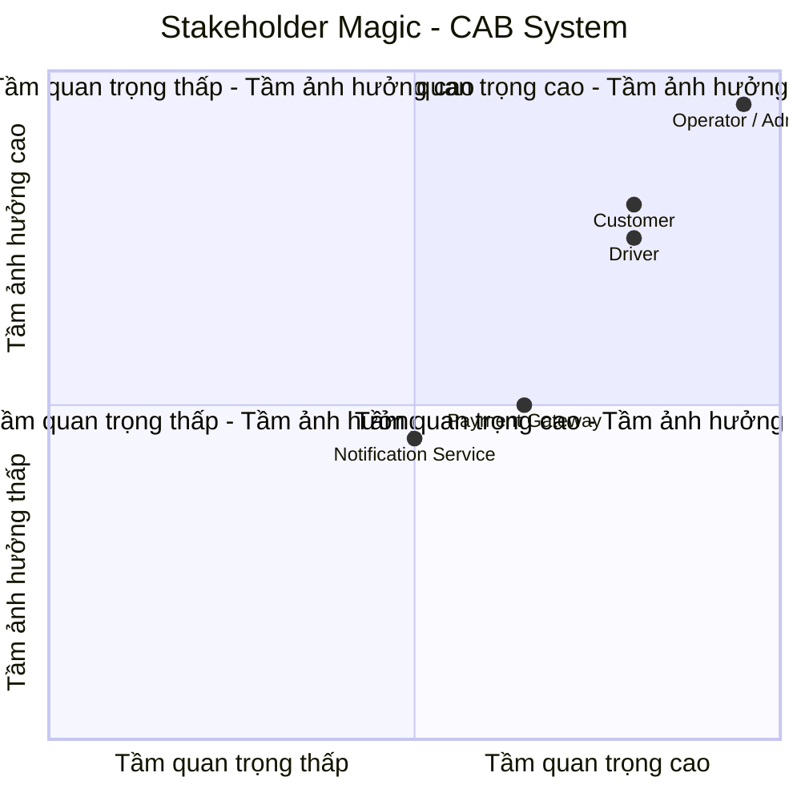

Bước 1 - Yêu cầu: Đọc và phân tích sơ khởi của khách hàng giai đoạn 1 ( ngữ cảnh nghiệp vụ )xác định vấn đề nghiệp vụ là gì, tự phân tích đặt ra 1 số câu hỏi khách hàng muốn giải quyết vấn đề gì tại sao hệ thống không làm được mà phải sử dụng hệ thống mới ai tham gia sử dụng hệ thống này ?  

Giai đoạn 1 – Ngữ cảnh nghiệp vụ, mình sẽ phân tích ở mức sơ khởi.
1. Bối cảnh & Vấn đề nghiệp vụ là gì?
Bối cảnh: Công ty ABC cung cấp dịch vụ đặt xe trực tuyến, hiện vận hành thủ công qua tổng đài kết hợp ứng dụng sơ khai.
Vấn đề cốt lõi:
Phân công thủ công: Điều phối xe thủ công gây chậm trễ, sai sót và tắc nghẽn khi lượng đặt xe tăng cao.
Trải nghiệm kém: Khách hàng không thể theo dõi vị trí thực tế của tài xế, thời gian chờ hoặc trạng thái chuyến đi theo thời gian thực.
Dữ liệu phân mảnh: Dữ liệu thanh toán, chuyến đi và hồ sơ tài xế chưa được đồng bộ tập trung.
Khó mở rộng: Đội ngũ vận hành quá tải khi mở rộng quy mô phương tiện và địa bàn kinh doanh.
2. Tự đặt câu hỏi
Câu hỏi 1: Khách hàng muốn giải quyết vấn đề gì thông qua hệ thống mới?
Câu hỏi 2: Tại sao hệ thống cũ không làm được mà bắt buộc phải xây dựng hệ thống mới?
Câu hỏi 3: Ai tham gia sử dụng hệ thống này? (Các tác nhân / Stakeholders)

Bước 2 - Xác định stack holder trong yêu cầu khách hàng
Tên stack holder: customer, 
Vai trò của stack holder
Customer: đặt xe, thanh toán
Lập ra một ma trận stack holder magic ( cho biết tầm ảnh hưởng quan trọng của stack holder trong hệ thống) công cụ mermaid github vẽ lược đồ sơ đồ trong md
stack holder table - stack holder magic biết tầm quan trọng vai trò trong hệ thống

DANH SÁCH STAKEHOLDERS VÀ VAI TRÒ (CAB SYSTEM)
1. Customer (Khách hàng)
Đăng ký & Đăng nhập: Tạo tài khoản và cập nhật thông tin cá nhân.
Đặt chuyến xe: Nhập điểm đón, điểm đến, chọn loại xe và gửi yêu cầu đặt xe.
Theo dõi chuyến đi: Xem tài xế nhận chuyến, thời gian xe đến và vị trí xe trên bản đồ.
Thanh toán & Đánh giá: Trả tiền mặt hoặc thanh toán online; xem lại lịch sử chuyến và chấm điểm/đánh giá tài xế.
2. Driver (Tài xế)
Quản lý trạng thái: Đăng nhập, cập nhật xe và bật/tắt chế độ sẵn sàng nhận khách.
Nhận cuốc xe: Nhận thông báo cuốc mới, chọn chấp nhận hoặc từ chối.
Cập nhật hành trình: Bấm chuyển trạng thái (Đã đến điểm đón => Đã đón khách => Đang di chuyển => Hoàn thành).  
3. Operator / Admin (Nhân viên vận hành & Quản trị viên)
Quản lý dữ liệu: Xem danh sách, thêm/sửa/khóa tài khoản khách hàng, tài xế và phương tiện.  
Giám sát & Hỗ trợ: Theo dõi các cuốc xe đang chạy, can thiệp xử lý khi chuyến bị lỗi hoặc hủy.  
Thống kê báo cáo: Xem tổng quan số chuyến đi, doanh thu và tỷ lệ hoàn thành chuyến.  
4. Hệ thống bên ngoài (External Services)
Cổng thanh toán (Payment Gateway): Nhận yêu cầu thanh toán online và trả kết quả thành công/thất bại về hệ thống.  
Dịch vụ thông báo (Notification Service): Gửi thông báo đẩy (Push notification/SMS) khi có tài xế nhận chuyến hoặc hoàn thành đơn. 

MA TRẬN STAKEHOLDER (STAKEHOLDER MATRIX)
### 1. Bảng phân loại mức độ quan trọng (Power / Interest Grid)

| Nhóm Stakeholder | Quyền lực (Power) | Mức độ quan tâm (Interest) | Vị trí trong ma trận | Ý nghĩa thực hiện |
| :--- | :---: | :---: | :--- | :--- |
| **Admin / Operator** | Cao | Cao | **Manage Closely** (Quản lý chặt) | Quyết định quy trình vận hành và kiểm soát dữ liệu toàn bộ hệ thống. |
| **Customer** | Thấp | Cao | **Keep Informed** (Theo dõi thường xuyên) | Trực tiếp sử dụng dịch vụ đặt xe, trải nghiệm quyết định sự thành công. |
| **Driver** | Thấp | Cao | **Keep Informed** (Theo dõi thường xuyên) | Trực tiếp nhận cuốc và vận hành lộ trình theo luồng hệ thống. |
| **Payment / Notification** | Thấp | Thấp | **Monitor** (Theo dõi tối thiểu) | Dịch vụ ngoài, tích hợp qua API theo đặc tả kỹ thuật. |

## 2. Sơ đồ Ma trận Stakeholder (Quadrant Chart)

### Stakeholder Table

| Stakeholder | Vai trò | Tầm quan trọng | Tầm ảnh hưởng |
|---|---|---|---|
| Customer | Đặt xe, theo dõi chuyến, thanh toán và đánh giá tài xế | Cao | Cao |
| Driver | Nhận cuốc xe và cập nhật trạng thái chuyến đi | Cao | Cao |
| Operator / Admin | Quản lý khách hàng, tài xế, phương tiện và chuyến đi | Rất cao | Rất cao |
| Payment Gateway | Xử lý thanh toán trực tuyến | Cao | Trung bình |
| Notification Service | Gửi thông báo cho khách hàng và tài xế | Trung bình | Trung bình |

Bước 3: Xác định mục tiêu nghiệp vụ ( bussiness goal)
BG01 là gì vd giảm thời gian tìm tài xế => hệ thống có chức năng tự động tìm tài xế
BG02 là hỗ trợ thanh toán => cho phép thanh toán bằng tiền mặt và trực tuyến

| Mã BG | Vấn đề nghiệp vụ hiện tại (Business Problem) | Mục tiêu nghiệp vụ tương ứng (Business Goal) |
| :--- | :--- | :--- |
| **BG01** | Việc phân công tài xế chủ yếu làm thủ công, mất nhiều thời gian. | Tự động hóa quá trình tìm kiếm và điều phối tài xế gần khách hàng nhất. |
| **BG02** | Khách hàng khó theo dõi trạng thái chuyến đi và thời gian chờ. | Minh bạch hóa thông tin hành trình và thời gian xe đến theo thời gian thực. |
| **BG03** | Khách hàng phải tạo lại yêu cầu nếu tài xế đầu tiên từ chối. | Đảm bảo trải nghiệm đặt xe liên tục bằng cơ chế tự động chuyển tiếp chuyến cho tài xế khác. |
| **BG04** | Thông tin thanh toán chưa được quản lý tập trung, phụ thuộc tiền mặt. | Chuẩn hóa quy trình tính cước tự động và đa dạng hóa hình thức thanh toán (tiền mặt / trực tuyến). |
| **BG05** | Bộ phận vận hành gặp khó khăn, quá tải khi mở rộng quy mô. | Tối ưu hóa năng lực giám sát, quản lý dữ liệu và hỗ trợ xử lý sự cố nhanh chóng. |
| **BG06** | Ban lãnh đạo thiếu dữ liệu để đánh giá chất lượng và hiệu quả hoạt động. | Cung cấp số liệu thống kê trực quan về doanh thu, tỷ lệ hoàn thành chuyến và đánh giá tài xế. |

Bước 4: Xác định phạm vi đề bài, vd quản lý khách hàng, quản lý tài xế, trong bảng phạm vi phải biết nên làm gì,
trong phạm vi liệt kê yêu cầu phải làm module cơ bản, hệ thống dưới góc độ hệ thống mvp, điền thêm những cái ngoài phạm vi không nên làm hoặc không thể làm 

### 1. Bảng phạm vi nghiệp vụ (In-Scope vs. Out-of-Scope)

| Phân hệ / Module | Trong phạm vi MVP (In-Scope - Phải làm) | Ngoài phạm vi (Out-of-Scope - Không làm / Để sau) |
| :--- | :--- | :--- |
| **1. Quản lý Tài khoản & Phân quyền** | - Đăng ký, đăng nhập tài khoản Khách hàng và Tài xế. - Xem và cập nhật thông tin cá nhân cơ bản. - Phân quyền cơ bản (Khách hàng, Tài xế, Quản trị viên). | - Đăng nhập bằng mạng xã hội (Google, Facebook, Apple ID). - Xác thực sinh trắc học (vân tay, FaceID). - Quy trình KYC nâng cao (quét CCCD/bằng lái tự động qua AI). |
| **2. Quản lý Đặt xe & Khớp chuyến** | - Nhập điểm đón, điểm đến, chọn loại xe (4 chỗ/7 chỗ). - Tự động tìm tài xế gần nhất theo bán kính vị trí. - Chuyển tiếp cuốc tự động khi tài xế từ chối/hết giờ phản hồi. - Báo không tìm được xe khi hết tài xế khả dụng. | - Đặt xe trước theo lịch hẹn ngày/giờ. - Đặt chung chuyến / đi ghép (Carpooling). - Thuật toán định giá động (Surge pricing) theo thời tiết hay kẹt xe phức tạp. |
| **3. Theo dõi Chuyến xe (Tracking)** | - Hiển thị trạng thái cuốc xe (Tìm tài xế -> Đã nhận -> Đã đến đón -> Đang chở -> Hoàn thành). - Mô phỏng vị trí GPS tài xế và thời gian dự kiến đến (ETA cơ bản). | - Gọi điện thoại trực tiếp hoặc Chat thoại (VoIP) trong ứng dụng. - Tối ưu hóa điều hướng tránh tắc đường theo thời gian thực nâng cao. |
| **4. Thanh toán & Cước phí** | - Tự động tính tiền cước cơ bản dựa trên khoảng cách và loại xe. - Hỗ trợ thanh toán Tiền mặt. - Tích hợp Mock/Sandbox một Cổng thanh toán điện tử (VNPay/Momo/ZaloPay) để giả lập thanh toán online. | - Tích hợp nhiều cổng thanh toán cùng lúc. - Ví điện tử nội bộ, nạp/rút tiền tài xế. - Quản lý mã giảm giá, khuyến mãi (Voucher/Coupon) phức tạp. |
| **5. Đánh giá & Lịch sử** | - Khách hàng chấm điểm sao (1 - 5 sao) và để lại nhận xét ngắn. - Xem danh sách lịch sử các chuyến đi đã hoàn thành. | - Hệ thống thưởng/phạt điểm thưởng, phân cấp bậc tài xế (Rank VIP). - Báo cáo khiếu nại hoàn tiền tự động. |
| **6. Quản trị & Vận hành (Admin)** | - Giao diện Web xem danh sách Khách hàng, Tài xế, Phương tiện. - Giám sát danh sách các chuyến đi đang hoạt động. - Báo cáo thống kê cơ bản: Tổng số chuyến, doanh thu, tỷ lệ hủy chuyến. | - Quản lý ca kíp làm việc, chấm công chi tiết cho tài xế. - Hệ thống tổng đài viên nhận cuộc gọi đặt xe từ khách (Call Center). - Phân quyền đa cấp độ chi tiết (RBAC chuyên sâu theo phòng ban). |

---

### 2. Tóm tắt nguyên tắc MVP cho đề tài

* **Tập trung làm tốt luồng chính (Core Flow):** Khách đặt xe -> Hệ thống quét tìm tài xế -> Tài xế nhận cuốc -> Cập nhật lộ trình -> Hoàn thành chuyến -> Thanh toán (Tiền mặt/Online giả lập) -> Đánh giá.
* **Cắt giảm tính năng phụ:** Không mở rộng các tính năng khuyến mãi, chat nội bộ, gọi tổng đài hay ví tiền phức tạp để đảm bảo hoàn thành đúng thời hạn 7 tuần.

Bước 5: Xác nhận đúng yêu cầu thiết kế, chuyển thành Business Requirement, khi thiết kế kí hiệu là BR, ví dụ giả sử ở đây có BR01 đặt chuyến, diễn giải lập ra 1 bảng có 3 cột có BR01 tên BR01 là gì, diễn giải là hệ thống phải cho phép khách hàng tạo yêu cầu cung cấp điểm đến, điểm đón

| Mã BR | Tên Business Requirement | Diễn giải |
|---|---|---|
| **BR01** | Đặt chuyến xe | Hệ thống phải cho phép khách hàng tạo yêu cầu đặt xe bằng cách cung cấp điểm đón, điểm đến và loại xe. |
| **BR02** | Tìm và phân công tài xế | Hệ thống phải hỗ trợ tìm kiếm và phân công tài xế phù hợp cho yêu cầu đặt xe dựa trên vị trí và trạng thái sẵn sàng. |
| **BR03** | Nhận và xử lý cuốc xe | Hệ thống phải cho phép tài xế nhận hoặc từ chối cuốc xe được gửi đến. |
| **BR04** | Theo dõi chuyến xe | Hệ thống phải cho phép khách hàng theo dõi trạng thái chuyến xe từ lúc tìm tài xế đến khi hoàn thành chuyến. |
| **BR05** | Cập nhật trạng thái chuyến | Hệ thống phải cho phép tài xế cập nhật trạng thái chuyến gồm đã đến điểm đón, đã đón khách, đang di chuyển và hoàn thành. |
| **BR06** | Tính cước và thanh toán | Hệ thống phải hỗ trợ tính cước chuyến đi và cho phép khách hàng thanh toán bằng tiền mặt hoặc thanh toán trực tuyến. |
| **BR07** | Đánh giá tài xế | Hệ thống phải cho phép khách hàng đánh giá tài xế sau khi hoàn thành chuyến đi. |
| **BR08** | Quản lý tài khoản | Hệ thống phải cho phép khách hàng và tài xế đăng ký, đăng nhập và cập nhật thông tin cá nhân. |
| **BR09** | Quản lý và giám sát | Hệ thống phải cho phép Operator/Admin quản lý khách hàng, tài xế, phương tiện và theo dõi các chuyến xe đang hoạt động. |
| **BR10** | Thông báo | Hệ thống phải gửi thông báo cho khách hàng và tài xế về các sự kiện quan trọng như nhận chuyến, tài xế đến điểm đón, hoàn thành chuyến và kết quả thanh toán. |
| **BR11** | Lịch sử chuyến đi | Hệ thống phải cho phép khách hàng xem lại thông tin các chuyến đi đã hoàn thành và số tiền đã thanh toán. |
| **BR12** | Báo cáo hoạt động | Hệ thống phải cung cấp cho Operator/Admin các thống kê cơ bản về số chuyến, doanh thu và tỷ lệ hoàn thành chuyến. |

Bước 6: Xây dựng Bussiness Project, gợi ý: tạo chuyến đi (chọn điểm đến - đón), hệ thống xác nhận, tìm tài xế, nếu như tìm ra tính tiếp, tìm không ra thông báo, tìm ra tài xế, đợi tài xế chấp nhận, chấp nhận thì đi, không thì thông báo tìm tài xế khác ( hãy thiết kế các Bussiness project )

BP01: Quy trình Đặt chuyến xe & Điều phối tự động (Core Flow)
Tác nhân: Customer, Driver, Hệ thống.Mô tả luồng xử lý:Khách hàng chọn điểm đón, điểm đến và loại xe (4 chỗ/7 chỗ).Hệ thống tính khoảng cách và hiển thị cước phí tạm tính.Khách hàng nhấn "Xác nhận đặt xe".
Hệ thống quét danh sách tài xế thỏa mãn: Đang ONLINE, đúng loại xe, trong bán kính quy định (1–3 km).
Xử lý rẽ nhánh:Nếu không có tài xế nào: Hệ thống trả về thông báo "Không tìm thấy tài xế" $\rightarrow$ Kết thúc cuốc.Nếu tìm thấy tài xế: Hệ thống sắp xếp ưu tiên (gần nhất $\rightarrow$ rating cao nhất) và gửi thông báo nhận cuốc kèm đồng hồ đếm ngược (30 giây) đến tài xế đầu tiên.
Phản hồi của tài xế:Tài xế Từ chối hoặc Quá thời gian 30s: Hệ thống tự động chuyển tiếp yêu cầu đến tài xế ưu tiên tiếp theo trong danh sách. Nếu đã hết danh sách mà không ai nhận, báo không tìm thấy tài xế.
Tài xế Chấp nhận: Hệ thống khóa chuyến đi, gán tài xế vào cuốc (Status = ACCEPTED), gửi thông tin tài xế và biển số xe về cho khách hàng.

Bước 7: Có BR và BP thì phân rã yêu cầu nghiệp vụ mã viết tắt là FR, từ bussiness yêu cầu trên mỗi bussiness yêu cầu phân rã thành bussiness funcional requirment, ví dụ để tìm tài xế phân rã ra xác định được vị trí khách hàng, fr2 là trong khu vực đó có bán kính 1km có tài xế offline tài xế online chọn, fr3 chọn loại xe, fr4 trong requirmant ưu tiên rating cao, ưu tiên chọn tài xế đánh giá cao, .....

Bước 8: Bussiness Rules và Aception, kèm theo luật xảy ra ngoại lệ, quy định nghiệp vụ 
ví dụ khi xảy ra ngoại lệ phải sao ? tự thiết kế 
giả sử: chỉ những tài xế available trong trạng thái sẵn sàng mới nhận chuyến, aceptional giả sử khách hàng tạo chuyến chờ tìm tài xế, tìm tài xế lâu phải sao ví dụ như hủy chuyến hoặc đổi tài xế khác. Khi book có tài xế khác rồi nhưng mà quá thời hạn không bấm acept phải reject ra chuyển qua tài xế khác

Bước 9: Xây dựng data model (nhìn vô để xác định thực thể và vẽ lên sơ đồ ERD)
Bước 10: Xác định yêu cầu phi chức năng
vd như hệ thống mvp không quan tâm tới thời gian phản hồi dưới 1ms
tại đang làm xác định yêu cầu nghiệp vụ 

Bước 11-12: Vẽ sơ đồ use case UC01 là customer trong đó có những cái gì + đặc tả use case 

