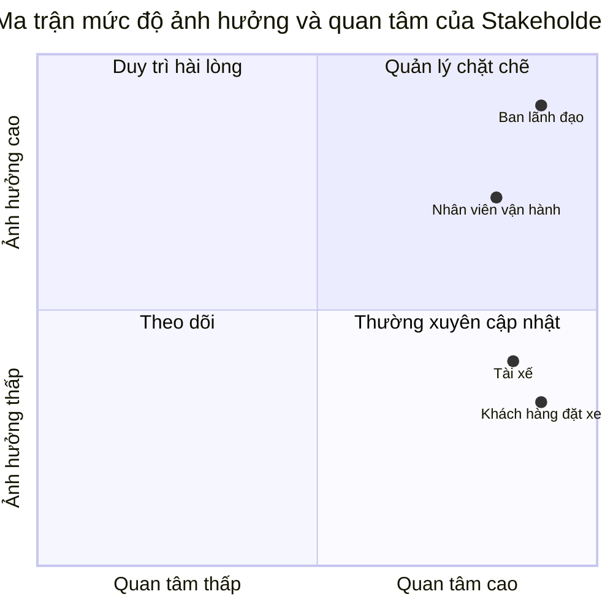
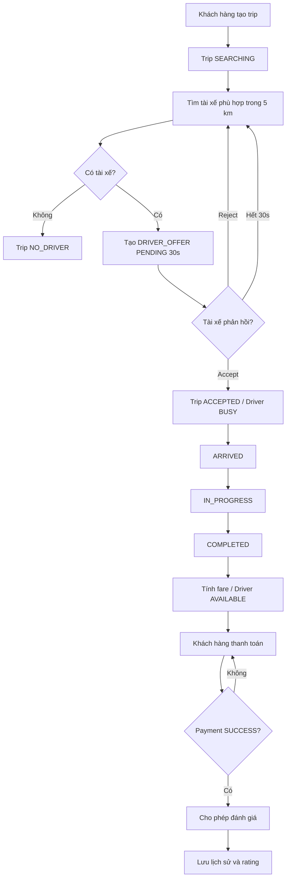
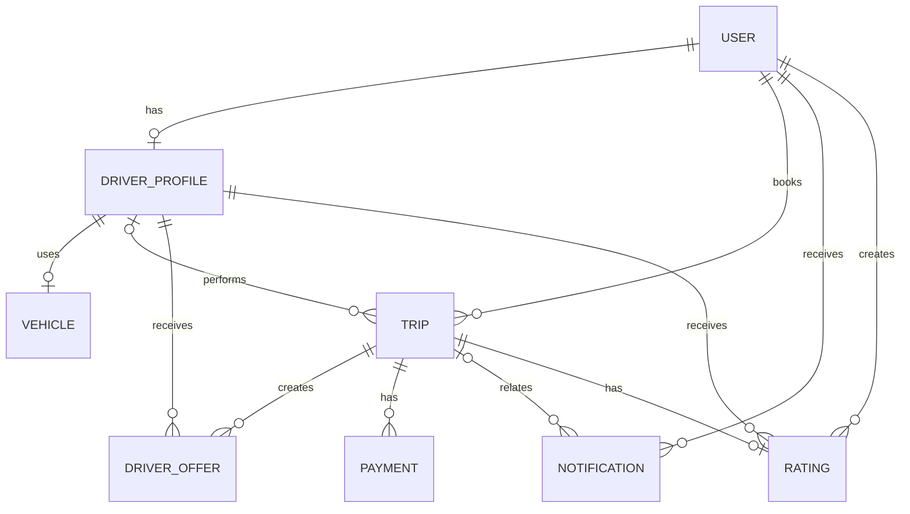
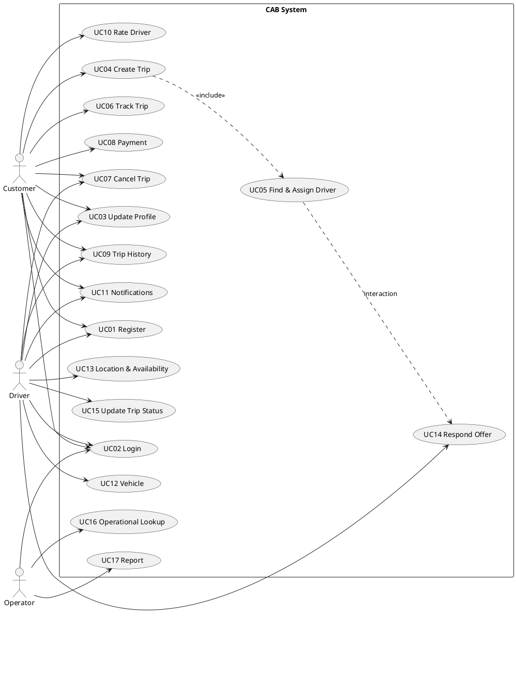

# PHÂN TÍCH YÊU CẦU HỆ THỐNG CAB SYSTEM
---

## Bước 1. Phân tích sơ khởi và ngữ cảnh nghiệp vụ

### 1.1. Bối cảnh nghiệp vụ

Công ty ABC đang cung cấp dịch vụ đặt xe trực tuyến. Hiện nay, khách hàng có thể liên hệ tổng đài hoặc sử dụng một ứng dụng đơn giản để yêu cầu xe. Tuy nhiên, quá trình tìm và phân công tài xế vẫn phụ thuộc nhiều vào xử lý thủ công, thông tin chuyến đi chưa được quản lý tập trung và việc theo dõi trạng thái giữa khách hàng, tài xế và nhân viên vận hành chưa thống nhất.

Công ty muốn xây dựng **CAB System** để hỗ trợ một quy trình đặt xe hoàn chỉnh: khách hàng tạo yêu cầu, hệ thống tìm tài xế phù hợp, tài xế phản hồi yêu cầu và thực hiện chuyến, hệ thống tính cước, ghi nhận thanh toán, lưu lịch sử và cho phép khách hàng đánh giá tài xế sau khi chuyến đã hoàn thành và thanh toán thành công.

CAB System được xây dựng trong thời gian 7 tuần dưới dạng **MVP**, tập trung vào các chức năng có thể triển khai, kiểm thử và minh họa bằng Node.js. Hệ thống không hướng tới mô phỏng đầy đủ một nền tảng gọi xe thương mại.

### 1.2. Vấn đề nghiệp vụ hiện tại

Hệ thống hiện tại tồn tại các vấn đề chính sau:

1. Việc tìm kiếm và phân công tài xế chủ yếu được thực hiện thủ công.
2. Khách hàng khó theo dõi trạng thái hiện tại của chuyến đi.
3. Khách hàng không biết tài xế nào đã nhận chuyến.
4. Tài xế chưa có quy trình thống nhất để nhận, từ chối và cập nhật chuyến.
5. Thông tin chuyến đi, cước phí và thanh toán chưa được quản lý tập trung.
6. Nhân viên vận hành khó theo dõi khách hàng, tài xế và các chuyến đang diễn ra.
7. Trường hợp tài xế từ chối, hết thời gian phản hồi hoặc không còn tài xế phù hợp chưa được xử lý thống nhất.
8. Doanh nghiệp gặp khó khăn khi thống kê số chuyến, số chuyến hoàn thành, số chuyến hủy và doanh thu.

### 1.3. Vấn đề doanh nghiệp muốn giải quyết

Doanh nghiệp muốn hệ thống mới có thể:

- Quản lý tài khoản khách hàng, tài xế và nhân viên vận hành theo vai trò.
- Cho phép khách hàng tạo và theo dõi yêu cầu đặt xe.
- Cho phép tài xế cập nhật hồ sơ, phương tiện, vị trí giả lập và trạng thái sẵn sàng nhận chuyến.
- Tự động tìm tài xế phù hợp theo trạng thái, loại xe, vị trí và tiêu chí ưu tiên.
- Cho phép tài xế chấp nhận hoặc từ chối đề xuất chuyến trong thời gian quy định.
- Chuẩn hóa trạng thái chuyến và quy tắc hủy chuyến.
- Tính và lưu cước phí sau khi chuyến hoàn thành.
- Ghi nhận thanh toán tiền mặt và mô phỏng thanh toán điện tử.
- Cho phép khách hàng xem lịch sử chuyến kèm thông tin thanh toán của chuyến.
- Chỉ cho phép đánh giá tài xế sau khi chuyến hoàn thành và đã thanh toán thành công.
- Cho phép nhân viên vận hành **tra cứu** dữ liệu vận hành và xem báo cáo cơ bản; không thực hiện CRUD dữ liệu khách hàng/tài xế trong MVP.

### 1.4. Tại sao cần xây dựng hệ thống mới?

CAB System giúp giảm phụ thuộc vào phân công tài xế thủ công, chuẩn hóa trạng thái chuyến, quản lý tập trung dữ liệu và tạo một quy trình thống nhất giữa khách hàng, tài xế và nhân viên vận hành.

Trong phạm vi MVP, hệ thống ưu tiên **tính đúng đắn của flow nghiệp vụ và khả năng kiểm thử** hơn các chức năng thời gian thực hoặc tích hợp dịch vụ bên ngoài.

### 1.5. Người tham gia sử dụng hệ thống

#### Khách hàng

- Đăng ký và đăng nhập.
- Cập nhật thông tin cá nhân.
- Tạo yêu cầu đặt xe.
- Theo dõi trạng thái chuyến.
- Hủy chuyến khi đáp ứng điều kiện.
- Thanh toán.
- Xem lịch sử chuyến và thông tin thanh toán liên quan.
- Đánh giá tài xế khi đủ điều kiện.
- Xem thông báo.

#### Tài xế

- Đăng ký và đăng nhập.
- Cập nhật thông tin cá nhân và phương tiện.
- Cập nhật vị trí giả lập.
- Chuyển trạng thái giữa `OFFLINE` và `AVAILABLE` khi đủ điều kiện.
- Nhận đề xuất chuyến.
- Chấp nhận hoặc từ chối đề xuất chuyến.
- Hủy chuyến đã nhận khi còn được phép.
- Cập nhật trạng thái thực hiện chuyến.
- Xem lịch sử chuyến.
- Xem thông báo.

#### Nhân viên vận hành

- Đăng nhập bằng tài khoản được tạo sẵn.
- Tra cứu khách hàng, tài xế, phương tiện và chuyến đi.
- Theo dõi trạng thái chuyến.
- Kiểm tra trạng thái tài xế.
- Xem báo cáo hoạt động cơ bản.

> Nhân viên vận hành trong MVP chỉ có quyền **tra cứu và theo dõi**. Chức năng sửa, xóa, khóa tài khoản, hủy chuyến thay người dùng hoặc quản trị giao dịch không thuộc phạm vi.

### 1.6. Các quyết định nghiệp vụ đã thống nhất

| Mã | Nội dung cần quyết định | Quyết định áp dụng cho MVP |
|---|---|---|
| DEC01 | Loại xe | Hỗ trợ `MOTORBIKE` và `CAR` |
| DEC02 | Giá cước | `MOTORBIKE`: 10.000đ mở cửa + 5.000đ/km; `CAR`: 20.000đ mở cửa + 10.000đ/km |
| DEC03 | Khoảng cách chuyến | `distance_km` là dữ liệu giả lập được cung cấp khi tạo chuyến và phải lớn hơn 0 |
| DEC04 | Vị trí tài xế | Tài xế chủ động cập nhật `current_latitude`, `current_longitude` giả lập |
| DEC05 | Bán kính tìm tài xế | Tối đa 5 km tính từ vị trí tài xế đến điểm đón |
| DEC06 | Tiêu chí ưu tiên | Ưu tiên khoảng cách đến điểm đón tăng dần; nếu bằng nhau thì ưu tiên rating cao hơn |
| DEC07 | Phản hồi đề xuất | Mỗi `DRIVER_OFFER` có hiệu lực 30 giây |
| DEC08 | Tài xế từ chối | Một tài xế chỉ phản hồi một lần trên một offer; nếu từ chối, hệ thống chuyển sang tài xế phù hợp tiếp theo |
| DEC09 | Không tìm được tài xế | Không giới hạn số lần cố định; hệ thống kết thúc khi đã hết danh sách tài xế phù hợp và chuyển chuyến sang `NO_DRIVER` |
| DEC10 | Hủy chuyến của khách hàng | Được hủy ở `SEARCHING`, `ACCEPTED`, `ARRIVED`; bắt buộc nhập lý do |
| DEC11 | Hủy chuyến của tài xế | Chỉ tài xế đã được phân công được hủy ở `ACCEPTED`, `ARRIVED`; offer chưa nhận thì dùng từ chối, không dùng hủy chuyến |
| DEC12 | Phí hủy | MVP không áp dụng phí hủy |
| DEC13 | Thanh toán điện tử | Chỉ mô phỏng hai kết quả `SUCCESS` hoặc `FAILED`; không tích hợp cổng thanh toán thật |
| DEC14 | Đánh giá | Điểm nguyên 1–5, tối đa một đánh giá/chuyến; chỉ được đánh giá khi trip `COMPLETED` và có payment `SUCCESS` |
| DEC15 | Quyền Operator | Chỉ tra cứu dữ liệu vận hành và xem báo cáo; không CRUD |
| DEC16 | Báo cáo | Tổng chuyến, chuyến hoàn thành, chuyến hủy và tổng doanh thu từ các payment `SUCCESS` |

---

## Bước 2. Xác định Stakeholder

### 2.1. Khái niệm Stakeholder

Stakeholder là cá nhân hoặc nhóm người có liên quan, bị ảnh hưởng hoặc có khả năng tác động đến quá trình xây dựng và vận hành hệ thống.

### 2.2. Danh sách Stakeholder

| Mã | Stakeholder | Vai trò và nhu cầu | Mức ảnh hưởng | Mức quan tâm | Cách quản lý |
|---|---|---|---|---|---|
| STK01 | Khách hàng đặt xe | Đặt chuyến, theo dõi, hủy, thanh toán, xem lịch sử và đánh giá | Thấp – Trung bình | Cao | Thu thập phản hồi và kiểm thử flow khách hàng |
| STK02 | Tài xế | Quản lý hồ sơ/phương tiện/vị trí, nhận chuyến và cập nhật quá trình thực hiện | Thấp – Trung bình | Cao | Thu thập phản hồi và kiểm thử flow tài xế |
| STK03 | Nhân viên vận hành | Tra cứu người dùng, tài xế, phương tiện, chuyến và báo cáo | Cao | Cao | Xác nhận nhu cầu theo dõi và số liệu vận hành |
| STK04 | Ban lãnh đạo Công ty ABC | Xác định mục tiêu, phạm vi, chỉ số cần theo dõi và nghiệm thu | Cao | Cao | Quản lý chặt chẽ và xác nhận yêu cầu quan trọng |

### 2.3. Phân tích Stakeholder

#### STK01 – Khách hàng đặt xe

Khách hàng trực tiếp tạo yêu cầu và sử dụng dịch vụ. Chất lượng của flow đặt xe, theo dõi, hủy, thanh toán và đánh giá tác động trực tiếp tới trải nghiệm sử dụng.

#### STK02 – Tài xế

Tài xế trực tiếp nhận và thực hiện chuyến. Tài xế cần có hồ sơ, phương tiện và vị trí hợp lệ trước khi chuyển sang `AVAILABLE`, sau đó phản hồi đề xuất và cập nhật trạng thái chuyến theo đúng thứ tự.

#### STK03 – Nhân viên vận hành

Nhân viên vận hành cần nhìn được dữ liệu để theo dõi hệ thống nhưng trong MVP **không sửa dữ liệu nghiệp vụ**. Quyền được giới hạn ở tra cứu và báo cáo.

#### STK04 – Ban lãnh đạo

Ban lãnh đạo quan tâm tới mục tiêu nghiệp vụ, phạm vi và các số liệu tổng hợp. Đây là stakeholder xác nhận yêu cầu và kết quả nghiệm thu.

### 2.4. Stakeholder Matrix

Các tọa độ chỉ thể hiện vị trí tương đối, không phải dữ liệu khảo sát định lượng.

### 2.5. Kết luận

Ban lãnh đạo và nhân viên vận hành có mức ảnh hưởng cao. Khách hàng và tài xế có mức quan tâm cao và là nguồn chính để kiểm chứng tính đúng đắn của các flow người dùng.

---

## Bước 3. Xác định mục tiêu nghiệp vụ

### 3.1. Khái niệm Business Goal

Business Goal là mục tiêu nghiệp vụ Công ty ABC muốn đạt được thông qua CAB System.

### 3.2. Danh sách Business Goal

| Mã | Mục tiêu nghiệp vụ | Vấn đề cần giải quyết | Kết quả mong đợi trong MVP |
|---|---|---|---|
| BG01 | Tự động hóa tìm và phân công tài xế | Phân công thủ công | Hệ thống lọc và đề xuất tài xế phù hợp |
| BG02 | Chuẩn hóa và theo dõi chuyến | Trạng thái chuyến chưa thống nhất | Mỗi chuyến tuân theo state flow xác định |
| BG03 | Quản lý tập trung chuyến và thanh toán | Dữ liệu phân tán | Lưu trip, fare và payment có liên kết |
| BG04 | Xử lý trường hợp đặt xe không thành công | Từ chối/hết hạn/không có tài xế chưa thống nhất | Tự chuyển tài xế khác hoặc kết thúc `NO_DRIVER` |
| BG05 | Hỗ trợ vận hành | Khó tra cứu và thống kê | Operator tra cứu dữ liệu và xem báo cáo |
| BG06 | Ghi nhận phản hồi sau chuyến | Chưa lưu đánh giá tập trung | Khách hàng đánh giá sau khi chuyến hoàn thành và thanh toán thành công |

### 3.3. Phân tích Business Goal

#### BG01 – Tự động hóa tìm và phân công tài xế

Hệ thống lọc tài xế `AVAILABLE`, có phương tiện đúng loại, có vị trí hợp lệ và nằm trong bán kính 5 km tính từ điểm đón. Danh sách được ưu tiên theo khoảng cách, sau đó theo rating.

#### BG02 – Chuẩn hóa và theo dõi chuyến

Flow trạng thái chính:

`SEARCHING → ACCEPTED → ARRIVED → IN_PROGRESS → COMPLETED`

Các trạng thái kết thúc khác gồm `CANCELLED` và `NO_DRIVER`.

#### BG03 – Quản lý tập trung chuyến và thanh toán

Trip lưu dữ liệu đặt xe và cước; payment lưu phương thức, số tiền và kết quả. Một trip có thể có nhiều payment `FAILED` nhưng tối đa một payment `SUCCESS`.

#### BG04 – Xử lý đặt xe không thành công

Offer bị từ chối hoặc hết 30 giây sẽ không được dùng lại. Hệ thống tiếp tục với tài xế phù hợp tiếp theo; khi hết ứng viên, trip chuyển `NO_DRIVER`.

#### BG05 – Hỗ trợ vận hành

Operator tra cứu khách hàng, tài xế, phương tiện và chuyến; đồng thời xem số liệu tổng hợp. Operator không sửa hoặc hủy dữ liệu trong MVP.

#### BG06 – Ghi nhận phản hồi sau chuyến

Khách hàng chỉ đánh giá khi trip `COMPLETED` và đã có payment `SUCCESS`. Rating được dùng để tính điểm trung bình của tài xế.

### 3.4. Giới hạn Business Goal

Không bao gồm AI dispatch, GPS thời gian thực, bản đồ thương mại, thanh toán thật, quy mô tải lớn hoặc phân tích dự báo nâng cao.

---

## Bước 4. Xác định phạm vi hệ thống

### 4.1. Mục tiêu xác định phạm vi

MVP phải đủ để demo một flow đặt xe từ đầu đến cuối và các ngoại lệ chính trong thời gian 7 tuần.

### 4.2. Phạm vi triển khai của MVP

| Mã | Module | Chức năng trong phạm vi | Cách kiểm chứng khi demo |
|---|---|---|---|
| SC01 | Tài khoản và phân quyền | Đăng ký, đăng nhập, phân quyền `CUSTOMER`, `DRIVER`, `OPERATOR` | Gọi chức năng bằng từng vai trò |
| SC02 | Hồ sơ khách hàng | Xem/cập nhật thông tin cá nhân; xem lịch sử chuyến và payment summary | Cập nhật hồ sơ, xem lịch sử |
| SC03 | Hồ sơ tài xế | Hồ sơ, phương tiện, vị trí giả lập và trạng thái hoạt động | Thêm xe, cập nhật tọa độ, chuyển `AVAILABLE` |
| SC04 | Đặt chuyến | Điểm đón, điểm đến, loại xe, tọa độ, khoảng cách giả lập | Tạo trip `SEARCHING` |
| SC05 | Tìm tài xế | Lọc theo `AVAILABLE`, phương tiện, vị trí và bán kính 5 km | Chuẩn bị nhiều tài xế và kiểm tra người được ưu tiên |
| SC06 | Driver Offer | Tài xế xem, chấp nhận/từ chối offer; tự hết hạn sau 30 giây | Kiểm tra `ACCEPTED`, `REJECTED`, `EXPIRED` |
| SC07 | Trạng thái và hủy chuyến | State transition và hủy hợp lệ kèm lý do | Thực hiện flow đúng/sai |
| SC08 | Tính cước | Tính theo loại xe và `distance_km` | So sánh với công thức |
| SC09 | Thanh toán | Cash và electronic mock | Kiểm tra `SUCCESS`/`FAILED` |
| SC10 | Thông báo | Lưu và hiển thị thông báo hệ thống | Xem danh sách theo tài khoản |
| SC11 | Lịch sử và đánh giá | Lịch sử chuyến; rating sau `COMPLETED` + payment `SUCCESS` | Kiểm tra điều kiện rating |
| SC12 | Vận hành và báo cáo | Operator tra cứu và xem báo cáo | Kiểm tra dữ liệu và tổng số liệu |

### 4.3. Quy trình nghiệp vụ trong phạm vi

1. Khách hàng và tài xế đăng nhập.
2. Tài xế có phương tiện, cập nhật vị trí giả lập và chuyển sang `AVAILABLE`.
3. Khách hàng tạo chuyến.
4. Hệ thống tạo trip `SEARCHING` và tìm tài xế phù hợp.
5. Hệ thống tạo `DRIVER_OFFER` có hạn 30 giây.
6. Nếu tài xế từ chối hoặc hết hạn, hệ thống tìm tài xế tiếp theo.
7. Nếu tài xế chấp nhận, trip chuyển `ACCEPTED` và tài xế chuyển `BUSY`.
8. Tài xế cập nhật `ARRIVED → IN_PROGRESS → COMPLETED`.
9. Khi `COMPLETED`, hệ thống tính cước và trả tài xế về `AVAILABLE`.
10. Khách hàng thanh toán; nếu electronic `FAILED` thì có thể thử lại hoặc chuyển `CASH`.
11. Khi có payment `SUCCESS`, khách hàng có thể đánh giá tài xế một lần.
12. Khách hàng xem lịch sử chuyến kèm thông tin thanh toán; tài xế xem lịch sử chuyến của mình.
13. Operator tra cứu dữ liệu và xem báo cáo.

### 4.4. Phạm vi ngoài MVP

| Mã | Nội dung ngoài phạm vi | Lý do |
|---|---|---|
| OS01 | GPS thời gian thực | Không cần cho demo flow |
| OS02 | Xe di chuyển trực tiếp trên bản đồ | Ngoài phạm vi MVP |
| OS03 | Google Maps/dịch vụ bản đồ trả phí | Dùng tọa độ giả lập |
| OS04 | Ngân hàng, ví, cổng thanh toán thật | Chỉ mock payment |
| OS05 | SMS/email/push thật | Chỉ lưu notification nội bộ |
| OS06 | AI dispatch | Dùng rule đơn giản |
| OS07 | Dynamic pricing | Giá cố định theo loại xe |
| OS08 | Voucher/khuyến mãi/ví nội bộ | Không thuộc core flow |
| OS09 | Nhiều thành phố/quốc gia | Dùng một vùng dữ liệu giả lập |
| OS10 | BI/dự báo nâng cao | Chỉ tổng hợp cơ bản |
| OS11 | Microservice phân tán nhiều máy | Module hóa trong ứng dụng Node.js |
| OS12 | Auto-scaling | Không cần cho môi trường demo |
| OS13 | Operator sửa/xóa người dùng hoặc can thiệp chuyến | Chỉ read-only trong MVP |
| OS14 | Bảo đảm timer offer tồn tại sau khi server restart | Không cần cho demo local |

### 4.5. Quy ước đơn giản hóa

- Tài xế nhập tọa độ giả lập; đây không phải GPS realtime.
- Khoảng cách từ tài xế đến điểm đón được tính từ tọa độ giả lập bằng công thức khoảng cách phù hợp, không gọi map API.
- `distance_km` của chuyến là dữ liệu giả lập đầu vào và phải lớn hơn 0.
- Offer có timeout 30 giây. MVP có thể xử lý timeout trong tiến trình Node.js; độ bền timer qua server restart nằm ngoài phạm vi.
- `simulated_result` của thanh toán điện tử là tham số phục vụ demo/kiểm thử, không phải kết quả do khách hàng thực tế quyết định.
- Báo cáo chỉ dùng phép đếm và tổng.

---

## Bước 5. Xây dựng Business Requirement

### 5.1. Khái niệm Business Requirement

Business Requirement mô tả khả năng nghiệp vụ cấp cao hệ thống phải cung cấp.

### 5.2. Danh sách Business Requirement

| Mã | Tên | Diễn giải |
|---|---|---|
| BR01 | Tài khoản và phân quyền | Đăng ký/đăng nhập và kiểm soát quyền theo `CUSTOMER`, `DRIVER`, `OPERATOR` |
| BR02 | Hồ sơ tài xế và phương tiện | Khách hàng cập nhật thông tin cá nhân; tài xế cập nhật thông tin cá nhân, phương tiện, vị trí giả lập và trạng thái hoạt động |
| BR03 | Tạo và theo dõi chuyến | Khách hàng tạo trip và theo dõi trạng thái/tài xế được phân công |
| BR04 | Tìm và phân công tài xế | Hệ thống lọc, ưu tiên, tạo offer, xử lý từ chối/hết hạn và `NO_DRIVER` |
| BR05 | Thực hiện và hủy chuyến | Tài xế cập nhật state; khách hàng/tài xế hủy theo đúng quyền, trạng thái và lý do |
| BR06 | Tính cước và thanh toán | Tính fare sau hoàn thành; ghi nhận cash và electronic mock |
| BR07 | Thông báo | Tạo và hiển thị notification liên quan tới offer, trip và payment |
| BR08 | Lịch sử và đánh giá | Khách hàng/tài xế xem lịch sử liên quan; khách hàng xem payment summary và đánh giá sau payment thành công |
| BR09 | Vận hành và báo cáo | Operator tra cứu dữ liệu và xem báo cáo cơ bản, không CRUD |

### 5.3. Quan hệ Business Goal – Business Requirement

| Business Goal | BR liên quan |
|---|---|
| BG01 | BR02, BR03, BR04 |
| BG02 | BR03, BR05, BR07 |
| BG03 | BR05, BR06, BR08 |
| BG04 | BR04, BR07 |
| BG05 | BR01, BR09 |
| BG06 | BR08 |

### 5.4. Giới hạn

Các BR không bao gồm chức năng nằm ngoài phạm vi tại mục 4.4.

---

## Bước 6. Xây dựng Business Process

### 6.1. Danh sách Business Process

| Mã | Tên quy trình | Người tham gia | Kết quả | BR |
|---|---|---|---|---|
| BP01 | Chuẩn bị tài khoản/tài xế | Khách hàng, tài xế, Operator | Người dùng xác thực; tài xế có xe, vị trí và trạng thái hợp lệ | BR01, BR02 |
| BP02 | Tạo chuyến và tìm tài xế | Khách hàng, tài xế | Có tài xế nhận hoặc trip `NO_DRIVER` | BR03, BR04, BR07 |
| BP03 | Thực hiện/hủy chuyến | Khách hàng, tài xế | Trip hoàn thành hoặc bị hủy hợp lệ | BR05, BR07 |
| BP04 | Tính cước và thanh toán | Khách hàng | Fare và payment được lưu | BR06, BR07 |
| BP05 | Lịch sử, đánh giá và vận hành | Khách hàng, tài xế, Operator | Lịch sử/đánh giá/báo cáo được tra cứu đúng quyền | BR08, BR09 |

### 6.2. Quy trình nghiệp vụ tổng quát

Nhánh hủy có thể xảy ra ở `SEARCHING`, `ACCEPTED`, `ARRIVED` theo RULE08. Không được hủy từ `IN_PROGRESS` trở đi.

### 6.3. Điểm bắt đầu và kết thúc

- Bắt đầu flow đặt xe: khách hàng gửi yêu cầu hợp lệ.
- Kết thúc thành công: trip `COMPLETED`, fare được tính và payment `SUCCESS` được ghi nhận; rating là tùy chọn.
- Kết thúc không thành công: trip `NO_DRIVER` hoặc `CANCELLED`.

---

## Bước 7. Xây dựng Functional Requirement

### 7.1. BR01 – Tài khoản và phân quyền

| FR | Tên | Mô tả |
|---|---|---|
| FR01 | Đăng ký tài khoản | Khách hàng và tài xế đăng ký với thông tin bắt buộc; Operator không tự đăng ký |
| FR02 | Đăng nhập | Xác thực email/mật khẩu và cấp token phiên |
| FR03 | Kiểm soát quyền | API được bảo vệ phải kiểm tra token và role |

### 7.2. BR02 – Hồ sơ và phương tiện

| FR | Tên | Mô tả |
|---|---|---|
| FR04 | Cập nhật hồ sơ khách hàng | Khách hàng xem và cập nhật thông tin cá nhân của mình |
| FR05 | Cập nhật hồ sơ tài xế và phương tiện | Tài xế cập nhật thông tin cá nhân và tối đa một phương tiện |
| FR06 | Cập nhật vị trí và trạng thái tài xế | Tài xế cập nhật tọa độ giả lập; chỉ chuyển `OFFLINE ↔ AVAILABLE` khi đủ điều kiện; `BUSY` do hệ thống quản lý |

### 7.3. BR03 – Tạo và theo dõi chuyến

| FR | Tên | Mô tả |
|---|---|---|
| FR07 | Nhập yêu cầu đặt xe | Khách hàng cung cấp điểm đón, điểm đến, tọa độ, loại xe và `distance_km` |
| FR08 | Kiểm tra và lưu trip | Hệ thống validate, kiểm tra active trip và tạo trip `SEARCHING` |
| FR09 | Theo dõi trip | Khách hàng xem trạng thái và thông tin tài xế/phương tiện khi đã phân công |

### 7.4. BR04 – Tìm và phân công tài xế

| FR | Tên | Mô tả |
|---|---|---|
| FR10 | Lọc tài xế | Chỉ chọn tài xế `AVAILABLE`, có xe đúng loại, có vị trí hợp lệ và trong 5 km |
| FR11 | Sắp xếp tài xế | Ưu tiên khoảng cách tăng dần; nếu bằng nhau ưu tiên rating cao hơn |
| FR12 | Tạo và gửi offer | Tạo `DRIVER_OFFER=PENDING`, `expires_at` sau 30 giây và notification cho tài xế |
| FR13 | Xử lý phản hồi/timeout | Accept thì phân công; Reject/Expired thì chuyển ứng viên tiếp theo |
| FR14 | Không có tài xế | Khi hết ứng viên, trip chuyển `NO_DRIVER` và thông báo khách hàng |

### 7.5. BR05 – Thực hiện và hủy chuyến

| FR | Tên | Mô tả |
|---|---|---|
| FR15 | Cập nhật trạng thái trip | Tài xế được phân công cập nhật `ACCEPTED → ARRIVED → IN_PROGRESS → COMPLETED` theo đúng thứ tự |
| FR16 | Hủy trip | Khách hàng/tài xế hủy theo RULE08; lý do hủy bắt buộc và được lưu |
| FR17 | Đồng bộ trạng thái tài xế | Accept → `BUSY`; trip `COMPLETED` hoặc `CANCELLED` → `AVAILABLE` |

### 7.6. BR06 – Tính cước và thanh toán

| FR | Tên | Mô tả |
|---|---|---|
| FR18 | Tính cước | Khi trip `COMPLETED`, tính fare theo vehicle type và `distance_km` |
| FR19 | Thanh toán tiền mặt | Trip `COMPLETED` chưa có payment `SUCCESS` có thể ghi nhận `CASH=SUCCESS` |
| FR20 | Thanh toán điện tử mô phỏng | Tạo kết quả `SUCCESS`/`FAILED`; nếu failed có thể thử lại hoặc chuyển cash |

### 7.7. BR07 – Thông báo

| FR | Tên | Mô tả |
|---|---|---|
| FR21 | Tạo thông báo | Tạo notification cho các sự kiện nghiệp vụ quan trọng |
| FR22 | Xem thông báo | Customer/Driver chỉ xem notification thuộc tài khoản mình |

### 7.8. BR08 – Lịch sử và đánh giá

| FR | Tên | Mô tả |
|---|---|---|
| FR23 | Xem lịch sử chuyến | Customer xem trip của mình kèm payment summary; Driver xem trip đã/đang được phân công cho mình |
| FR24 | Đánh giá tài xế | Customer đánh giá một lần, điểm 1–5, chỉ khi trip `COMPLETED` và có payment `SUCCESS`; cập nhật average rating |

### 7.9. BR09 – Vận hành và báo cáo

| FR | Tên | Mô tả |
|---|---|---|
| FR25 | Tra cứu dữ liệu vận hành | Operator read-only khách hàng, tài xế, phương tiện và trip |
| FR26 | Theo dõi trip | Operator lọc và xem trip theo trạng thái |
| FR27 | Báo cáo cơ bản | Tổng trip, `COMPLETED`, `CANCELLED`, doanh thu từ payment `SUCCESS` |

### 7.10. Nguyên tắc triển khai FR

Mỗi FR phải có API hoặc hành vi hệ thống tương ứng, có AC kiểm chứng được và phải trace được ngược về BR/BG. Test Case chỉ được xây dựng sau khi SRS và API Specification đã đồng bộ.

---

## Bước 8. Business Rules và Exceptions

### 8.1. Business Rules

| Rule | Tên | Nội dung | FR |
|---|---|---|---|
| RULE01 | Phân quyền | Ba role: `CUSTOMER`, `DRIVER`, `OPERATOR`; chỉ được dùng chức năng đúng role | FR01–FR03 |
| RULE02 | Điều kiện AVAILABLE/nhận chuyến | Tài xế phải có phương tiện và tọa độ hợp lệ; để được tìm phải đang `AVAILABLE` và đúng loại xe | FR05, FR06, FR10 |
| RULE03 | Giới hạn trip tài xế | Một tài xế tối đa một trip chưa kết thúc tại một thời điểm | FR13, FR17 |
| RULE04 | Giới hạn trip khách hàng | Một khách hàng tối đa một active trip thuộc `SEARCHING`, `ACCEPTED`, `ARRIVED`, `IN_PROGRESS` | FR07, FR08 |
| RULE05 | Tìm tài xế | Bán kính tối đa 5 km từ vị trí tài xế tới pickup; gần hơn ưu tiên trước, bằng khoảng cách thì rating cao hơn | FR10, FR11 |
| RULE06 | Timeout offer | Mỗi offer `PENDING` có 30 giây; hết hạn tự chuyển `EXPIRED` và tìm ứng viên tiếp theo | FR12, FR13 |
| RULE07 | State transition | `SEARCHING → ACCEPTED → ARRIVED → IN_PROGRESS → COMPLETED`; không bỏ qua/quay ngược | FR08, FR15 |
| RULE08 | Hủy trip | Customer: `SEARCHING/ACCEPTED/ARRIVED`; Driver đã phân công: `ACCEPTED/ARRIVED`; bắt buộc lý do; không phí hủy; khi hủy `SEARCHING`, mọi offer `PENDING` của trip chuyển `CANCELLED` | FR16, FR17 |
| RULE09 | Trạng thái tài xế | Accept → `BUSY`; `COMPLETED/CANCELLED` → `AVAILABLE`; tài xế `BUSY` không tự đổi status | FR06, FR17 |
| RULE10 | Loại xe/công thức | Chỉ `MOTORBIKE`, `CAR`; fare = opening fee + `distance_km × price_per_km` | FR05, FR07, FR18 |
| RULE11 | Mức cước demo | Motorbike 10.000 + 5.000/km; Car 20.000 + 10.000/km | FR18 |
| RULE12 | Điều kiện payment | Chỉ trip `COMPLETED` mới thanh toán; tối đa một payment `SUCCESS`; cho phép nhiều `FAILED` trước đó | FR19, FR20 |
| RULE13 | Electronic mock | Kết quả demo `SUCCESS` hoặc `FAILED`; failed cho phép retry hoặc cash | FR20 |
| RULE14 | Điều kiện rating | Trip phải `COMPLETED`, thuộc customer hiện tại, có payment `SUCCESS`, chưa có rating; score nguyên 1–5 | FR24 |
| RULE15 | Doanh thu | Chỉ cộng amount của payment `SUCCESS` | FR27 |
| RULE16 | Lịch sử/payment summary | Customer chỉ xem lịch sử của mình và payment summary của từng trip; Driver không xem payment của customer | FR23 |

### 8.2. Bảng giá cước

| Loại xe | Phí mở cửa | Giá/km |
|---|---:|---:|
| `MOTORBIKE` | 10.000đ | 5.000đ |
| `CAR` | 20.000đ | 10.000đ |

Ví dụ: MOTORBIKE 4 km = `10.000 + 4 × 5.000 = 30.000đ`.

### 8.3. Exceptions

| EX | Trường hợp | Xử lý | FR |
|---|---|---|---|
| EX01 | Thiếu/sai dữ liệu tạo trip hoặc `distance_km <= 0` | Từ chối và trả validation error | FR07, FR08 |
| EX02 | Customer đang có active trip | Không tạo trip mới | FR08 |
| EX03 | Không có tài xế phù hợp | Trip `NO_DRIVER`, thông báo customer | FR14, FR21 |
| EX04 | Driver reject offer | Offer `REJECTED`, tìm driver tiếp theo | FR13 |
| EX05 | Driver không phản hồi 30 giây | Offer `EXPIRED`, tự tìm driver tiếp theo | FR13 |
| EX06 | Sai state transition | Từ chối, giữ state hiện tại | FR15 |
| EX07 | Hủy không hợp lệ | Từ chối nếu sai actor/state hoặc thiếu lý do | FR16 |
| EX08 | Electronic payment failed | Lưu `FAILED`, cho retry/cash | FR20 |
| EX09 | Rating không hợp lệ | Từ chối nếu chưa completed, chưa payment success, score sai, đã rating hoặc không sở hữu trip | FR24 |
| EX10 | Sai quyền | `401` nếu chưa xác thực; `403` nếu role không có quyền | FR03 |
| EX11 | Driver chuyển AVAILABLE khi thiếu xe/vị trí | Từ chối cập nhật status | FR06 |
| EX12 | Offer không còn hiệu lực | Từ chối response nếu offer expired/rejected/cancelled/accepted hoặc trip không còn `SEARCHING` | FR13 |

---

## Bước 9. Xây dựng Data Model

### 9.1. Danh sách thực thể

| Mã | Entity | Mục đích |
|---|---|---|
| ENT01 | `USER` | Tài khoản và role |
| ENT02 | `DRIVER_PROFILE` | Hồ sơ nghiệp vụ, vị trí và trạng thái tài xế |
| ENT03 | `VEHICLE` | Phương tiện tài xế |
| ENT04 | `TRIP` | Yêu cầu và trạng thái chuyến |
| ENT05 | `DRIVER_OFFER` | Lần đề xuất trip cho tài xế |
| ENT06 | `PAYMENT` | Các lần thanh toán |
| ENT07 | `NOTIFICATION` | Thông báo nội bộ |
| ENT08 | `RATING` | Đánh giá tài xế |

### 9.2. Thuộc tính chính

#### USER

| Thuộc tính | Kiểu | Ràng buộc |
|---|---|---|
| id | String | PK |
| full_name | String | Required |
| email | String | Required, Unique |
| password_hash | String | Required, không trả về API |
| phone | String | Required |
| role | String | `CUSTOMER/DRIVER/OPERATOR` |
| created_at | DateTime | Auto |

#### DRIVER_PROFILE

| Thuộc tính | Kiểu | Ràng buộc |
|---|---|---|
| id | String | PK |
| user_id | String | FK, Unique |
| driver_status | String | `AVAILABLE/BUSY/OFFLINE` |
| current_latitude | Number | Nullable tới khi tài xế cập nhật; -90..90 |
| current_longitude | Number | Nullable tới khi tài xế cập nhật; -180..180 |
| average_rating | Number | 0..5, default 0 |

#### VEHICLE

| Thuộc tính | Kiểu | Ràng buộc |
|---|---|---|
| id | String | PK |
| driver_id | String | FK, Unique |
| vehicle_type | String | `MOTORBIKE/CAR` |
| license_plate | String | Required, Unique |
| brand | String | Optional |

#### TRIP

| Thuộc tính | Kiểu | Ràng buộc |
|---|---|---|
| id | String | PK |
| customer_id | String | FK, Required |
| driver_id | String | FK, Nullable khi chưa phân công |
| vehicle_type | String | `MOTORBIKE/CAR` |
| pickup_address | String | Required |
| pickup_latitude | Number | Required |
| pickup_longitude | Number | Required |
| destination_address | String | Required |
| destination_latitude | Number | Required |
| destination_longitude | Number | Required |
| distance_km | Number | Required, > 0 |
| trip_status | String | `SEARCHING/ACCEPTED/ARRIVED/IN_PROGRESS/COMPLETED/CANCELLED/NO_DRIVER` |
| fare_amount | Number | Default 0, tính khi completed |
| cancel_reason | String | Nullable; required nếu `CANCELLED` |
| created_at | DateTime | Auto |
| completed_at | DateTime | Nullable |

#### DRIVER_OFFER

| Thuộc tính | Kiểu | Ràng buộc |
|---|---|---|
| id | String | PK |
| trip_id | String | FK |
| driver_id | String | FK |
| offer_status | String | `PENDING/ACCEPTED/REJECTED/EXPIRED/CANCELLED` |
| expires_at | DateTime | Required |
| responded_at | DateTime | Nullable |

#### PAYMENT

| Thuộc tính | Kiểu | Ràng buộc |
|---|---|---|
| id | String | PK |
| trip_id | String | FK |
| payment_method | String | `CASH/ELECTRONIC` |
| payment_status | String | `PENDING/SUCCESS/FAILED` |
| amount | Number | Required, bằng fare của trip |
| created_at | DateTime | Auto |

#### NOTIFICATION

| Thuộc tính | Kiểu | Ràng buộc |
|---|---|---|
| id | String | PK |
| user_id | String | FK |
| trip_id | String | FK, Nullable |
| notification_type | String | Required |
| message | String | Required |
| created_at | DateTime | Auto |

> MVP chỉ yêu cầu **xem danh sách notification**, chưa yêu cầu đánh dấu đã đọc nên không dùng `is_read`.

#### RATING

| Thuộc tính | Kiểu | Ràng buộc |
|---|---|---|
| id | String | PK |
| trip_id | String | FK, Unique |
| customer_id | String | FK |
| driver_id | String | FK |
| score | Integer | 1..5 |
| comment | String | Optional |
| created_at | DateTime | Auto |

### 9.3. ERD

### 9.4. Ràng buộc dữ liệu quan trọng

1. Email và biển số xe không được trùng.
2. Một DRIVER user có đúng tối đa một `DRIVER_PROFILE` và một `VEHICLE` trong MVP.
3. Driver phải có vehicle + tọa độ hợp lệ trước khi chuyển `AVAILABLE`.
4. `TRIP.driver_id` null cho tới khi một offer được accept.
5. Mỗi cặp `(trip_id, driver_id)` chỉ nên có tối đa một offer cho cùng một quá trình tìm tài xế.
6. Tại một thời điểm, một trip chỉ có tối đa một offer `PENDING` vì hệ thống đề xuất tuần tự.
7. Trip có thể có nhiều payment `FAILED` nhưng tối đa một `SUCCESS`.
8. Trip tối đa một rating.
9. Nếu trip `CANCELLED`, `cancel_reason` phải có giá trị.
10. Nếu customer hủy trip `SEARCHING`, offer `PENDING` liên quan phải chuyển `CANCELLED` để không thể accept sau đó.
11. Mật khẩu lưu bằng hàm băm một chiều, không lưu mật khẩu gốc.
12. Báo cáo được tính từ trip và payment, không cần entity REPORT.

---

## Bước 10. Non-functional Requirement

| NFR | Nhóm | Yêu cầu | Cách kiểm chứng |
|---|---|---|---|
| NFR01 | Hiệu năng | API thông thường phản hồi ≤ 3 giây trong môi trường demo local | Đo bằng Postman |
| NFR02 | Hiệu năng tìm tài xế | Với tối đa 100 tài xế thử nghiệm, bước lọc/sắp xếp ứng viên hoàn thành ≤ 3 giây, không tính thời gian chờ offer 30 giây | Seed dữ liệu và đo thời gian |
| NFR03 | Xác thực | API bảo vệ yêu cầu token hợp lệ | Gọi không token/token sai |
| NFR04 | Phân quyền | Kiểm soát `CUSTOMER/DRIVER/OPERATOR` | Gọi API sai role |
| NFR05 | Mật khẩu | Password được hash một chiều và không xuất hiện trong response | Kiểm tra DB/response |
| NFR06 | Dữ liệu payment | Không lưu số thẻ/tài khoản ngân hàng | Kiểm tra PAYMENT |
| NFR07 | Validation | Từ chối thiếu trường, sai kiểu, sai enum, tọa độ/distance/rating không hợp lệ | Negative request |
| NFR08 | Toàn vẹn | Bảo đảm liên kết user-driver-trip-payment-rating và state rule | Kiểm tra các thao tác trái rule |
| NFR09 | Xử lý lỗi | Payment failed không làm mất trip; cho phép retry/cash | Mô phỏng failed |
| NFR10 | Bảo trì | Node.js tổ chức module theo auth/profile/trip/offer/payment/notification/rating/operation | Kiểm tra cấu trúc code |
| NFR11 | Logging | Log đăng nhập thất bại, transition quan trọng và payment result | Kiểm tra log |
| NFR12 | API consistency | Response thống nhất `success`, `message`, `data` hoặc `error` | So sánh endpoint |
| NFR13 | Usability | Message nêu rõ kết quả hoặc nguyên nhân từ chối | Kiểm tra error message |

---

## Bước 11. Xây dựng Use Case

### 11.1. Actor

| Mã | Actor | Mô tả |
|---|---|---|
| ACT01 | Khách hàng | Đặt, theo dõi, hủy, thanh toán, lịch sử và đánh giá |
| ACT02 | Tài xế | Hồ sơ/xe/vị trí, phản hồi offer, thực hiện/hủy trip |
| ACT03 | Nhân viên vận hành | Read-only dữ liệu vận hành và báo cáo |

Operator được tạo sẵn, không tự đăng ký.

### 11.2. Danh sách Use Case

| UC | Tên | Actor chính | FR |
|---|---|---|---|
| UC01 | Đăng ký | Customer, Driver | FR01 |
| UC02 | Đăng nhập | Customer, Driver, Operator | FR02 |
| UC03 | Cập nhật thông tin cá nhân | Customer, Driver | FR04, FR05 |
| UC04 | Tạo yêu cầu đặt xe | Customer | FR07, FR08 |
| UC05 | Tìm và phân công tài xế | Customer; Driver hỗ trợ qua phản hồi offer | FR10–FR14 |
| UC06 | Theo dõi trip | Customer | FR09 |
| UC07 | Hủy trip | Customer, Driver được phân công | FR16, FR17 |
| UC08 | Thanh toán | Customer | FR18–FR20 |
| UC09 | Xem lịch sử chuyến | Customer, Driver | FR23 |
| UC10 | Đánh giá tài xế | Customer | FR24 |
| UC11 | Xem thông báo | Customer, Driver | FR21, FR22 |
| UC12 | Quản lý phương tiện | Driver | FR05 |
| UC13 | Cập nhật vị trí và trạng thái hoạt động | Driver | FR06 |
| UC14 | Phản hồi offer | Driver | FR12, FR13 |
| UC15 | Cập nhật trạng thái trip | Driver | FR15, FR17, FR18 |
| UC16 | Tra cứu dữ liệu vận hành | Operator | FR25, FR26 |
| UC17 | Xem báo cáo | Operator | FR27 |

> FR03 là yêu cầu phân quyền dùng chung và được áp dụng cho tất cả Use Case/API được bảo vệ, không phải một mục tiêu người dùng độc lập.

### 11.3. Mã nguồn sơ đồ Use Case tổng quát

---

## Bước 12. Đặc tả Use Case

### UC01 – Đăng ký

- **Actor:** Customer, Driver.
- **Tiền điều kiện:** Không yêu cầu.
- **Trigger:** Người dùng gửi thông tin đăng ký.
- **FR:** FR01.

**Main flow:** nhập full name, email, phone, password, role `CUSTOMER/DRIVER` → hệ thống validate → kiểm tra email → hash password → tạo user; nếu Driver thì tạo `DRIVER_PROFILE` mặc định `OFFLINE` → trả kết quả thành công.

**Exception:** thiếu/sai dữ liệu, email trùng, role khác `CUSTOMER/DRIVER` → từ chối.

### UC02 – Đăng nhập

- **Actor:** Customer, Driver, Operator.
- **Tiền điều kiện:** Không yêu cầu.
- **FR:** FR02.

**Main flow:** gửi email/password → tìm user → so khớp password hash → tạo token → trả user và role.

**Exception:** email không tồn tại hoặc mật khẩu sai → `401`, không tiết lộ trường nào sai.

### UC03 – Cập nhật thông tin cá nhân

- **Actor:** Customer, Driver.
- **Tiền điều kiện:** Đã đăng nhập.
- **FR:** FR04, FR05.

Người dùng xem và cập nhật các trường được phép của chính mình. Không được cập nhật user khác hoặc thay role qua chức năng này.

### UC04 – Tạo yêu cầu đặt xe

- **Actor:** Customer.
- **Tiền điều kiện:** Đã đăng nhập; không có active trip.
- **FR:** FR07, FR08.
- **Rule:** RULE04, RULE10.

**Main flow:** nhập pickup/destination + tọa độ + vehicle type + `distance_km` → validate → kiểm tra active trip → tạo `TRIP=SEARCHING` → tạo notification tiếp nhận → kích hoạt UC05.

**Exception:** thiếu/sai dữ liệu, tọa độ ngoài miền, `distance_km <= 0`, vehicle type sai hoặc có active trip → từ chối.

### UC05 – Tìm và phân công tài xế

- **Actor chính:** Customer (flow được hệ thống tự động thực hiện sau UC04).
- **Actor hỗ trợ:** Driver thông qua UC14.
- **Tiền điều kiện:** Trip `SEARCHING`.
- **FR:** FR10–FR14.

**Main flow:** lấy Driver `AVAILABLE` → yêu cầu có vehicle và tọa độ hợp lệ → đúng vehicle type → tính khoảng cách tới pickup → giữ ứng viên ≤ 5 km → loại driver đã có offer cho trip → sort khoảng cách tăng dần, rating giảm dần → tạo một offer `PENDING`, `expires_at = now + 30s` → notification Driver → chờ phản hồi.

Nếu accept: offer `ACCEPTED` → gán driver → trip `ACCEPTED` → driver `BUSY` → notification Customer.

Nếu reject/timeout: offer `REJECTED/EXPIRED` → tìm ứng viên tiếp theo. Nếu hết ứng viên: trip `NO_DRIVER` → notification Customer.

### UC06 – Theo dõi trip

- **Actor:** Customer.
- **Tiền điều kiện:** Customer sở hữu trip.
- **FR:** FR09.

Trả trạng thái, thông tin đặt xe và driver/vehicle khi đã phân công. Customer không xem trip người khác.

### UC07 – Hủy trip

- **Actor:** Customer hoặc Driver được phân công.
- **FR:** FR16, FR17.
- **Rule:** RULE08, RULE09.

**Customer:** được hủy `SEARCHING`, `ACCEPTED`, `ARRIVED`.  
**Driver:** chỉ driver đã phân công được hủy `ACCEPTED`, `ARRIVED`.  
**Bắt buộc:** lý do hủy không rỗng.

**Main flow:** kiểm tra actor + state + reason → trip `CANCELLED` → lưu `cancel_reason` → nếu có driver thì chuyển `AVAILABLE` → nếu đang `SEARCHING`, offer `PENDING` chuyển `CANCELLED` → notification cho bên liên quan.

Không được hủy `IN_PROGRESS`, `COMPLETED`, `CANCELLED`, `NO_DRIVER`.

### UC08 – Thanh toán

- **Actor:** Customer.
- **Tiền điều kiện:** Customer sở hữu trip; trip `COMPLETED`; chưa có payment `SUCCESS`.
- **FR:** FR18–FR20.

**CASH:** lấy `fare_amount` → tạo payment `SUCCESS`.  
**ELECTRONIC:** tạo payment và mô phỏng `SUCCESS/FAILED`; `FAILED` được lưu và cho retry hoặc chuyển CASH.

Amount không nhận tùy ý từ client mà lấy từ fare của trip.

### UC09 – Xem lịch sử chuyến

- **Actor:** Customer, Driver.
- **FR:** FR23.

Customer xem các trip theo `customer_id`, mới nhất trước; mỗi trip có payment summary nếu có (`payment_method`, `payment_status`, `amount`). Driver xem các trip được phân công theo `driver_id` và không xem payment của customer.

### UC10 – Đánh giá tài xế

- **Actor:** Customer.
- **Tiền điều kiện:** Customer sở hữu trip; trip `COMPLETED`; có ít nhất một payment `SUCCESS`; chưa có rating.
- **FR:** FR24.
- **Rule:** RULE14.

Customer nhập score nguyên 1–5 và comment tùy chọn → hệ thống kiểm tra điều kiện → tạo rating → tính lại `average_rating` của driver.

Exception: chưa completed, chưa payment success, score sai, đã rating hoặc không sở hữu trip → từ chối.

### UC11 – Xem thông báo

- **Actor:** Customer, Driver.
- **FR:** FR21, FR22.

Trả danh sách notification thuộc user hiện tại theo thời gian mới nhất trước. MVP chưa yêu cầu đánh dấu đã đọc.

### UC12 – Quản lý phương tiện

- **Actor:** Driver.
- **FR:** FR05.

Driver xem và tạo/cập nhật tối đa một vehicle. Vehicle type chỉ `MOTORBIKE/CAR`, license plate phải unique.

### UC13 – Cập nhật vị trí và trạng thái hoạt động

- **Actor:** Driver.
- **FR:** FR06.

Driver có thể cập nhật latitude/longitude giả lập hợp lệ. Chỉ được chuyển sang `AVAILABLE` khi đã có vehicle và tọa độ hợp lệ. Driver `BUSY` không tự đổi status; hệ thống trả về `AVAILABLE` khi trip kết thúc.

### UC14 – Phản hồi offer

- **Actor:** Driver.
- **Tiền điều kiện:** Offer thuộc driver, `PENDING`, chưa hết hạn; trip `SEARCHING`; driver `AVAILABLE`.
- **FR:** FR12, FR13.

**ACCEPT:** offer `ACCEPTED` → trip `ACCEPTED` → driver `BUSY`.  
**REJECT:** offer `REJECTED` → driver vẫn `AVAILABLE` → tìm driver tiếp theo.  
**TIMEOUT:** sau 30 giây nếu còn `PENDING`, hệ thống tự `EXPIRED` và tìm driver tiếp theo.

Offer `CANCELLED`, `EXPIRED`, `REJECTED`, `ACCEPTED` không được phản hồi lại.

### UC15 – Cập nhật trạng thái trip

- **Actor:** Driver được phân công.
- **FR:** FR15, FR17, FR18.

Chỉ chấp nhận state tiếp theo trong chuỗi `ACCEPTED → ARRIVED → IN_PROGRESS → COMPLETED`. Khi `COMPLETED`, hệ thống tính fare, lưu `completed_at`, chuyển driver `AVAILABLE` và tạo notification.

### UC16 – Tra cứu dữ liệu vận hành

- **Actor:** Operator.
- **FR:** FR25, FR26.

Operator tìm/xem customer, driver, vehicle, trip và lọc trip theo status. Đây là chức năng read-only; không sửa/xóa/hủy.

### UC17 – Xem báo cáo

- **Actor:** Operator.
- **FR:** FR27.

Hệ thống trả tổng trip, số `COMPLETED`, số `CANCELLED` và doanh thu là tổng amount của payment `SUCCESS`. Nếu chưa có dữ liệu thì giá trị bằng 0.

---

## Bước 13. Acceptance Criteria

### 13.1. Danh sách AC

| AC | FR | Given | When | Then |
|---|---|---|---|---|
| AC01 | FR01 | Email chưa tồn tại, dữ liệu hợp lệ | Customer/Driver đăng ký | Tạo đúng role; email trùng bị từ chối |
| AC02 | FR02 | User hợp lệ | Gửi đúng/sai credentials | Đúng trả token; sai trả `401` |
| AC03 | FR03 | User đã/ chưa xác thực hoặc khác role | Gọi protected API | `401` nếu chưa xác thực, `403` nếu sai role |
| AC04 | FR04 | Customer đăng nhập | Cập nhật profile mình | Lưu dữ liệu hợp lệ; không sửa user khác |
| AC05 | FR05 | Driver đăng nhập | Cập nhật profile/vehicle | Vehicle hợp lệ được lưu; plate trùng/type sai bị từ chối |
| AC06 | FR06 | Driver đăng nhập | Cập nhật tọa độ và chuyển status | Tọa độ hợp lệ được lưu; chỉ `AVAILABLE` khi có vehicle + location; `BUSY` không tự đổi status |
| AC07 | FR07 | Customer chưa có active trip | Nhập đầy đủ dữ liệu trip | Hệ thống tiếp nhận; distance phải > 0 |
| AC08 | FR08 | Input hợp lệ | Gửi tạo trip | Tạo id riêng, state `SEARCHING`; active trip bị `409` |
| AC09 | FR09 | Customer sở hữu trip | Xem trip | Trả đúng state và driver nếu đã gán; trip người khác bị từ chối |
| AC10 | FR10 | Có nhiều driver | Hệ thống tìm ứng viên | Chỉ `AVAILABLE`, đúng xe, có location, ≤ 5 km |
| AC11 | FR11 | ≥2 ứng viên | Hệ thống sắp xếp | Khoảng cách thấp hơn trước; bằng nhau rating cao hơn trước |
| AC12 | FR12 | Có ứng viên | Tạo đề xuất | Một offer `PENDING`, expires sau 30 giây, notification driver |
| AC13 | FR13 | Offer còn hiệu lực | Driver accept/reject hoặc không phản hồi | Accept phân công; reject/30s expired tự chuyển driver tiếp theo |
| AC14 | FR14 | Hết ứng viên | Quá trình tìm kết thúc | Trip `NO_DRIVER`, notification customer |
| AC15 | FR15 | Driver được phân công | Cập nhật status | Chỉ đúng chuỗi `ACCEPTED→ARRIVED→IN_PROGRESS→COMPLETED` |
| AC16 | FR16 | Actor/state hợp lệ, có reason | Hủy trip | Trip `CANCELLED`, lưu reason; invalid state/actor/reason bị từ chối; pending offer bị `CANCELLED` khi cần |
| AC17 | FR17 | Driver accept hoặc trip kết thúc | State thay đổi | Accept→`BUSY`; Completed/Cancelled→`AVAILABLE` |
| AC18 | FR18 | Trip `COMPLETED` | Hệ thống tính fare | Đúng công thức theo loại xe |
| AC19 | FR19 | Trip completed, chưa payment success | Customer chọn CASH | Tạo payment `SUCCESS`, amount = fare |
| AC20 | FR20 | Trip completed, chưa payment success | Customer chọn ELECTRONIC | Kết quả mock `SUCCESS/FAILED`; failed có thể retry/cash |
| AC21 | FR21 | Sự kiện quan trọng xảy ra | Offer/trip/payment thay đổi | Notification tạo đúng người nhận |
| AC22 | FR22 | User đăng nhập | Xem notifications | Chỉ trả notification của user hiện tại |
| AC23 | FR23 | Customer/Driver đăng nhập | Xem lịch sử | Chỉ trả trip liên quan, mới nhất trước; Customer nhận payment summary, Driver không nhận payment customer |
| AC24 | FR24 | Trip thuộc customer, `COMPLETED`, payment `SUCCESS`, chưa rating | Gửi score 1–5 | Tạo một rating và cập nhật average; thiếu payment success/đánh giá lần 2 bị từ chối |
| AC25 | FR25 | Operator đăng nhập | Tra cứu customer/driver/vehicle/trip | Trả dữ liệu phù hợp; chức năng read-only |
| AC26 | FR26 | Có dữ liệu trip | Operator lọc theo status | Trả đúng các trip thuộc status |
| AC27 | FR27 | Operator đăng nhập | Xem report | Trả tổng trip/completed/cancelled và doanh thu từ payment success |

### 13.2. Điều kiện nghiệm thu flow chính

Flow chính phải demo được theo thứ tự:

`Driver cập nhật xe + vị trí → AVAILABLE → Customer tạo trip → tạo offer → Driver ACCEPT → ARRIVED → IN_PROGRESS → COMPLETED → tính fare → Payment SUCCESS → Rating`.

### 13.3. Ngoại lệ tối thiểu phải demo được

- Email đăng ký trùng hoặc login sai.
- Sai role truy cập API.
- Driver `AVAILABLE` khi chưa có vehicle/location.
- Customer tạo trip khi có active trip.
- Driver đầu reject và hệ thống chuyển driver tiếp theo.
- Offer tự expired sau 30 giây.
- Không còn driver → `NO_DRIVER`.
- Sai state transition.
- Hủy không có reason hoặc hủy từ `IN_PROGRESS`.
- Customer hủy `SEARCHING` làm pending offer mất hiệu lực.
- Electronic payment `FAILED` và retry/cash.
- Rating trước payment `SUCCESS` hoặc rating lần hai.

---

## Bước 14. Requirement Traceability Matrix

### 14.1. Nguyên tắc

Chuỗi truy xuất hiện tại:

`Business Goal → Business Requirement → Functional Requirement → Use Case → Acceptance Criteria`

Cột **Test Case** được giữ để hoàn thiện ở bước kiểm thử sau khi API Specification được audit và đồng bộ với SRS. Ở phiên bản này **không gán trước TC01–TC27** để tránh tạo Test Case từ yêu cầu/API chưa khóa.

### 14.2. RTM

| BG | BR | FR | UC | AC | Test Case |
|---|---|---|---|---|---|
| BG05 | BR01 | FR01 | UC01 | AC01 | Chưa xây dựng |
| BG05 | BR01 | FR02 | UC02 | AC02 | Chưa xây dựng |
| BG05 | BR01 | FR03 | Áp dụng cho protected UC | AC03 | Chưa xây dựng |
| BG05 | BR02 | FR04 | UC03 | AC04 | Chưa xây dựng |
| BG01, BG05 | BR02 | FR05 | UC03, UC12 | AC05 | Chưa xây dựng |
| BG01, BG05 | BR02 | FR06 | UC13 | AC06 | Chưa xây dựng |
| BG01, BG02 | BR03 | FR07 | UC04 | AC07 | Chưa xây dựng |
| BG01, BG02 | BR03 | FR08 | UC04 | AC08 | Chưa xây dựng |
| BG02 | BR03 | FR09 | UC06 | AC09 | Chưa xây dựng |
| BG01 | BR04 | FR10 | UC05 | AC10 | Chưa xây dựng |
| BG01 | BR04 | FR11 | UC05 | AC11 | Chưa xây dựng |
| BG01 | BR04 | FR12 | UC05, UC14 | AC12 | Chưa xây dựng |
| BG01, BG04 | BR04 | FR13 | UC05, UC14 | AC13 | Chưa xây dựng |
| BG04 | BR04 | FR14 | UC05 | AC14 | Chưa xây dựng |
| BG02 | BR05 | FR15 | UC15 | AC15 | Chưa xây dựng |
| BG02, BG04 | BR05 | FR16 | UC07 | AC16 | Chưa xây dựng |
| BG02 | BR05 | FR17 | UC07, UC15 | AC17 | Chưa xây dựng |
| BG03 | BR06 | FR18 | UC08, UC15 | AC18 | Chưa xây dựng |
| BG03 | BR06 | FR19 | UC08 | AC19 | Chưa xây dựng |
| BG03 | BR06 | FR20 | UC08 | AC20 | Chưa xây dựng |
| BG02, BG04 | BR07 | FR21 | UC04, UC05, UC07, UC08, UC15 | AC21 | Chưa xây dựng |
| BG02 | BR07 | FR22 | UC11 | AC22 | Chưa xây dựng |
| BG03 | BR08 | FR23 | UC09 | AC23 | Chưa xây dựng |
| BG06 | BR08 | FR24 | UC10 | AC24 | Chưa xây dựng |
| BG05 | BR09 | FR25 | UC16 | AC25 | Chưa xây dựng |
| BG05 | BR09 | FR26 | UC16 | AC26 | Chưa xây dựng |
| BG05 | BR09 | FR27 | UC17 | AC27 | Chưa xây dựng |

